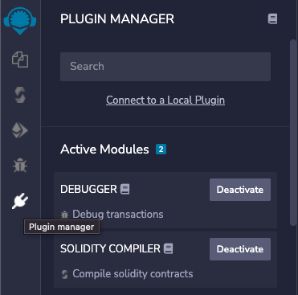
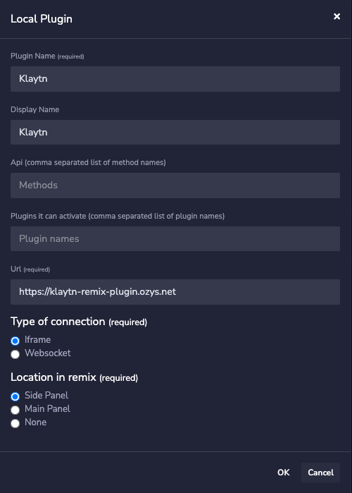
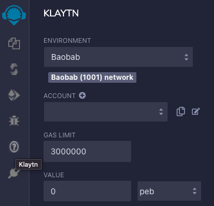
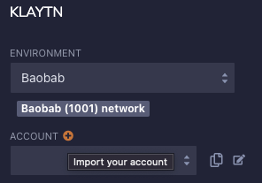
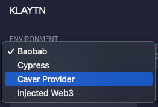
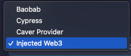
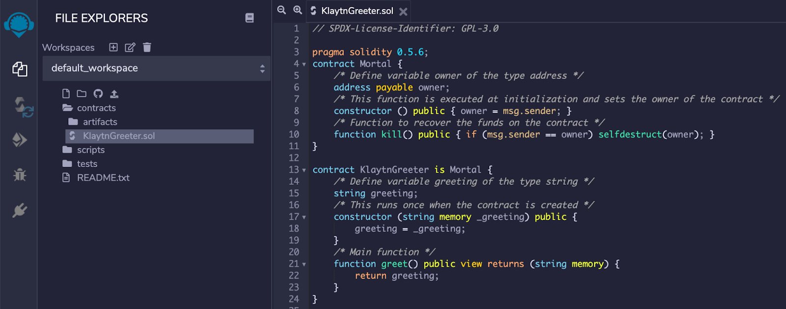
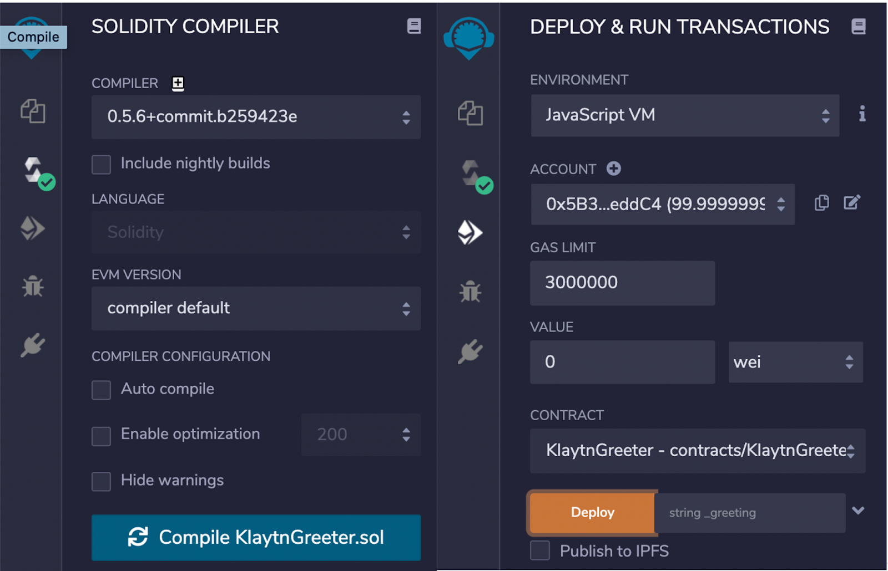
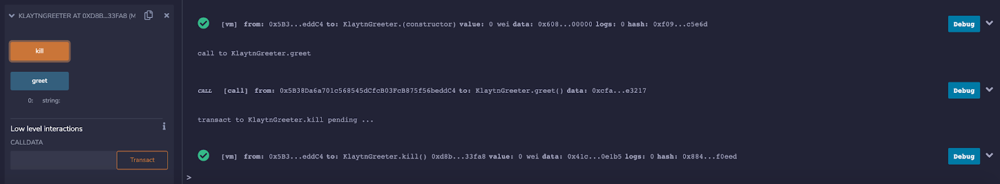

# Connecting Remix 

## What is Remix 

Remix is a browser-based IDE (Integrated Development Environment) for developing Solidity contracts. Klaytn supports Solidity contracts, and is compatible with the Constantinople version of EVM. This document will cover connecting Remix with Klaytn. If you want to know more about how to use Remix, please refer to[ **Remix docs**](https://remix-ide.readthedocs.io/en/latest/) or [**Klaytn IDE**](../../smart-contract/ide-and-tools/README.md#klaytn-ide), which was derived from Remix.

## Connect to a local plugin 

You need a local plugin to connect to the Klaytn network using Remix. The process is described in the following:

* Go to https://remix.ethereum.org/, click **plugin manager**, and then click **Connect to a Local Plugin**.

* Put https://klaytn-remix-plugin.ozys.net in the **URL**. Use any name what you want in the **Plugin Name** and **Display Name**.

* If the [Klaytn] tab appears, you are ready to interact with Klaytn.

## Setting up the Deployment Environment 

* Click on the [Klaytn] tab.
* Select the appropriate [Environment].  You can select **Baobab**, **Cypress**, or **Caver provider**.
  * **[Baobab]**: Connects to the Baobab network
  * **[Cypress]**: Connects to the Cypress network
  * **[Caver Provider]**: Connects directly to Klaytn node, which supports RPC

## Import account 

* You can import keys from **private key** or **Keystore**.
* Click **plus** button next to the **ACCOUNT**.

* Then put private key or keystore.
* You can also import keys for the **feePayer**. It only supports **private key**.

## Connecting Klaytn - Remix using EN (Endpoint Node) 

* Set up an Endpoint Node in the local environment by following the instructions in [**the EN documents**](https://docs.klaytn.com/getting-started/quick-start/launch-an-en).

* Create an account by following the instructions in [**Account Management**](https://docs.klaytn.com/getting-started/account).

  > **Note:** If you use the Public EN from Baobab, instead of from your local environment, you won't be connected to your account because the personal API is disabled. 

* Select [Caver Provider] in the Environment menu.

* Enter the RPC address of the EN in the Caver Provider Endpoint.
  Local EN (default): [http://localhost:8551](http://localhost:8551/)

* Once you are successfully connected to the Network, you will see the Chain ID as below. You can view the list of accounts that you have created in Account.

## Connecting Klaytn - Remix using MetaMask 

* Connect Klaytn with MetaMask by referring to the [**Connecting to MetaMask**](https://docs.klaytn.com/bapp/tutorials/connecting-metamask).
* Select [Injected Web3] on the Remix Environment menu.

* When you see the MetaMask pop-up, select the connected account and click [Next].
* Once you are connected to the Network (Baobab Testnet in this example), you will see the Chain ID as below. You can check the connection status with the MetaMask wallet under [Account].

## Tutorial: KlaytnGreeter Contract 

We will be using the [**KlaytnGreeter**](https://docs.klaytn.com/smart-contract/sample-contracts/klaytngreeter) sample contract.

* Add KlaytnGreeter.sol and write the testing code.

* On the Solidity Compile tab, select [Compile KlaytnGreeter.sol] to compile the contract code.
* In the Deploy & Run Transactions tab, click [Deploy] to deploy the compiled contract.

* You can view the deployed contract. You can test or debug it.

