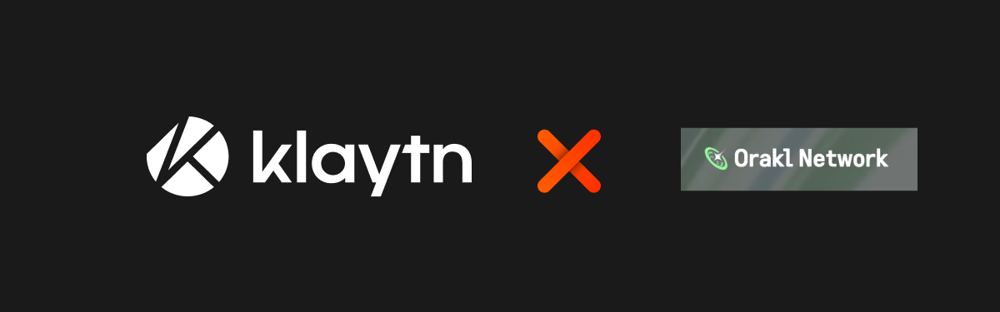
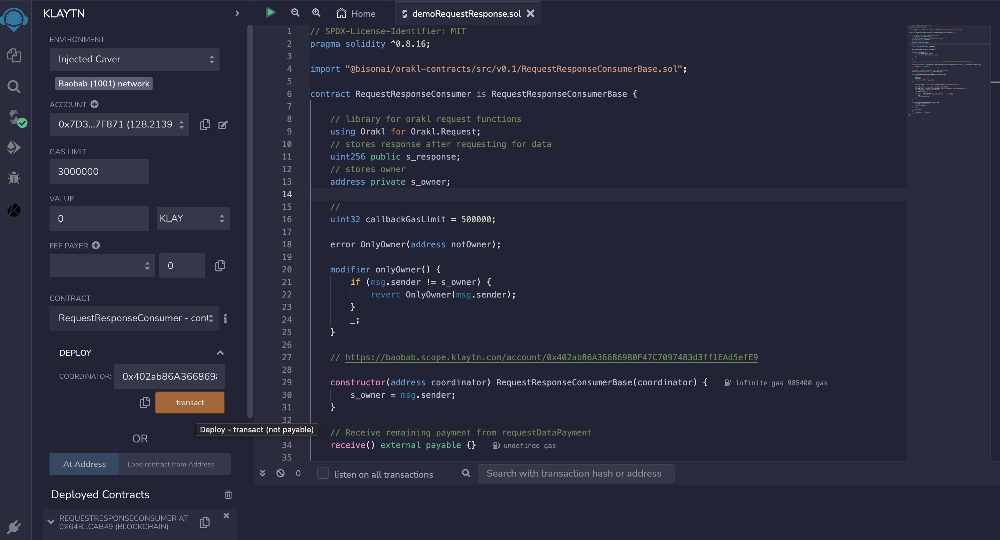
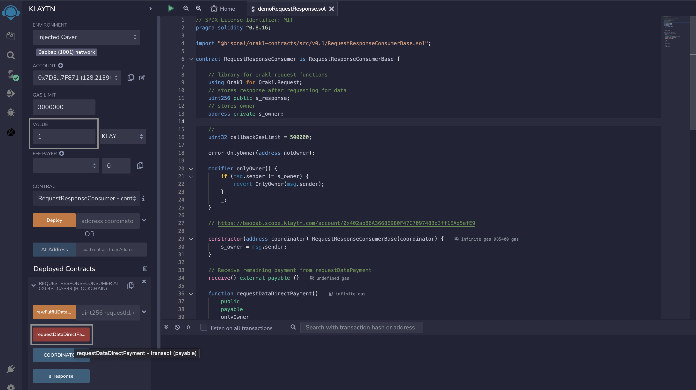
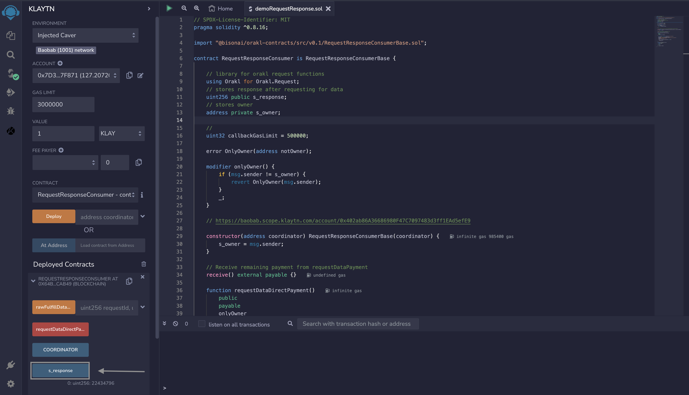

# Introduction



[Orakl Network](https://docs.orakl.network/docs/developers-guide/readme) is a decentralized oracle network that allows smart contracts to securely access off-chain data and other resources. It takes pride in being a native Klaytn oracle that offers data feed, VRF, and request-response solutions.

With Orakl Network, users can make a request-response, where users can specify within their smart contracts the specific data they require and how it should be processed before it is received on-chain. This feature returns data in several predefined formats, such as single-word responses and multi-variable word responses, providing users with greater flexibility and control over their data and allowing them to access a wide range of external data sources.

You can get access to Orakl Network services such as request-response and VRF services with two different payment methods, namely: [prepayment](https://docs.orakl.network/docs/developers-guide/readme#prepayment) , [direct](https://docs.orakl.network/docs/developers-guide/readme#direct-payment) method. In this tutorial, you will use the Orakl Network Request-Response solution to request data with the **Direct Payment** method.

# Prerequisites 
* [Kaikas](https://chrome.google.com/webstore/detail/kaikas/jblndlipeogpafnldhgmapagcccfchpi?hl=en)
* [Remix IDE](https://remix.ethereum.org/)
* [Klaytn Plugin on Remix](https://klaytn.foundation/using-klaytn-plugin-on-remix/)
* Test KLAY from [Faucet](https://baobab.wallet.klaytn.foundation/faucet)

# Getting Started

In this tutorial we will request for a KLAY/USDT price from `(https://api.coinbase.com/)` API server. The request describes where to fetch data `(https://api.coinbase.com/v2/exchange-rates?currency=KLAY)`, and how to parse (path and pow10) on the response from API server. Let’s get started making our data request.

## Step 1: Initialization for direct payment

To request and receive data, you need to initialize the `RequestCordinatorContract`. This coordinator contract is used for the initialization of parent class RequestResponseConsumerBase from which the consumer's contract has to inherit. The RequestCordinatorContract is currently deployed on Klaytn Baobab Network with the contract address `0x402ab86A36686980F47C7097483d3ff1EAd5efE9`

```javascript
import "@bisonai/orakl-contracts/src/v0.1/RequestResponseConsumerBase.sol";
contract RequestResponseConsumer is RequestResponseConsumerBase {
  constructor(address coordinator) RequestResponseConsumerBase(coordinator) {
  }
}
```
## Step 2: Initialize contract state variable

In this step, we will initialize the state variables needed for our contract functionality. This includes the s_response variable which stores the data received, the s_owner variable which is used for the onlyOwner modifier, the callbackGasLimit variable, and the Orakl library for initailizing the request parameters. 

```solidity
    using Orakl for Orakl.Request;

    uint256 public s_response;

    address private s_owner;

    uint32 callbackGasLimit = 500000;

    error OnlyOwner(address notOwner);

    modifier onlyOwner() {
        if (msg.sender != s_owner) {
            revert OnlyOwner(msg.sender);
        }
        _;
    }
  constructor(address coordinator) RequestResponseConsumerBase(coordinator) {
        s_owner = msg.sender;
   }
```

## Step 3: Request data with direct payment (consumer)

To request data using the direct method, users need to send $KLAY together with a call using value property. 

```solidity
    // Receive remaining payment from requestDataPayment
    receive() external payable {}

    function requestDataDirectPayment()
        public
        payable
        onlyOwner
        returns (uint256 requestId)
    {
        
        bytes32 jobId = keccak256(abi.encodePacked("any-api-uint256")); 
        Orakl.Request memory req = buildRequest(jobId);
        req.add("get", "https://api.coinbase.com/v2/exchange-rates?currency=KLAY");
        req.add("path", "data,rates,USDT"); 
        req.add("pow10", "8");
        requestId = COORDINATOR.requestData{value: msg.value}(
            req,
            callbackGasLimit
        );
    }
```
The code above explains  a function call to the requestData() function defined in COORDINATOR contract, and passes req and callbackGasLimit as arguments. The payment for service is sent through msg.value to the requestData() in the COORDINATOR contract. If the payment is larger than expected payment, exceeding payment is returned to the caller of requestData function, therefore it requires the user contract to define the [receive()](https://docs.soliditylang.org/en/v0.8.16/contracts.html#receive-ether-function) function as shown in the top of code listing. 

## Step 4: Receive response

This function is called by RequestResponseCoordinator to fulfill the data request.

```solidity
    function fulfillDataRequest(
        uint256 /*requestId*/,
        uint256 response
    )
        internal
        override
    {
        s_response = response;
    }
```
Now that we have the request-response solution code, let’s get to see it in action.

# Practical implementation 

In the example below, the contract provides access to request data and fulfill data request. 

## Create and Deploy Sample Code 

**Remix IDE**

* Navigate to [Remix IDE](https://remix.ethereum.org/).
* Click on File Explorer tab, create a new file named `demoRequestResponse.sol` in the contracts folder.
* Paste the code below in your newly created file.
* In Remix, click **Compile contract**.
* Click the Klaytn tab on your left having installed the plugin.
* Select **Environment** > **Injected Caver** - **Kaikas**.
* In **Contract**, select your contract. For example, RequestResponseConsumer.
* Pass in the coordinator contract address `0x402ab86A36686980F47C7097483d3ff1EAd5efE9` as argument.
* Click Deploy.

**Sample Code**

```solidity
// SPDX-License-Identifier: MIT
pragma solidity ^0.8.16;
import "@bisonai/orakl-contracts/src/v0.1/RequestResponseConsumerBase.sol";
contract RequestResponseConsumer is RequestResponseConsumerBase {
    
    // library for orakl request functions
    using Orakl for Orakl.Request;
    // stores response after requesting for data
    uint256 public s_response;
    // stores owner
    address private s_owner;
    
    uint32 callbackGasLimit = 500000;
    error OnlyOwner(address notOwner);
    modifier onlyOwner() {
        if (msg.sender != s_owner) {
            revert OnlyOwner(msg.sender);
        }
        _;
    }

    // Coordinator address = 0x402ab86A36686980F47C7097483d3ff1EAd5efE9
    // https://baobab.scope.klaytn.com/account/0x402ab86A36686980F47C7097483d3ff1EAd5efE9

    constructor(address coordinator) RequestResponseConsumerBase(coordinator) {
        s_owner = msg.sender;
    }

    // Receive remaining payment from requestDataPayment
    receive() external payable {}

    function requestDataDirectPayment()
        public
        payable
        onlyOwner
        returns (uint256 requestId)
    {
        
        bytes32 jobId = keccak256(abi.encodePacked("any-api-uint256")); 
        Orakl.Request memory req = buildRequest(jobId);
        req.add("get", "https://api.coinbase.com/v2/exchange-rates?currency=KLAY");
        req.add("path", "data,rates,USDT"); 
        req.add("pow10", "8");
        requestId = COORDINATOR.requestData{value: msg.value}(
            req,
            callbackGasLimit
        );
    }

    function fulfillDataRequest(
        uint256 /*requestId*/,
        uint256 response
    )
        internal
        override
    {
        s_response = response;
    }
}
```


## Interact with Smart Contract

To get the value of KLAY/USDT, you have to first make a request by calling the `requestDataDirectPayment()` function. For this function to successfully execute, the user has to send KLAY (minimum of 1 KLAY) as stated previously. Afterwards, once the request has been fulfilled, the `s_response()` can be executed. This `s_response()` function returns the response of the data request.

* **requestDataDirectPayment()**: Will be sending 1 KLAY to execute this function. The image below illustrate this:



* **s-response()**: After the RequestResponseCoordinator has fulfilled the request, the response is stored in the s_response variable. To get the response, call the `s_response()` function.



As of the time of writing, s_response() returned `22434796`. If you will recall, in requestDataDirectPayment
() function, we multiplied the request by some large constant (10^8). This was done to ensure the floating point value returned by the API can be converted without losing precision to uint256. Hence, to get the actual KLAY/USD price, you need to divide the response by 10^8 which equals $0.22434796.

# Conclusion

In this tutorial, you learnt how to request a KLAY/USDT price using the request-response solution. The Orakl Network provides more oracle services such as Price-feed, VRF (random number) et al. For more in-depth guides on Orakl Network and how it works, please refer to the [Orakl Network Docs](https://docs.orakl.network/docs/developers-guide/readme). 
