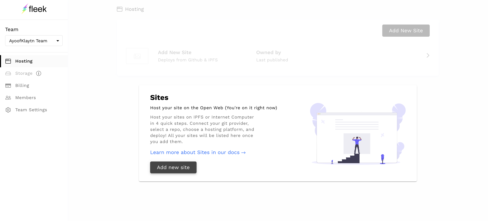
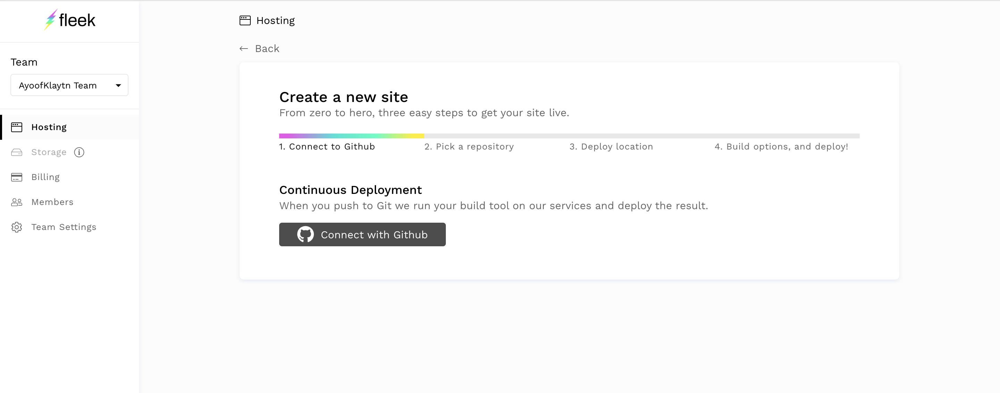
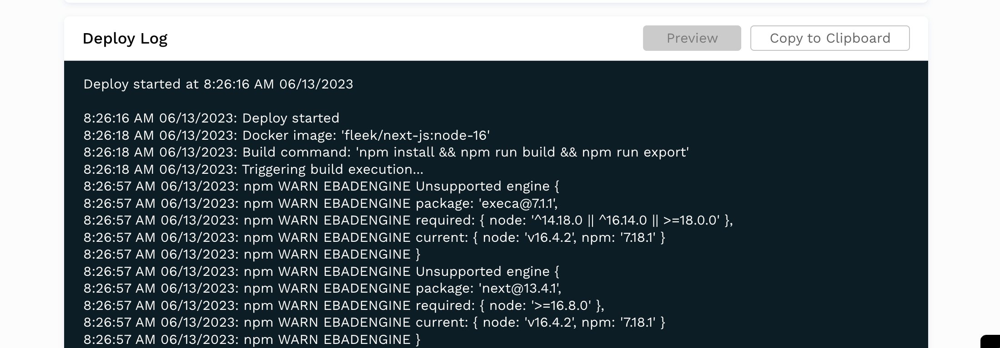
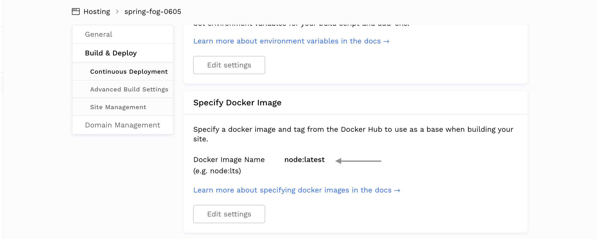
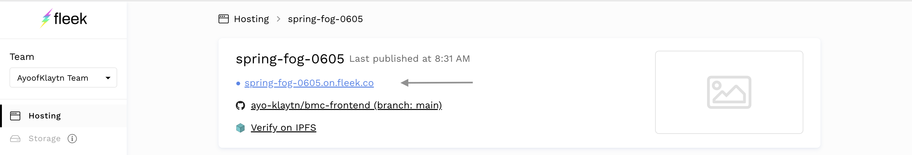

# Deploying Frontend code on IPFS using Fleek <a id="deploying-bmc-frontend-to-ipfs-using-fleek"></a>

Fleek is an infrastructure that enables us to build modern sites and apps on IPFS. With fleek your sites or app becomes permissionless, trustless, censorship resistant, and free of centralized gatekeepers. In this tutorial we will be deploying our Next js app to Fleek other than the traditional platforms like Vercel. 
Yeah you got it! We are deploying a decentralized application to a decentralized hosting platform! 

The following are the steps to deploy your BMC dApp to Fleek:

1. Make sure to confirm these configurations in your frontend code: 

    a. Open package.json and add in the following scripts:

    ```js
		"scripts": {
   		 "dev": "next",
   		 "build": "next build",
		  "start": "next start",
    		  "export": "next export"  
		}
	```
	b. Paste the code below in your next.config.js file in the root directory:

	```js
		module.exports = {
  			exportTrailingSlash: true,
		};
	```
For more information, visit this [guide](https://blog.fleek.co/posts/fleek-nextJS)

2. Navigate to your dashboard on Fleek and click on **Add new Site**



3. Connect your GitHub account to access your repositories.



4. Select the repository you intend to deploy.

5. On the next page,select the **Next Js** framework  in the **Basic build setting** tab, and Fleek will automatically populate the other fields. 
6. Click deploy site 
7. In the event of an **npm WARN EBADENGINE Unsupported engine** as shown in the image below:




Head over to **Deploy setting** in the **Deploy** tab and change the **Docker image Name** to **node:latest** as shown in the image below:



8. Now your site should build and deploy to IPFS easily.
9. Click the link generated to view your website. 



Voila! We have our BMC dApp deployed and hosted on IPFS.
