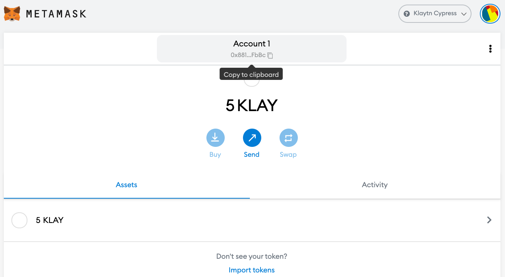

# Connecting MetaMask 

> **Note**: MetaMask is mostly used as a wallet for Ethereum, but it is also compatible with Klaytn due to the identical address structures. Klaytn also has a browser extension wallet called [Kaikas](../developer-tools/README.md#kaikas), so it basically provides the same features as MetaMask, except for Remix.

## Step 1. Install MetaMask 

* We will be using Chrome browser in this example. ([**Install Chrome**](https://www.google.com/intl/en_us/chrome/))

* Add [**MetaMask Extension**](https://chrome.google.com/webstore/detail/metamask/nkbihfbeogaeaoehlefnkodbefgpgknn?hl=en) to Chrome.

  >  **Note:** You may need additional installations if you are using another browser. 

* You can start MetaMask by clicking on the icon in the upper right-hand corner of your chrome browser.

## Step 2. Generate a MetaMask Wallet 

* Click on [Create a Wallet].
* Set a password.
* You will be given a 12 word seed phrase; back it up somewhere secure.

  > **Note:** You can only restore your wallet with the seed phrase. Sharing your seed phrase with others may result in losing all of your funds. Therefore, it is recommended that you either write it down manually or store it in an offline device.

## Step 3. Connect to Klaytn Network 

* Click on the Network tab, which is on Ethereum Mainnet as default and select [Custom RPC].

* Enter the Endpoint Node (EN) data of the Klaytn chain.

  * Cypress
    * Network Name: Klaytn Cypress
    * New RPC URL: (Default: [https://public-node-api.klaytnapi.com/v1/cypress](https://public-node-api.klaytnapi.com/v1/cypress))
    * Block Explorer URL: [https://scope.klaytn.com/](https://scope.klaytn.com/)
    * Chain ID: 8217
  * Baobab
    * Network Name: Klaytn Baobab
    * New RPC URL: [https://api.baobab.klaytn.net:8651](https://api.baobab.klaytn.net:8651)
    * Block Explorer URL: [https://baobab.scope.klaytn.com/](https://baobab.scope.klaytn.com/)
    * Chain ID: 1001
  * Common
    * Currency Symbol: KLAY

* Click [Save] to add Klaytn Cypress Network.

## Step 4. Send KLAY 
**Note:** To send KLAY, you will need to make a transaction, which requires KLAY. For the Klaytn Baobab Network, follow this step if you don't have enough KLAY.

* Click on the round icon in the top right corner, and select [Create Account] in the menu to create a new account.
* Copy the account address to clipboard.

* In the drop-down menu, change to the first account.
* On [Send], enter the recipient's account address as well as the amount of KLAY and then click [Next] to proceed.
  > **Note:** The gas price on Klaytn is fixed. Arbitrarily changing the price may result in a transaction failure. You can view your transaction history in the [Activity] tab.

## Klaytn Baobab Network - Obtain KLAY to make a transaction 
> **Note:** This tutorial uses Public EN of the Testnet (Baobab) to connect to the network. Make sure to use Baobab when you are running a test.

* Click [Save] to add Klaytn Baobab Network.

* To test the connection of the Klaytn Wallet, you will need to make a transaction, which requires KLAY.
* Click on the kebab menu (three dots) in the upper right corner and select [Account details].
* Click [Export Private Key] to obtain your private key.

* When using Baobab Testnet, you can obtain Test Klay in [**Klaytn Faucet**](https://baobab.wallet.klaytn.com/access?next=faucet).
* Enter your private key on Klaytn Wallet and log in by clicking [Access]. (Attach 0x in front of the private key.)
* Click [Run Faucet]. 5 Testnet KLAY will be sent to your account and the balance will be updated accordingly. You can claim Testnet KLAY from Faucet once every 24 hours per account.

* Come back to MetaMask and confirm the KLAY that you received.
* You can follow step 4 for the Klaytn Baobab Network.

