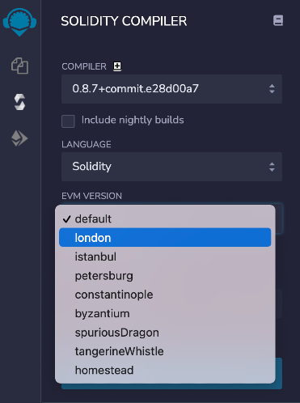
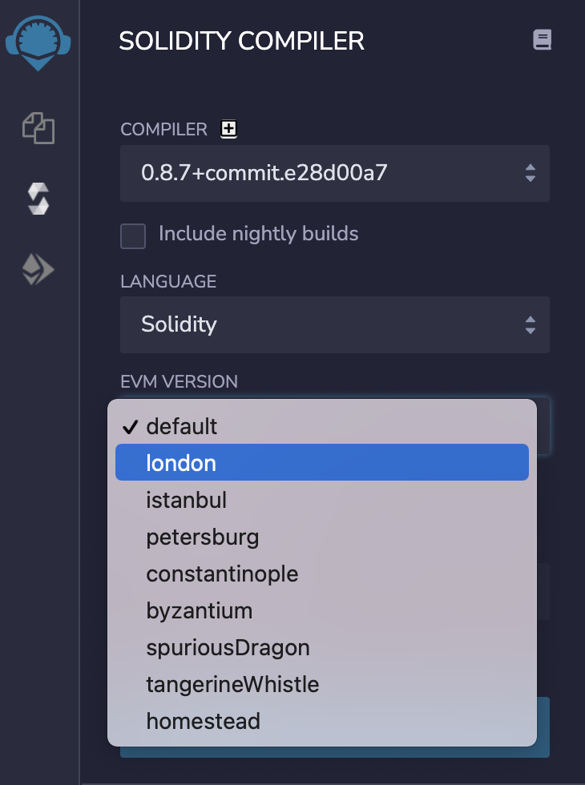
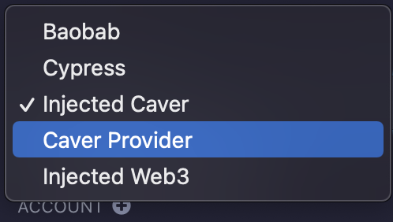
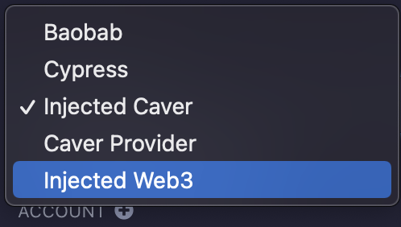
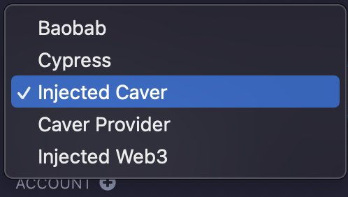
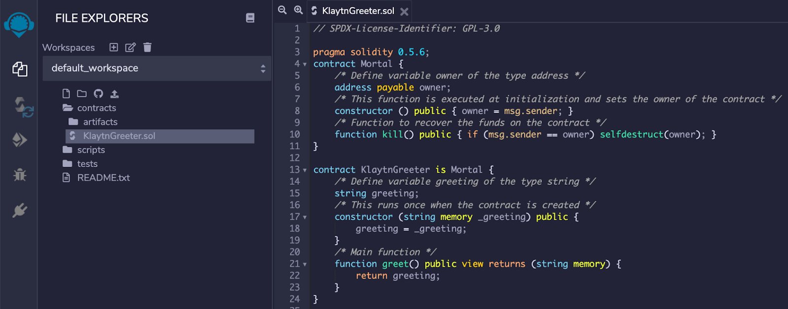

# Connecting Remix 

## What is Remix 

Remix is a browser-based IDE (Integrated Development Environment) for developing Solidity contracts. This document will cover connecting Remix with Klaytn. If you want to know more about how to use Remix, please refer to[ **Remix docs**](https://remix-ide.readthedocs.io/en/latest/) or [**Klaytn IDE**](../../smart-contract/ide-and-tools/README.md#klaytn-ide), which was derived from Remix.

> Remix IDE : [https://remix.ethereum.org/](https://remix.ethereum.org/)

## Setup EVM version 
Klaytn supports contracts written in Solidity, and is compatible with the **London** version of EVM. Also, Solidity version 0.8.x and lower are supported in Klaytn.
Therefore, to deploy the contract on Klaytn, the contract must be compiled with the **London** EVM version.

* Click **solidity compiler**, and then choose **London** EVM version in the 'Advanced Configurations'.

## Connect to a local plugin 

You need a local plugin to connect to the Klaytn network using Remix. The process is described in the following:

* Click **plugin manager**, and then click **Connect to a Local Plugin**.

* Put https://klaytn-remix-plugin.ozys.net in the **URL**. Use any name what you want in the **Plugin Name** and **Display Name**.

* If the [Klaytn] tab appears, you are ready to interact with Klaytn.

## Setting up the Deployment Environment 

* Click on the [Klaytn] tab.
* Select the appropriate [Environment].
* You can select **Baobab**, **Cypress**, **Injected Caver**, **Caver Provider** or **Injected Web3**.
  * **[Baobab]**: Connects to the Baobab network
  * **[Cypress]**: Connects to the Cypress network
  * **[Injected Caver]**: Connects to injected caver(e.g., Kaikas)
  * **[Caver Provider]**: Connects directly to Klaytn node, which supports RPC
  * **[Injected Web3]**: Connects to injected web3(e.g., Metamask)

## Import account 

* You can import keys from **private key** or **Keystore**.
* Click **plus** button next to the **ACCOUNT**.

* Then put private key or keystore.
* You can also import keys for the **feePayer**. It only supports **private key**.

## Connecting Klaytn - Remix using EN (Endpoint Node) 

* Set up an Endpoint Node in the local environment by following the instructions in [**the EN documents**](https://docs.klaytn.foundation/getting-started/quick-start/launch-an-en).

* Create an account by following the instructions in [**Account Management**](https://docs.klaytn.foundation/getting-started/account).

  > **Note:** If you use the Public EN from Baobab, instead of from your local environment, you won't be connected to your account because the personal API is disabled. 

* Select [Caver Provider] in the Environment menu.

* Enter the RPC address of the EN in the Caver Provider Endpoint.
  Local EN (default): [http://localhost:8551](http://localhost:8551/)

* Once you are successfully connected to the Network, you will see the Chain ID and Account of the connected network.

## Connecting Klaytn - Remix using MetaMask 

* Connect Klaytn with MetaMask by referring to the [**Connecting to MetaMask**](https://docs.klaytn.foundation/dapp/tutorials/connecting-metamask).
* Select [Injected Web3] on the Remix Environment menu.

* When you see the MetaMask pop-up, select the account by clicking it.
* Once you are successfully connected to the Network, you will see the Chain ID and Account of the connected network.

## Connecting Klaytn - Remix using Kaikas 

* Select [Injected Caver] on the Remix Environment menu.

* When you see the Kaikas pop-up, click [Connect].
* Once you are successfully connected to the Network, you will see the Chain ID and Account of the connected network.

## Tutorial: KlaytnGreeter Contract 

We will be using the [**KlaytnGreeter**](https://docs.klaytn.foundation/smart-contract/sample-contracts/klaytngreeter) sample contract.

* Add KlaytnGreeter.sol and write the testing code.

* On the Solidity Compile tab, select [Compile KlaytnGreeter.sol] to compile the contract code.
> It is better to turn on the 'Auto compile' option.
* In the Deploy & Run Transactions tab, click [Deploy] to deploy the compiled contract.

* You can view the deployed contract. You can test or debug it.

