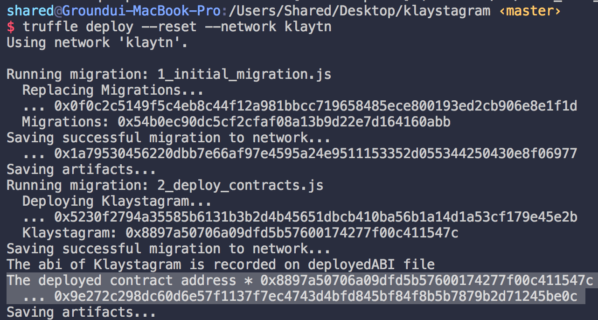

# 5. Deploy Contract <a id="5-deploy-contract"></a>

1\) Get some testnet KLAY to deploy contract  
2\) Truffle configuration  
3\) Deploy setup \(select contract which you want to deploy\)  
4\) Deploy

## 1\) Get some KLAY <a id="1-get-some-klay"></a>

To deploy contract, we need some KLAY in your account to pay for gas price. You can get 150 KLAY via Klaytn Wallet in the testnet. 1. Create your Klaytn account at [Baobab Klaytn Wallet](https://baobab.wallet.klaytn.com/create) -&gt; `PRIVATE KEY` will be used in truffle configuration. So copy it down somewhere 2. After creating your Klaytn account, run faucet to receive 5 Baobab testnet KLAY in [Baobab Klaytn Faucet](https://baobab.wallet.klaytn.com/faucet)


## 2\) truffle configuration <a id="2-truffle-configuration"></a>

`truffle-config.js` is a configuration file including deployment configuration. We are going to deploy our contract using `Private key` we've just created in the previous step. Paste your `Private key` that has enough KLAY to truffle-config.js

_WARNING: You shouldn't expose your private key. Otherwise, your account would be hacked._

```javascript
// truffle-config.js

const HDWalletProvider = require("truffle-hdwallet-provider-klaytn");

/**
 * truffle network variables
 * for deploying contract to klaytn network.
 */
const NETWORK_ID = '1001'

/**
 * URL: URL for the remote node you will be using
 * PRIVATE_KEY: Private key of the account that pays for the transaction (Change it to your own private key)
 */
const URL = 'https://api.baobab.klaytn.net:8651'

// Paste your `Private key` that has enough KLAY to truffle.js
const PRIVATE_KEY = 'your_private_key'

module.exports = {
  networks: {
    klaytn: {
      provider: () => new HDWalletProvider(PRIVATE_KEY, URL),
      network_id: NETWORK_ID,
      gas: '8500000',
      gasPrice: null,
    },
  },

  // Specify the version of compiler, we use 0.5.6
  compilers: {
    solc: {
      version: '0.5.6',
    },
  },
}
```

### `networks` property <a id="networks-property"></a>

See `networks` property above. `klaytn` network has 4 properties,  
`provider`, `network_id`, `gas`, `gasPrice`.

* `provider: () => new HDWalletProvider(PRIVATE_KEY, URL)` Just as the name indicates, it injects private key and url defined above.
* `network_id: NETWORK_ID` Specify network id in Klaytn, you should set it to `1001` to use Klaytn Baobab network \(testnet\).
* `gas: GASLIMIT` Maximum gas you are willing to spend.
* `gasPrice: null` This is price per every gas unit. Currently in Klaytn, the gas price is fixed to `'25000000000'`. By setting it to `null`, truffle will automatically set the gas price.

### `compiler` property <a id="compiler-property"></a>

Remember that for Solidity contract we used version 0.5.6, thus specify compiler version here.

## 3\) Deployment setup <a id="3-deployment-setup"></a>

`migrations/2_deploy_contracts.js`:

```javascript
const Klaystagram = artifacts.require('./Klaystagram.sol')
const fs = require('fs')

module.exports = function (deployer) {
  deployer.deploy(Klaystagram)
    .then(() => {
    if (Klaystagram._json) {
      // 1. Record recently deployed contract's abi file to 'deployedABI'
      fs.writeFile(
        'deployedABI',
        JSON.stringify(Klaystagram._json.abi, 2),
        (err) => {
          if (err) throw err
          console.log(`The abi of ${Klaystagram._json.contractName} is recorded on deployedABI file`)
        })
    }

    // 2. Record recently deployed contract's address to 'deployedAddress'
    fs.writeFile(
      'deployedAddress',
      Klaystagram.address,
      (err) => {
        if (err) throw err
        console.log(`The deployed contract address * ${Klaystagram.address} * is recorded on deployedAddress file`)
    })
  })
}
```

You can specify which contract code will you deploy in your `contracts/` directory.

1. Import your contract file \(`Klaystagram.sol`\) via  

   `const Klaystagram = artifacts.require('./Klaystagram.sol')`  

2. Use `deployer` to deploy your contract,  `deployer.deploy(Klaystagram)`.  
3. If you want to add more logic after deploying your contract, use `.then()` \(optional\)  
4. To save contracts' `deployedABI` and `deployedAddress`, use `fs` node.js module  

   `fs.writeFile(filename, content, callback)` \(optional\)

cf. For further information about `artifacts.require()`, refer to truffle official documentation at [truffle docs](https://trufflesuite.com/docs/truffle/getting-started/running-migrations#artifacts-require-)

## 4\) Deploy <a id="4-deploy"></a>



In your terminal type `$ truffle deploy --network klaytn`.  
It will deploy your contract according to `truffle-config.js` and `migrations/2_deploy_contracts.js` configuration.

Terminal will display deployed contract address if deployment was successful.

cf\) `--reset` option  
If you provide this option, truffle will recompile and redeploy your contract even if contracts haven't changed.  
ex\) `$ truffle deploy --reset --network klaytn`

