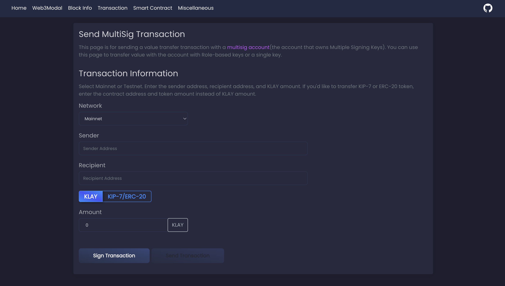

# Klaytn Online Toolkit 

## What is the Klaytn Online Toolkit?
* `Klaytn Online Toolkit` provides code examples and github page to help you to utilize the `Klaytn SDK(caver-js)` easily.
* `Klatyn SDK(caver-js)` is a JavasScript API library that allows developers to interact with a Klaytn node using a HTTP or Websocket connection.
* You can just try out Klatyn's features without having to code.

> To help more people use the `Klaytn Online Toolkit`, We have prepared the ["Using Klaytn Online Toolkit"](https://medium.com/klaytn/using-klaytn-online-toolkit-1-multisig-60399a0b0278) series.

## Links
Here are the links for `Klaytn Online Toolkit`. Feel free to it :)
* [Github Repository](https://github.com/klaytn/klaytn-online-toolkit)
* [Github Page](https://klaytn.github.io/klaytn-online-toolkit/)
* [Klaytn SDK(caver-js)](https://docs.klaytn.foundation/dapp/sdk/caver-js)

