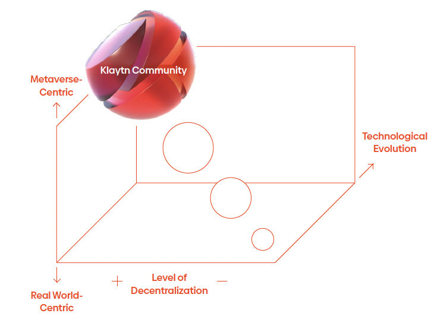

# Decentralizing Governance

## Our Unique Governance Structure Delivers Decentralization with Stability

## Response to the Growth of Non-traditional Entities
With technological advancement, we will live in a more metaversified world where the influence of non-traditional entities such as builders contributing to the operation of the metaverse and DAOs as a major form of organization in the metaverse will continue to grow.

## Diversification of Governance Participants
In addition to traditional enterprises, by bringing the two decentralized entities into Klaytn Governance Council (GC), we are opening up the potential to rebuild the entire Klaytn governance structure in an unprecedented way with hundreds of governance participants.

## Voting Power that Scales with Community Support
A stake-based governance model will be introduced to enable governance participants who can gather more support from Klaytn Communities to shape Klaytn in line with their preference. The Gini Coefficient will be discontinued soon. Entities who can make a proper decision in a Metaversified world will have more influence in the Klaytn GC. We believe DAOs and builders will lead the scene in the future.

## Ultimate Goal of Decentralization
When the level of metaversification crosses the critical threshold, Klaytn governance will be fully decentralized with DAOs and builders. Ultimately, Klaytn will evolve into a DAO of DAOs and a platform for DAOs to communicate the voices of Klaytn Communities through on-chain mechanisms.
