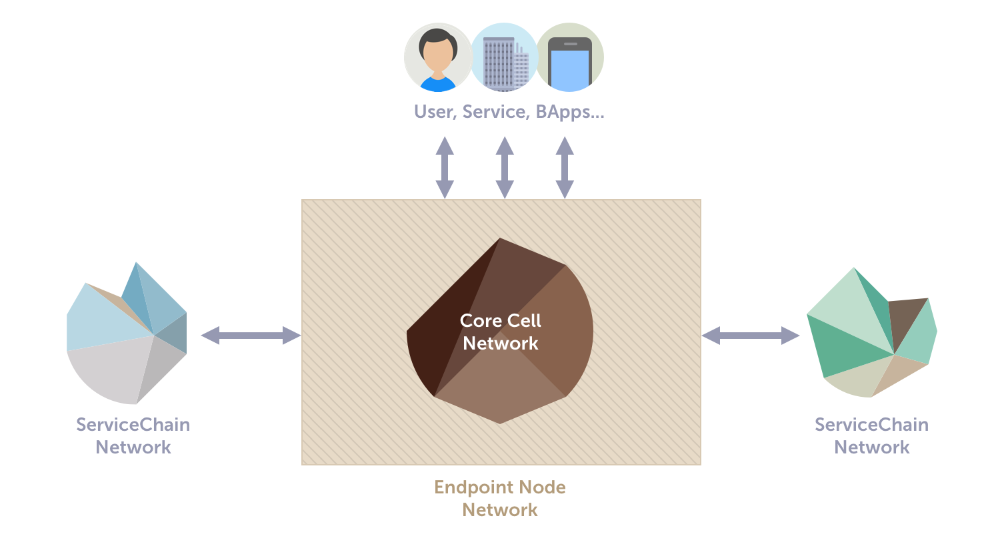

# Overview

Klaytn is a highly optimized, BFT-based public blockchain that aims to meet the enterprise-grade reliability.
Key design goals are;

- Immediate finality.
- High TPS that meets real-world use cases.
- Lower the cost of running Blockchain Applications.
- Lower the barriers to entry for end-users without technical experience.
- Ease the technology adoption process for industry.

Klaytn launched its mainnet, **Cypress**, on Jun/27/2019 with the following specifications.

- 1-second block generation and confirmation time.
- 4,000 transactions per second.
- Low gas price that is almost 1/10 of Ethereum.
- Runs EVM (Ethereum Virtual Machine) and supports the execution of Solidity contracts.  
- 23 reputable corporations worldwide formed Klaytn Governance Council to operate consensus nodes.
- More than 50 initial service partners have committed to launch Blockchain Applications on Klaytn.

## Klaytn Network

Klaytn network can be partitioned into three logical subnetworks based on their roles and purposes. The below figure displays the high-level view of the Klaytn network.

### Core Cell Network (CCN)

CCN consists of Core Cells (CCs) that verify and execute transactions submitted through Endpoint Nodes (ENs). CCN is also responsible for creating and propagating blocks throughout the network.

### Endpoint Node Network (ENN)

ENN consists of Endpoint Nodes (ENs) that mainly create transactions, handle RPC API requests, and process data requests from service chains.

**Core Cell Network** and **Endpoint Node Network** form a Klaytn main chain.

### Service Chain Network (SCN)

SCNs are Klaytn subnetworks composed of auxiliary blockchains independently operated by blockchain applications (BApps). Service chains are connected to the main chain via ENs.

