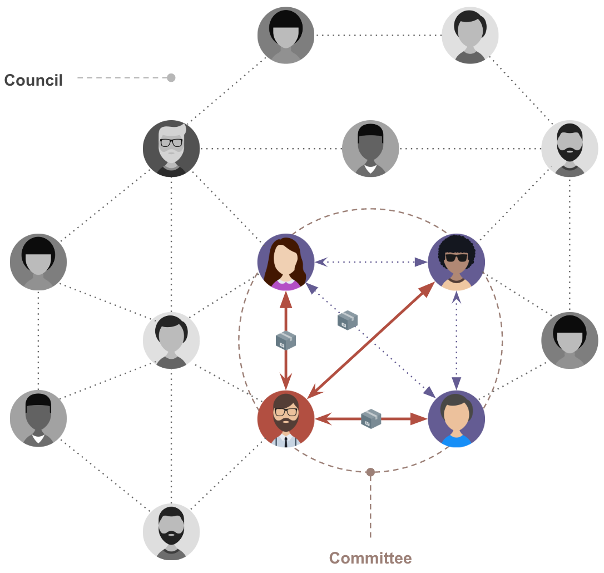

# Consensus Mechanism

A consensus mechanism (algorithm) is a way of reaching a consensus between trustless entities. In blockchain technology, it is used to reach a consensus about if a block is valid or not. 

Bitcoin and Ethereum are using PoW (Proof of Work) based consensus mechanism. And there are other block chain networks using PoS (Proof of Stake) mechanism which decides a block generating node by the stake of the node. Usually these algorithms have no communication between nodes in deciding an order and a validity of blocks. 

So in these systems, a fork can happen which means two or more different blocks can be made on the same height . Usually "Longest chain wins" rule is used to solve the fork condition. It means that those forks will be merged to a single canonical chain eventually, but it also means a list of blocks can be reverted in some period of time when it belongs to the shorter chain. So in these algorithms, there is no guarantee of finality of blocks and transactions. The finality only can be achieved probabilistically after some period of time though it can't be 100% sure.

This lack of finality is very difficult issue in customer facing services which uses a blockchain platform. Because an user's activity can be reverted until some time have passed, a service can't be confident to believe it. This characteristic gives negative effect both on users and service providers. 

A simple example of this issue is a financial service. Assuming that an user transferred some funds to someone, the service can't acknowledge that the transfer is valid until 30 to 60 minutes passed. Because it have to wait until forks are merged into a single chain and several blocks stacked after the transfer to believe the transaction is not reversible.

## PBFT (Practical Byzantine Fault Tolerance) 
To prevent above issues, we need other algorithm which guarantees finality confidently. BFT algorithm is one of those, first [published](https://dl.acm.org/citation.cfm?doid=357172.357176) at 1982 by Lamport, Shostak, Pease. In 1999, Miguel Castro and Barbara Liskov introduced "Practical Byzantine Fault Tolerance" ([PBFT](http://www.pmg.csail.mit.edu/papers/bft-tocs.pdf)) which provides high performance state machine replication.

In PoW algorithm stated above, though each node receive and validate blocks, there are no message exchange between nodes to make a consensus. But in PBFT, each node communicates with other participating nodes to make a consensus and the finality of the block can be guaranted as soon as nodes were able to make a consensus.

The communication between nodes basically progress as shown below. But there are some variants which reflects each system's characteristics.

As shown above, a participating node in PBFT basically cummunicates with all nodes in the network in several phases. This characteristic limits the number of nodes because the communication volume increases in multiple as the number of nodes increases.

## Consensus Mechanism in Klaytn
Klaytn is aiming to be a Enterprise-ready and Service Centric platform. Therefore we need to solve the finality problem written above and the network should be able to allow many nodes to participate in the network. To make this possible, Klaytn is using optimized version of Istanbul BFT which implements PBFT with blockchain network's characteristics.

In Klaytn, nodes are separated in three types, CN (Consensus Node), PN (Proxy Node) and EN (Endpoint Node). CN nodes managed by CCOs (Core Cell Operators) are in charge of building blocks and these blocks are verified by all nodes in the network. Please refer to [here]() to know more about this network topology.

Klaytn achieves fast finality by adopting Istanbul BFT. Because validation and consensus are done for each block there is no fork and the block's finality is guaranted instantly as soon as the consensus is made. 

And also the issue of increasing communication volume in BFT algorithm is solved by utilizing randomly selected `Committee`. All CN nodes form a `Council` and some of them are selected as a `Committee` for each block using a VRF (Verifiable Random Function).

Because consensus messages are exchanged only between the committee members, the communication volume can be limited under the designed level even though the total number of CNs increased.

Currently, Klaytn Mainnet Cypress can provide high throughput of 4,000 transactions per second with one seconde block generation interval. Above 50 consensus nodes can participate in the CNN (Consensus Node Network) at the moment and the number will be coutinuously increased as the algorithm is being optimized aggressively.
