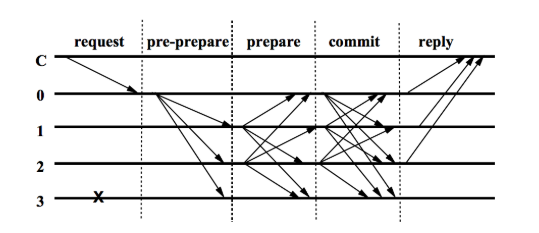

# Consensus Mechanism

A consensus mechanism \(algorithm\) is a way of reaching a consensus between trustless entities. In blockchain technology, it is used to reach a consensus about if a block is valid or not. The performance of blockchain networks relies on the performance of the adopted consensus mechanisms, and it has a significant impact on the perceived usability of the Blockchain Applications.

Klaytn Mainnet Cypress exhibits the following performance.

* Handles 4,000 transactions per second. 
* Immediate transaction finality.
* One-second block generation time. 
* Over 50 consensus nodes can participate in the consensus process.

In the document, we will go over how Klaytn implemented the high-performing consensus process.

## Background 

[Bitcoin](https://en.wikipedia.org/wiki/Bitcoin) and [Ethereum](https://en.wikipedia.org/wiki/Ethereum) are using [PoW](https://en.wikipedia.org/wiki/Proof_of_work) \(Proof of Work\) based consensus mechanism. And there are other blockchain networks using [PoS](https://en.wikipedia.org/wiki/Proof_of_stake) \(Proof of Stake\) mechanism which decides a block generating node by the stake of the node. Usually, these algorithms have no communication between nodes in deciding validities of blocks.

So in these systems, a fork can happen which means two or more different blocks can be made on the same height. Usually "Longest chain wins" rule is used to solve the fork condition. It means that those forks will be merged into a single canonical chain eventually, but it also means a list of blocks can be reverted in some period of time when it belongs to the shorter chain. So in these algorithms, there is no guarantee of the finality of blocks and transactions. The finality only can be achieved probabilistically after some period of time though it can't be 100% sure.

This lack of finality is a very difficult issue in customer-facing services which use a blockchain platform. Because it has to wait until forks are resolved and enough blocks are stacked after the transfer to believe the transaction is not reversible. This characteristic gives a negative effect both on users and service providers.

A simple example of this issue is a financial service. Assuming that an user transferred some funds to someone, the service can't acknowledge that the transfer is valid until 30 to 60 minutes passed. Because it have to wait until forks are merged into a single chain and several blocks stacked after the transfer to believe the transaction is not reversible.

### PBFT \(Practical Byzantine Fault Tolerance\) 

To prevent the above issues, we need other algorithms that guarantee the finality. BFT algorithm is one of those, first [published](https://dl.acm.org/citation.cfm?doid=357172.357176) in 1982 by Lamport, Shostak, Pease. In 1999, Miguel Castro and Barbara Liskov introduced "Practical Byzantine Fault Tolerance" \([PBFT](http://www.pmg.csail.mit.edu/papers/bft-tocs.pdf)\) which provides high-performance state machine replication.

In the PoW algorithm stated above, though each node receives and validates blocks, there are no message exchanges between nodes to reach a consensus. But in PBFT, each node communicates with other participating nodes to reach a consensus and the finality of the block can be guaranteed as soon as nodes were able to reach a consensus.

The communication between nodes basically progresses as shown below. But there are some variants which reflect each system's characteristics.

As shown above, a participating node in PBFT basically communicates with all nodes in the network in several phases. This characteristic limits the number of nodes because the communication volume increases exponentially as the number of nodes increases.

## Consensus Mechanism in Klaytn 

Klaytn is aiming to be an Enterprise-ready and Service-centric platform. Therefore we need to solve the finality problem written above and the network should be able to allow many nodes to participate in the network. To make this possible, Klaytn is using an optimized version of Istanbul BFT, which implements PBFT with modifications to deal with blockchain network's characteristics.

In Klaytn, there are three types of nodes, CN \(Consensus Node\), PN \(Proxy Node\) and EN \(Endpoint Node\). CNs are managed by CCOs \(Core Cell Operators\) and are in charge of block generation. These blocks are verified by all nodes in the network. Please refer to [here](../#klaytn-network-topology) to know more about this network topology.

Klaytn achieves fast finality by adopting and improving Istanbul BFT. Because validation and consensus are done for each block there is no fork and the block's finality is guaranteed instantly as soon as the consensus is made.

And also the issue of increasing communication volume in the BFT algorithm is solved by utilizing randomly selected `Committee`. CNs collectively form a `Council` and on each block generation, part of them are selected as a member of `Committee` using a VRF \(Verifiable Random Function\).

Because consensus messages are exchanged only between the committee members, the communication volume can be limited under the designed level even though the total number of CNs increases.

Currently, Klaytn Mainnet Cypress can provide a high throughput of 4,000 transactions per second with one-second block generation interval. More than 50 consensus nodes can participate in the CNN \(Consensus Node Network\) at the moment and the number will continuously increase as Klaytn continues to aggressively optimize the algorithm.

