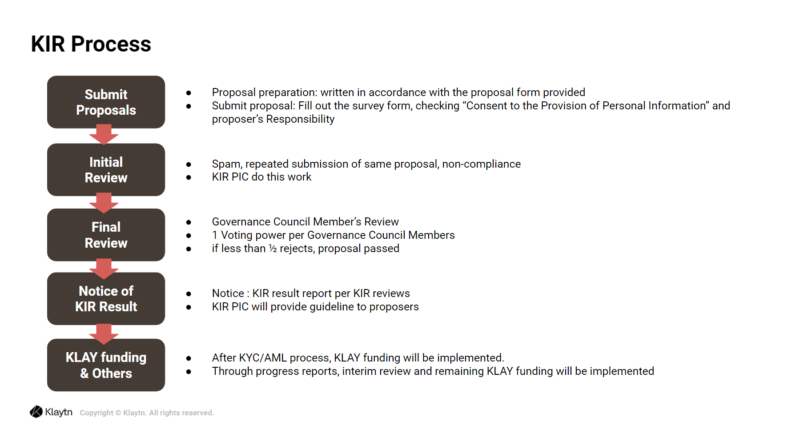

# Governance 

## Overview 

### Klaytn Governance Council: Co-governed by Klaytn Contributors 

Klaytn believes that its contributors who build and grow the platform with their interests aligned with the platform’s long-term development plans are the most qualified entities to undertake Klaytn governance. Service providers who support mass adoption by delivering new services to Klaytn, Ecosystem builders who introduce and promote Klaytn to the world, or contributors of any other kinds, are potential members of Klaytn Governance Council. In other words, Klaytn Governance Council is the governing body that will generate long-term growth of Klaytn. For detailed information on governance, please refer to [Token Economy & Governance Paper](https://www.klaytn.com/Klaytn_Token_Economics_and_Governance_Paper_V1.01.pdf).

### Bootstrapping 

To make the platform trustworthy in its initial stages, only trusted entities are considered as potential Klaytn Governance Council members. This is designed to improve the protocol in a rapid manner for the development and stabilization phase.

## Governance Topics 

The main topics that can be decided through the governance structure include the following three areas, and proposals that require additional decision making may be introduced in a regular meeting or temporary meeting for review. The Klaytn Governance Council must make decisions that are best for the growth of Klaytn.

- **Technology**
  - Matters related to the technical update of the platform. Here the issues on the blockchain's basic structure (e.g., Account Structure), new features (e.g., L2 solution), or software update schedule are included.
- **Economy**
  - Issues relating to additional issuance of KLAY and its distribution structure, changes in transaction fees, and Klaytn Improvement Reserve spending approval etc. are included in this category.
- **Governing Rule**
  - The governance subjects and processes, as well as the rules for the responsibilities and rights of governing bodies, are included in this category.

## Governance Process 

The Goal of Klaytn Governance Process Klaytn collectively defines its decision-making process, from introducing agenda to voting, as Klaytn Governance Process. Klaytn Governance Process may differ in detail depending on the agenda category. Klaytn Governance Process aims to be executed on-chain, where the voting process itself and the results are transparently disclosed to all Klaytn ecosystem participants. However, initially, Klaytn Governance Process may be operated in an off-chain environment, followed by a transparent disclosure of discussion and decision results.

Klaytn principally aims for the governance process to occur within the protocol (on-chain). Through this process, the votes will be recorded on the blockchain, and the results will be carried out following the vote. As the platform grows, more matters will be handled through on-chain governance.

### General Governance Process 

The initial governance process proceeds in the following order: proposal introduction, statement of opinion submitted by advisors, voting by council members, and various follow-up procedures depending on the result of the vote.

Those who have the right to introduce proposals can make sure each proposal is voted on by introducing it. Once the proposal is introduced, the advisors must conduct expert analysis on the proposal and submit a statement of opinion with their results.

During the initial phase of Klaytn governance, the Klaytn Governance Council members have the right to vote on the introduced proposal and will reference the advisors' statements of opinion to vote on what they believe to be the best option. If the number of votes passes the threshold, the proposal will pass; if not, the proposal will be dismissed. The follow-up measures for an approved proposal will be led by the chairman, and the chairman has the responsibility to carry out all the proposals that have been passed by the council during his or her term. 

### Klaytn Improvement Reserve Review Process 

The KIR Proposal review will be decided through the voting of the Governance Council members, and the proposal will be rejected if half of the committee or more vote against(rejected) the proposal. For more details on the KIR Proposal review, refer to the following.

For more information, visit [KIR Forum](https://kir.klaytn.com/).

## Duties and Rights of the Governing Body 

**Duties**

Klaytn Governance Council is required to actively participate in Klaytn Governance Process and vote for the long-term growth of Klaytn.

**Voting Rights**

Each of the Klaytn Governance Council members can cast one vote. This was decided as it is important to make sure one body cannot hold monopolistic power over Klaytn. However, the number of votes each council member has may increase later on depending on their level of contribution to the platform and governance structure as well as on their amount of staked KLAY. Each governance council member will have their number of votes determined using the following formula. The maximum value that can be given by the following formula is capped at two, and thus each governance council member’s number of votes will be a real number between one and two.

* _1+α×f\(governance contribution\)+\(1-α\)×g\(staking contribution\), where 0&lt;a&lt;1_

governance contribution may be calculated using the number of new proposals introduced and whether the proposals were passed, voting participation rate for all proposals, etc.

## Governance Roadmap 

The bodies participating in governance must act in consideration of Klaytn’s long-term benefits rather than just for their personal interests, and they must actively participate in the voting process. Additionally, all participants that contribute to the network as Klaytn Governance Council members must secure computing resources that are greater than the platform requirements and stake a set amount KLAY of their own or from third parties. For the smooth operations in development and stabilization of the platform, Klaytn. Pte. Ltd. will take many roles in governance related matters in the initial development phase. In the future, however, other bodies will gradually take greater roles in the decision-making process, and they will have the right to participate independently.

* **Development Phase**: The initial development phase after the mainnet launch must quickly see parameter adjustments, new feature developments, etc. For this to be possible, many issues will be decided through gathering the opinions of the Klaytn Governance Council members, service providers, and community members. To secure initial stabilization, Klaytn. Pte. Ltd. may assist in the decision-making process. Additionally, all decided matters will be transparently shared with the public.
* **Stabilization Phase**: The Klaytn Governance Council has voting rights on most proposals. For special matters such as those concerning platform development, the opinion of Klaytn. Pte. Ltd. may be taken into consideration. For specific topics with the possibility of conflict of interest \(rewards for CCOs, etc.\), separate entities such as foundations will advise the council.
* **Decentralization Phase**: Following the stabilization period, to gather additional opinions, more service providers and other bodies may additionally be brought into the decision-making process.
