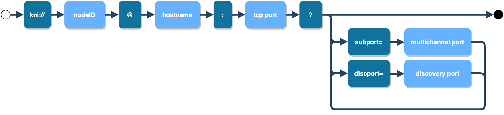

# KNI <a id="KNI"></a>

**KNI (Klaytn Network Identifier)** is a URL scheme to identify a Klaytn node. Its syntax is shown below:
```
kni://<nodeID>@<hostname>:<port>?subport=<subport>&discport=<discport>
```


**nodeID** is a random hexadecimal string and is in the username part of an URL. The private key of the node is derived from the nodeID.

**hostname** describes the address of a node, located between `@` and `:`. The address format can be one of the following:
* IPv4 dotted decimal (`192.0.2.1`)
* IPv6 (`[2001:db8::68]`)
* IPv4-mapped IPv6 (`[2001:db8:3c4d:15::abcd:ef12]`)
* Domain name (`your.node.com`)

**TCP listening port** is used to make connections with peer nodes. Depending on the number of TCP listening ports, Klaytn offers two types of connections.
* Single Channel : a single-channel server uses one port. The port is placed at the end of hostname
* Multi Channel: a multi-channel server uses two ports. The ports can be specified in hostname and by `subport` query parameter. In Klaytn, the default port number is 32323 and the default subport number is 32324.
    * You might not set `subport` when connecting to multi-channel server.In this case, at first, a klaytn server tries to connect using single-channel. In handshake process, the actual peer's port numbers are revealed. If the peer server is using multi-channel, the server will cancel the ongoing connection and try to reconnect with the updated ports.

**UDP discovery port** is for searching new nodes and checking if the nodes are reachable.
By default, the UDP port uses the same port with the TCP port.
If the UDP port differs from TCP port, the UDP port can be set using `discport` query parameter.

The following two URLs shows an example of IP address `10.0.0.1` and TCP listening port `32323` and `32324`.
The omitted UDP discovery port is set to `32323`, same as the main TCP port.
```
kni://a979...163c@10.0.0.1:32323                 # either single-channel or multi-channel peer with omitted subport
kni://a979...163c@10.0.0.1:32323?subport=32324   # multi-channel peer
```

The next two examples shows UDP discovery port of `30301`.
```
kni://a979...163c@10.0.0.1:32323?discport=30301                 # either single-channel or multi-channel peer with omitted subport
kni://a979...163c@10.0.0.1:32323?subport=32324&discport=30301   # multi-channel peer
```

A kni address can be generated by [Node Key & Node URI Creation](../../node/core-cell/installation-guide/before-you-install.md#node-key-node-uri-creation).
The kni scheme is used in node discovery protocol, [setting `static-nodes.json` file](../../node/core-cell/installation-guide/proxy-node-setup/configuration.md#install-static-nodes-json), [addPeer API](../../bapp/json-rpc/api-references/admin.md#admin_addpeer), [bootnodes option](../../node/endpoint-node/operation-guide/configuration.md#properties) and etc.
