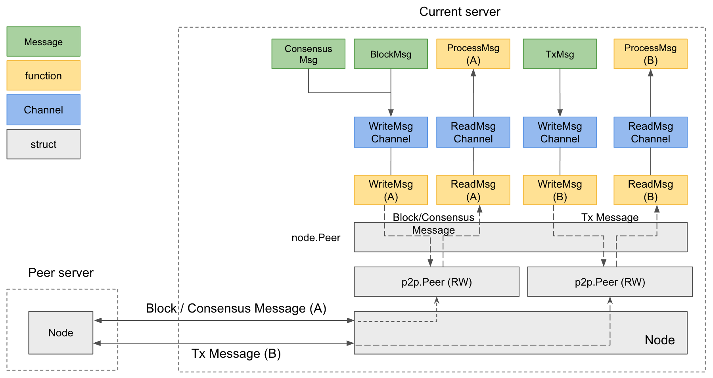
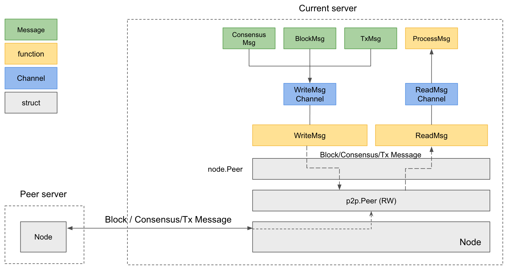

# Multichannel 

A Klaytn node can be run with Multichannel.
When 2 nodes are connected with Multichannel, they use 2 ports for communication.

Depending on the number of [TCP listening ports](./kni.md), the connection differs. If 2 ports are enabled, multichannel is used. If a port is used, single channel is applied.
If you use `kend.conf`, a multi channel is used in default.
Currently, only one `subport` is supported at max.

## Architecture 

The picture above shows a connection between two multichannel servers.
Two ports, mainport(A) and subport(B), are used in different ways.
* **Mainport**(A) is used to transfer block and consensus messages.
  * Block message includes request and response of block hash, header, body and receipt.
  * Consensus message includes Request, Preprepare, Prepare, Commit and RoundChange. The meaning of messages can be found in [PBFT](./consensus-mechanism.md#pbft-practical-byzantine-fault-tolerance).
* **Subport**(B) is for transferring transaction message.

The picture shows a connection between two single channel servers or between a single channel server and a multi channel server.
In this case, all messages including Block, Transactions, Consensus are transported via the same port.

## Ports  

* Single Channel : a single-channel server uses one port. The port is placed at the end of hostname
* Multi Channel: a multi-channel server uses two ports. The ports can be specified in hostname and by `subport` query parameter. In Klaytn, the default port number is 32323 and the default subport number is 32324.
    * You might not set `subport` when connecting to multi-channel server.In this case, at first, a klaytn server tries to connect using single-channel. In handshake process, the actual peer's port numbers are revealed. If the peer server is using multi-channel, the server will cancel the ongoing connection and try to reconnect with the updated ports.
    