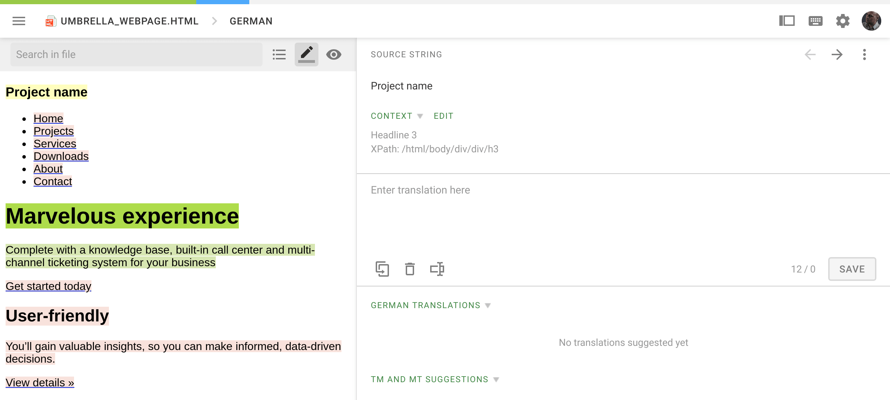

# Languages 

KlaytnDocs is available in the following languages:

- [English](https://docs.klaytn.com)
- [한국어](https://ko.docs.klaytn.com)

## Get involved! 

If you are native in a language and are willing to contribute to translate 
or to improve the quality of the localized documents, 
see [the list of languages currently being translated](https://crowdin.com/project/klaytn-docs).

### How to contribute KlaytnDocs localization via Crowdin  

Crowdin is a web service for collaborative translation. To contribute to localization, please follow these steps: 

- Go to [Klaytn-Docs project at Crowdin](https://crowdin.com/project/klaytn-docs).

- Create an account there.

- Select the language you want to contribute. Can not find your language? Please write a line to the project owner to initiate a new language translation.

- Join the translator team. Wait until one of the managers approves your request. 

- Choose the file you want to contribute. 

- You can submit your translation for a string, vote for a translation, or leave a comment. When you submit a translation, please make sure your word choice conforms to the Klaytn Terminologies. 

  

For detailed usage guidelines for the online-editor, please refer to the official [Crowdin document](https://support.crowdin.com/online-editor/). 

Translation suggestions will be reviewed and approved by the managers in a couple of days, then, will be made available to the web site. The list of localized web sites are listed above.

### Discussion  
Join the [discussion board](https://crowdin.com/project/klaytn-docs/discussions) and meet the fellow contributors.

### Leaderboard 

Huge thanks to our [top contributors](https://crowdin.com/project/klaytn-docs/reports)❤️

Top Members: ~ 2019/12/18

| Name                           | Languages | Translated Words | Target Words | Approved Words | Votes | 
|--------------------------------|-----------|--------------------|--------------|------------------|-------| 
| [Chris (klaytn.docs)](https://crowdin.com/profile/klaytn.docs)     | Korean    | 46106     | 34980     | 15561       | 0  | 
| [Guillaez (guillaez)](https://crowdin.com/profile/guillaez)   | Korean    | 31939    | 25028    | 61   | 1     | 
| [박상현 / 학생 / 전기·정보공학부 (twodude)](https://crowdin.com/profile/twodude) | Korean  | 28276 | 21756  | 0  | 0  | 
| [Kyle Jung (universale0723)](https://crowdin.com/profile/universale0723)  | Korean  | 22074 | 15907  | 64490 | 0  | 
| [Blue (skqksh)](https://crowdin.com/profile/skqksh)     | Korean    | 198     | 140     | 0       | 0  | 
| [김정현(Colin) (colin.kim)](https://crowdin.com/profile/colin.kim) | Korean    | 36    | 29     | 0       | 0  | 
| [SeBae](https://crowdin.com/profile/Sebae)     | Korean    | 16     | 14     | 0       | 0  | 

### Code of conduct 
 
Please be respectful to fellow community members. Project managers may delete any offensive posts or comments without notice and reserve the right to revoke the membership.  

 
