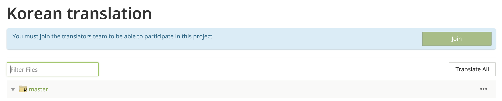
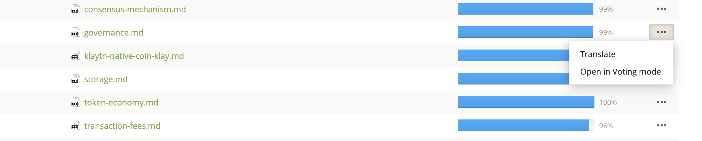

# Languages

KlaytnDocs is available in the following languages:

- [English](https://docs.klaytn.com)
- [한국어](https://ko.docs.klaytn.com)

## Get involved!

If you are native in a language and are willing to contribute to translate 
or to increase the quality of the localized documents, 
see [the list of languages currently being translated](https://crowdin.com/project/klaytn-docs).   

### How to contribute KlaytnDocs localization via Crowdin

Crowdin is a web service for collaborative translation. To contribute to localization, please follow these steps: 
1. Go to [Klaytn-Docs project at Crowdin](https://crowdin.com/project/klaytn-docs).

1. Create an account there.

1. Select the language you want to contribute. Can not find your language? Please write a line to the project owner to initiate a new language translation.

1. Join the translators team. Wait until one of the managers approves your request.

1. Choose the file you want to contribute.

1. You can either submit your translation for a string, vote for a translation, or leave a comment. When you make a translation suggestion, please make sure your word choice conforms to the Klaytn Glossary.   

  

For detailed usage guidelines for the online-editor, please refer to the official [Crowdin document](https://support.crowdin.com/online-editor/). 

Translation suggestions will be reviewed and approved in a couple of days, then, will be made available to the web site. If you are interested in becoming a proofreader or a project manager, please contact one of the project managers. The web site for each language is listed above.

### Discussion 
Join the [discussion board](https://crowdin.com/project/klaytn-docs/discussions) and meet the fellow contributors.

### Leaderboard

Many thanks to our [top contributors](https://crowdin.com/project/klaytn-docs/reports):heart:.

### Code of conduct
 
Please be respectful to fellow community members. Project managers may delete any offensive posts or comments without notice and reserve the right to revoke the membership.  

 
