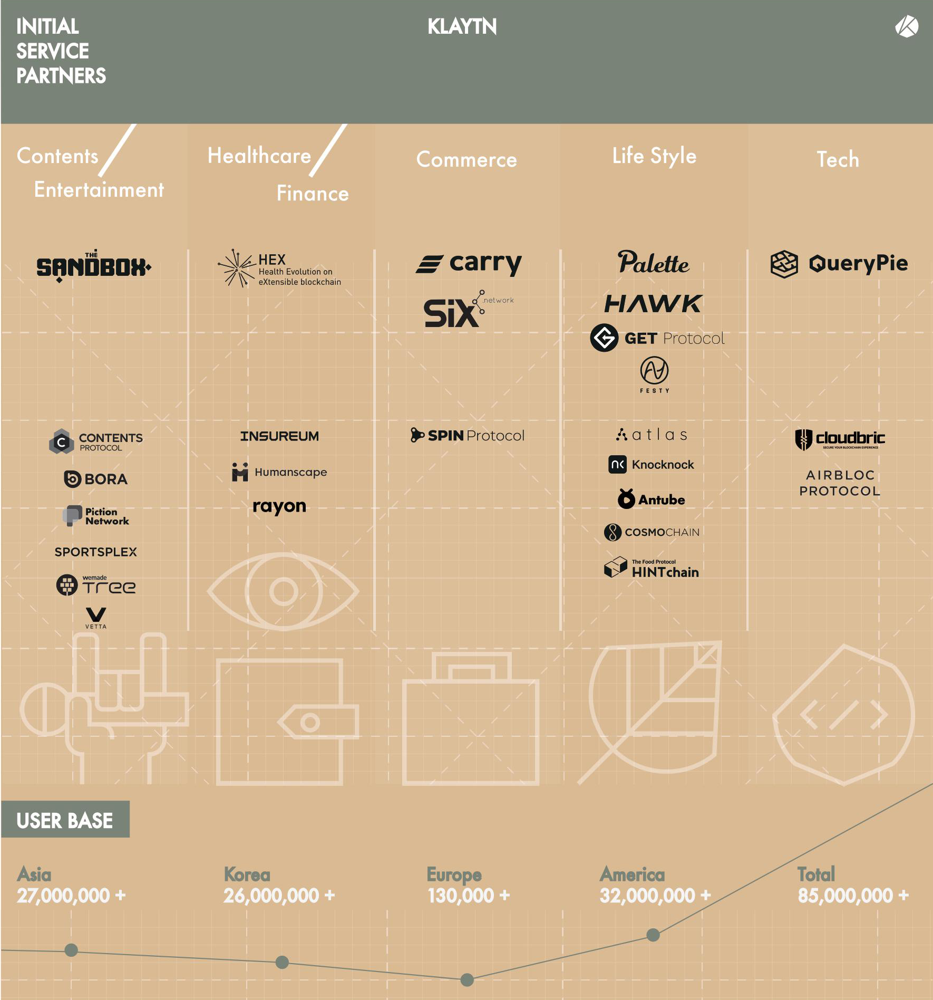

The service that will be onboard within a certain period of time(within 3-6 months) after Klaytn Mainnet opens is called Initial Service Partner(ISP) and it plays an important role in Klaytn ecosystem. Since 2018, we have boarded stable service partners of good quality that can make real use cases while operating an ISP partnership program. Reviewing universal blockchain service and interviewing individually more than 300 projects excluding the projects about gambling or speculation, about 40 service partners have been secured until now. They extend to 13 different countries globally and one-third of them are services of the region other than Korea. The picture below shows about 40 ISPs that have been secured until Klaytn Mainnet launching period.

The ISP selection standard is very strict. First, service providers that have blockchain-based services with a user base were preferentially selected. And only the services that can provide real use value to ordinary users were selected and we tried hard to select various areas of service evenly. Meaningful services are lined up across various fields like gaming, entertainment, healthcare, finance, commerce, payment, and lifestyle. And there are places that use KLAY instead of publishing their own token among service partners and they are called KLAY BApps. Now there are more kinds of game and they are expanding their range.

Especially there are lots of cases that Korean ISPs are reverse blockchain projects of enterprises that do big scale business in Korea. They are Wemade Tree (Wemade), Contents Protocol(Watcha), Carry Protocol(Spoqa), Cosmochain(Huiseoul), Spin Protocol(Womanstalk) and are aggressively carrying forward their blockchain business. Also, PASSPORT(Hi) is a Hongkong unicorn company that is preparing big scale blockchain based business and selected Klaytn as the platform. Like this, most ISPs are more of places that secured business bases than starting from zero base and their user base acquisition into Klaytn and is expected to make synergy from each other.

About 40 ISPs are prepared at the period of Mainnet launch and until the end of 2019, it aims to expand to 100. If it is the strategical effort of Klaytn for ISPs to onboard good quality service, BApp will voluntarily come up after Mainnet. To support them, Klaytn Hackathon and Klaytn Horizon (BApp Competition) program are provided. Through these programs, Klaytn BApp will be abundant qualitatively and quantitatively. Here critically, PoC (Proof of Contribution) program that can support Klaytn BApp financially is inherent in Klaytn itself. Depending on the level of contribution to Klaytn network, KLAY is given as compensation to BApps. Therefore, competent BApps can earn a separate profit while operating service at Klaytn.
