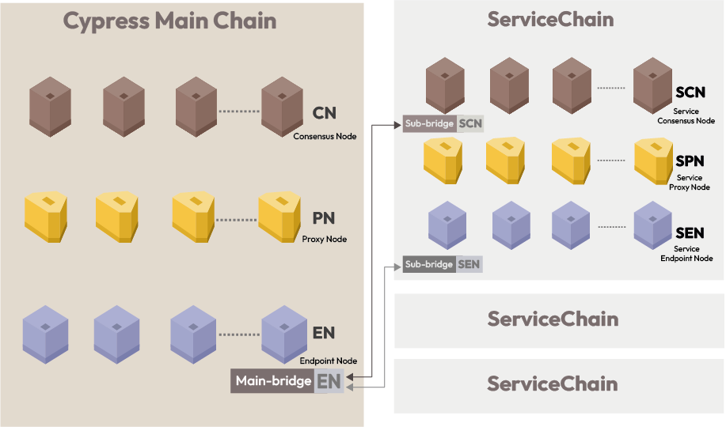

# Reference Manuals

## Intended Audience 

* Companies that want to build blockchains for Metaverse, GameFi, and NFTs
* dApp developers who need high TPS, minimal transaction fees, and data privacy.
* Anyone who wants to build a local private network or a ledger database for testing.

## ServiceChain Overview 

ServiceChain is an enterprise-level blockchain to meet companies' requirements such as value transfer, security, high performance, and customization. Klaytn ServiceChain provides the following features:

* Immediate finality
* Token transfer between Klaytn chains
* Data anchoring to the main chain for data integrity
* Multi-sig bridge contract to meet enterprise-level security requirements

Read the [Klaytn Scaling Solution](../../../../../installation-guide/deployment/klaytn/scaling-solutions.md) for more details about the ServiceChain. And the following videos will help you understand Klaytn ServiceChain.

* [Horizontal Scaling through Service Chain in Klaytn | TXGX 2019](https://www.youtube.com/watch?v=8yQc5FQysJc)
* [High Availability Architecture of Klaytn Service Chain | TXGX 2019](https://www.youtube.com/watch?v=HcdhWtXPuR0)
