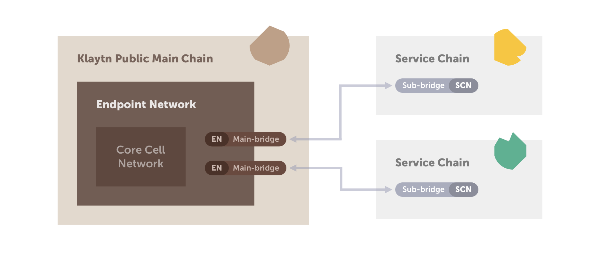

# Service Chain

## Intended Audience

- BApp operators who need high TPS, minimal transaction fees, or data privacy.  

## Service Chain Overview

Klaytn Service Chain provides the following features.

- Immediate finality. 
- Cross-chain token transfer.
- Data anchoring to the main chain.
- Multi-sig bridge contract to meet enterprise security requirements.

Read the [Klaytn Scaling Solution] for more details about the Service Chain.
