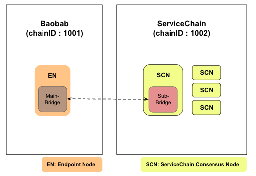
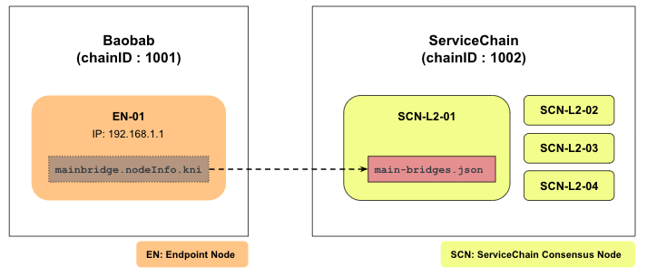
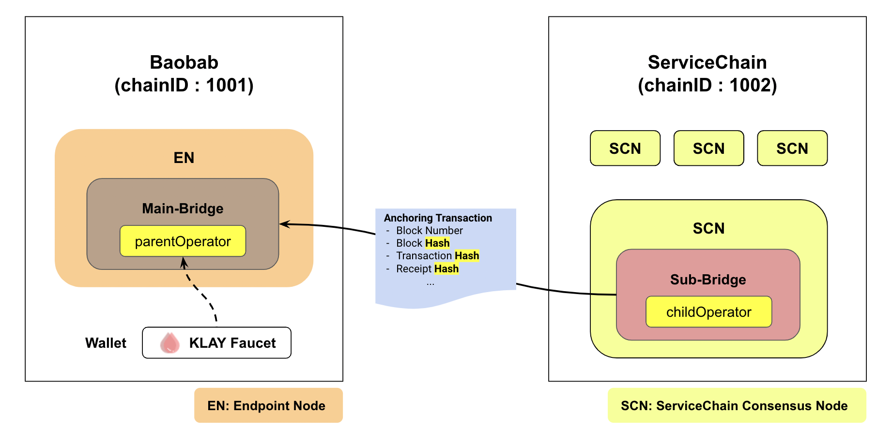
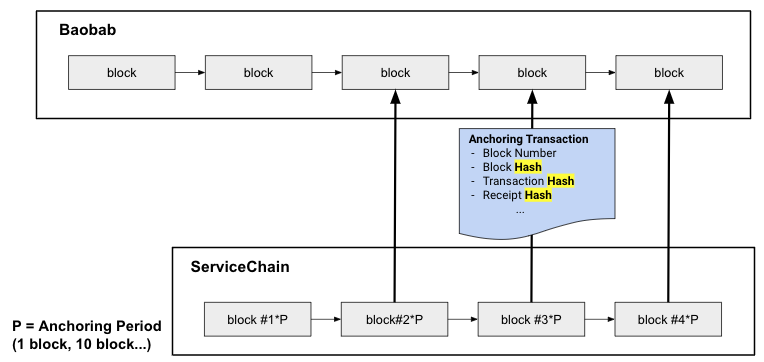

This section covers how to connect your 4-node ServiceChain to the Baobab network.
You will set up a Baobab EN and connect the EN with one of your SCNs. Then you will enable the Anchoring feature to write ServiceChain block information on Baobab network.



## Prerequisites <a id="prerequisites"></a>
 - 1 Linux or MacOS server for EN
 - Minimum hardware requirements for testing
   - CPU: 4-core (Intel Xeon or equivalent), RAM: 16GB, HDD: 50GB
   - Please refer to the [System Requirements](../references/system-requirements.md) for more explanation.
 - Download the Baobab EN executable. For the full list of downloadables, see [Download](../../download/README.md).
 - Assumptions and Limitations
   - ServiceChain is installed and running.([link](4nodes-setup-guide.md))
   - EN connects to Baobab testnet.
   - One EN can only have one SCN one-to-one connection.
   - Not every SCN has to connect to the EN.

## Step 0: Install Baobab EN <a id="install-baobab-en"></a>
The installation is the uncompression of the downloaded package. Extract the archive on the EN server.

```bash
$ tar xvf ken-baobab-vX.X.X-XXXXX-amd64.tar.gz
```

## Step 1: Preparing genesis.json <a id="step-1-preparing-genesis-json"></a>
From the EN server, download the `genesis.json` for `Baobab` network.
```
$ curl -X GET https://packages.klaytn.net/baobab/genesis.json -o ~/genesis.json
```

## Step 2: EN Node Initialization <a id="step-2-en-node-initialization"></a>
Now, we will initialize the EN node using the genesis file. Execute the following command.
It will create the data folder storing the chain data and logs on your home directory.
You can change the data folder using the `--datadir` directive.

```
$ ken --datadir ~/data init ~/genesis.json
```

## Step 3: Configure the EN Node <a id="step-3-configure-the-en-node"></a>
Go to the ken installation folder and rename `mv kend_baobab.conf kend.conf`, then edit `conf/kend.conf` as follows.

```
...
NETWORK="baobab"
...
SC_MAIN_BRIDGE=1
...
DATA_DIR=~/data
...
```

## Step 4: Start the EN Node <a id="step-4-start-the-en-node"></a>
```
$ kend start
Starting kscnd: OK
```
You can check block sync status by watching `klay.blockNumber`. If this number is not 0, the node is working fine. Downloading all blocks on the Baobab network may take a long time depending on network conditions and hardware performance, so we recommend using [Fast Sync](https://docs.klaytn.com/node/endpoint-node/installation-guide/configuration#fast-sync-optional) to synchronize blocks. 
```
$ ken attach --datadir ~/data
> klay.blockNumber
21073
```
If you want to stop a node, you can use the command `kend stop`

## Step 5: Check KNI of EN Node <a id="step-5-check-kni-of-en-node"></a>
Take note of EN's KNI which is the information used to connect from an SCN node. This value will be used in the next step when generating `main-bridges.json`
```
$ ken attach --datadir ~/data
> mainbridge.nodeInfo.kni
"kni://0f7aa6499553...25bae@[::]:50505?discport=0"
```



## Step 6: Create main-bridges.json <a id="step-6-create-main-bridges-json"></a>
Log on to an SCN (note: not the EN node) and create `main-bridges.json` on `~/data`. Replace `[::]` located after `@` letter with EN node's IP address.
```
$ echo '["kni://0f7aa6499553...25bae@192.168.0.5:50505?discport=0"]' > ~/data/main-bridges.json
```

## Step 7: Configure SCN then Reboot <a id="step-7-configure-scn-then-reboot"></a>
From the SCN node's shell, edit `kscn-XXXXX-amd64/conf/kscnd.conf`.
If `SC_SUB_BRIDGE` is set to 1, data anchoring starts automatically when the SCN node starts. In this example, `SC_PARENT_CHAIN_ID` is set to 1001 because the `chainID` of the parent chain, Baobab, is 1001.
`SC_ANCHORING_PERIOD` is the parameter that decides the period to send an anchoring tx to the main chain. By setting the value to 10, you configure the node to perform anchoring every 10 blocks. The default value is 1.
```
...
SC_SUB_BRIDGE=1
...
SC_PARENT_CHAIN_ID=1001
...
SC_ANCHORING_PERIOD=10
...
```

Reboot the SCN node
```
$ kscnd stop
Shutting down kscnd: Killed
$ kscnd start
Starting kscnd: OK
```

Check if the SCN is connected to the EN by checking `subbridge.peers.length`
```
$ kscn attach --datadir ~/data
> subbridge.peers.length
1
```

## Anchoring  <a id="anchoring"></a>
After finishing the EN and SCN connection, you can log ServiceChain block information on the parent chain via Anchoring.
In this section, you will top up a parent operator account, enable Anchoring, and check the anchored block number.

### Step 1: Get KLAY to test anchoring <a id="step-1-get-klay-to-test-anchoring"></a>
To do an anchoring, SCN has to make an anchoring transaction to Baobab. So `subbridge.parentOperator` account should have enough KLAY to pay the transaction fee. Get some KLAY from [Baobab Wallet Faucet](https://baobab.wallet.klaytn.com/) and transfer 5 KLAY to the `subbridge.parentOperator`. For data anchoring in real service, parentetOperator needs to have enough KLAY for transaction fee.
```
$ kscn attach --datadir ~/data
> subbridge.parentOperator
"0x3ce216beeafc62d20547376396e89528e1d778ca"
```


### Step 2: Start Anchoring <a id="step-2-start-anchoring"></a>
```
$ kscn attach --datadir ~/data
> subbridge.anchoring(true)
true
```
After anchoring starts, you can check the latest block anchored to Baobab by using `subbridge.latestAnchoredBlockNumber`. Please note that this only works after the EN already followed up on the latest block of Baobab. By default, SCN tries anchoring on every block from the block on which anchoring is turned on. The anchoring period can be set by changing `SC_ANCHORING_PERIOD`. If the value is set to 10, the node tries anchoring when the block number is a multiple of 10.
```
$ kscn attach --datadir ~/data
> subbridge.latestAnchoredBlockNumber
100
```

