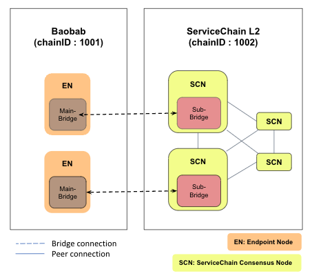
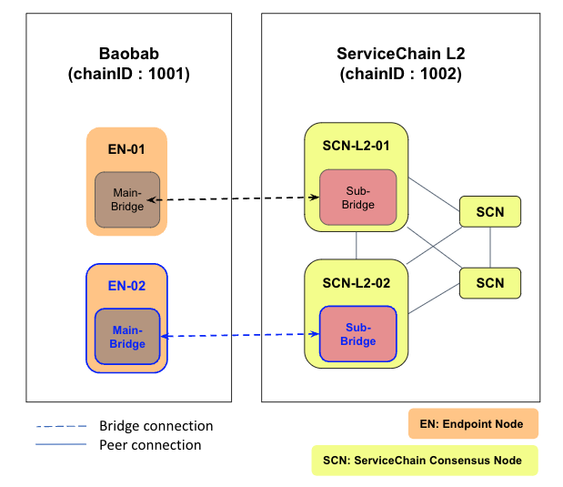
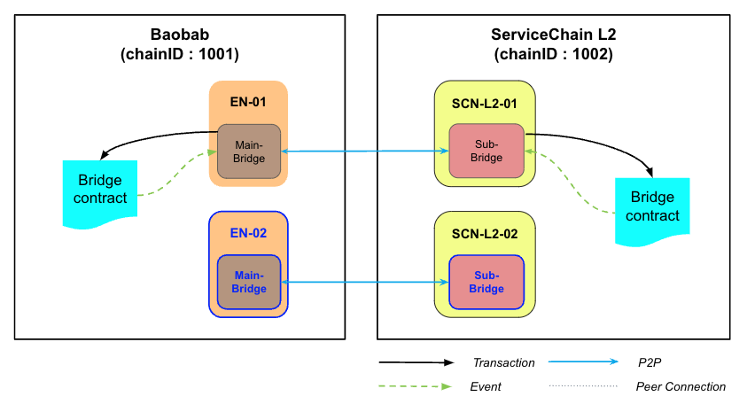
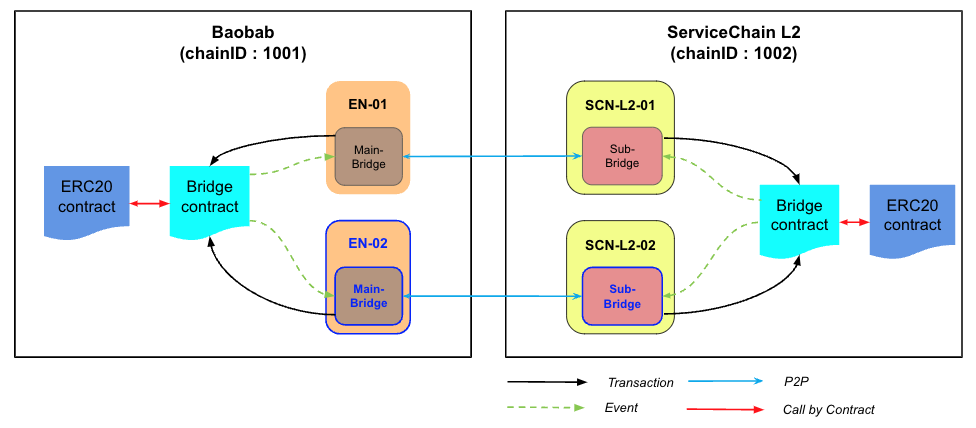

If only a pair of bridges are used in the ServiceChain, that bridge can become a single point of failure. To solve this, we describe how you can build an HA system with two or more pairs of bridges. As shown in the figure below, configure the bridges to be connected in at least two pairs, so that even if there is a problem in one bridge connection, data anchoring and value transfer between chains work normally through the other bridge.




## Prerequisites <a id="prerequisites"></a>
 - The main bridge of EN node and the subbridge pair of SCN node are connected.
 - This section describes how to add a bridge between Baobab and ServiceChain L2. In the same way, you can also set up HA by adding a bridge even between ServiceChains.

## Step 1: Add bridge between EN-SCN <a id="step-1-add-bridge-between-en-scn"></a>

In the previous [Baobab connection](./en-scn-connection.md), if we define the EN node and the SCN node connected by a bridge as EN-01 and SCN-L2-01, respectively, in this section, we will add a bridge between EN-02 and SCN-L2-02, which is the part marked in blue. 
Since it follows the same procedure, we will briefly explain.




After building the new EN-02 node, set `SC_MAIN_BRIDGE` to 1 in `conf/kend.conf` and restart the EN-02 node.

```console
SC_MAIN_BRIDGE=1
```

Check KNI information of EN-02 node. 


```console
$ ken attach --datadir ~/data
> mainbridge.nodeInfo.kni
"kni://eb8f21df10c6562...25bae@[::]:50505?discport=0"
```

Connect to SCN-L2-02 node, and create main-bridges.json.


```console
$ echo '["kni://eb8f21df10c6562...25bae@192.168.0.5:50505?discport=0"]' > ~/data/main-bridges.json
```

From the SCN node's shell, edit `kscn-XXXXX-amd64/conf/kscnd.conf`.
To connect a bridge, set `SC_SUB_BRIDGE` to 1.
`SC_PARENT_CHAIN_ID` is set to Baobob's `chainID` 1001. 
`SC_ANCHORING_PERIOD` is the parameter that decides the period to send an anchoring tx to the main chain. 
```
...
SC_SUB_BRIDGE=1
...
SC_PARENT_CHAIN_ID=1001
...
SC_ANCHORING_PERIOD=10
...
```


If you reboot EN node, a bridge is connected between the EN-02 and the SCN-L2-02 and data is anchored as shown in the figure below.



## Step 2: Register and Subscribe to the Bridge Contract <a id="step-2-register-bridge-contract"></a>

As shown in the figure above, only one bridge between EN-01 and SCN-L2-01 has registered a bridge contract.

Connect to the SCN-L2-02 console and run the APIs for bridge registration, bridge subscription, and token registration, which were created while deploying the Bridge Contract with EN-01 and SCN-L2-01 in step 2 of the previous section([link](./value-transfer.md)).

```
$ kscn attach --datadir ~/data
> subbridge.registerBridge("0x5f093de8a1b1d32Fc4cF6F40357DCcD24453BAb3", "0xD1C4808960Fb4581b9A5B3B217b9a67057D84c19")
null
> subbridge.subscribeBridge("0x5f093de8a1b1d32Fc4cF6F40357DCcD24453BAb3", "0xD1C4808960Fb4581b9A5B3B217b9a67057D84c19")
null
> subbridge.registerToken("0x5f093de8a1b1d32Fc4cF6F40357DCcD24453BAb3", "0xD1C4808960Fb4581b9A5B3B217b9a67057D84c19", "0x96272131600EC7c64c45CE139C32F4919fBFaDC8", "0xc7858a153376764208e8F6B6B55B4a0792B67c3E")
null
```

When registration is completed, a bridge between EN-02 and SCN-L2-02 is added as shown in the figure below to configure HA.


