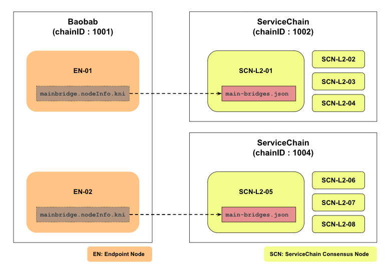
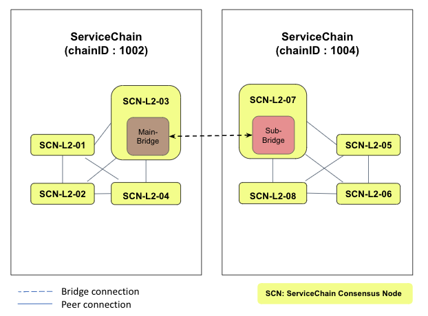

This section will explain how to enable ERC-20 value transfer between servicechain newtorks.
You will add KLAY to the operator account and deploy bridge and ERC-20 contracts. 
Then you will register the contract address on SCN. And you will test an ERC-20 value transferring.


## Prerequisites <a id="prerequisites"></a>
- We assume that you installed two ServiceChains, Each servicechain is connected to the baobab EN. Refer to [Connecting to Baobab](en-scn-connection.md).
- We also assume that you have experienced value transfer through [Cross-Chain Value Transfer](value-transfer.md). 





Repeat [Connecting to Baobab](en-scn-connection.md) as shown in the picture above to additionally install ServiceChain (chianID 1004).


## Step 1: Check KNI of SCN-L2-03 Node <a id="step-1-check-kni-of-scn-node"></a>
Take note of SCN-L2-03's KNI which is the information used to connect from an SCN node. This value will be used in the next step when generating `main-bridges.json`



```
$ kscn attach --datadir ~/data
> mainbridge.nodeInfo.kni
"kni://...39047242eb86278689...@[::]:50505?discport=0"
```

## Step 2: Create main-bridges.json <a id="step-2-create-main-bridges-json"></a>
Log on to an SCN-L2-07 (note: chianID 1004) and create `main-bridges.json` on `~/data`. Replace `[::]` located after `@` letter with EN node's IP address.
```
$ echo '["kni://...39047242eb86278689...@192.168.0.3:50505?discport=0"]' > ~/data/main-bridges.json
```

## Step 3: Configure SCN then Reboot <a id="step-3-configure-scn-then-reboot"></a>
From the SCN-L2-07 node's shell, edit `kscn-XXXXX-amd64/conf/kscnd.conf`. Since each ServiceChain already anchored with the Baobab EN, data anchoring between sibling is not required.

```
...
SC_SUB_BRIDGE=1
...
SC_PARENT_CHAIN_ID=1002
...
SC_ANCHORING=0
...
```

Reboot kscnd on SCN-L2-07 node
```
$ kscnd stop
Shutting down kscnd: Killed
$ kscnd start
Starting kscnd: OK
```

Check if the SCN-L2-07 is connected to the SCN-L2-03 by checking `subbridge.peers.length`
```
$ kscn attach --datadir ~/data
> subbridge.peers.length
1
```

In the case of value transfer, if the information corresponding to chainID 2 is used as the mainbridge information and the information corresponding to chainID 4 is set as a subbridge, value transfer is possible between siblings as in the previous value transfer example.
