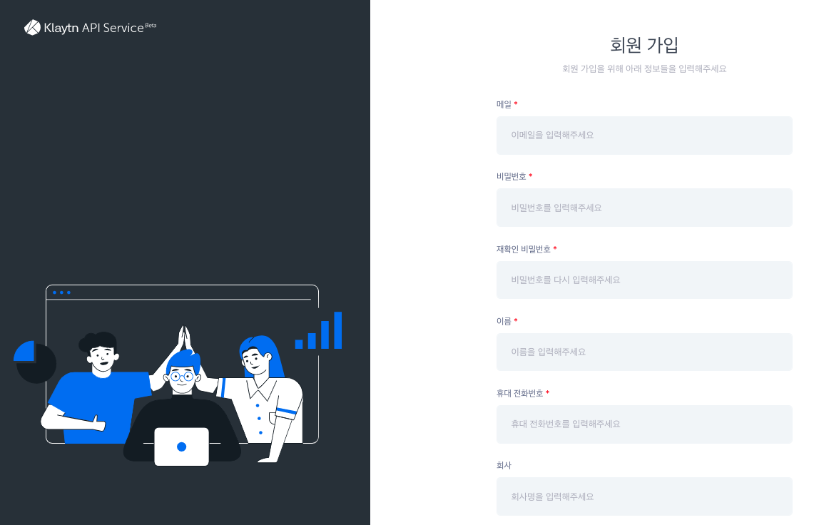
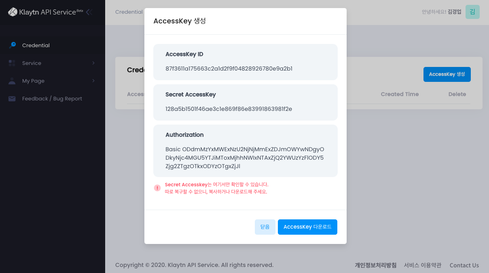
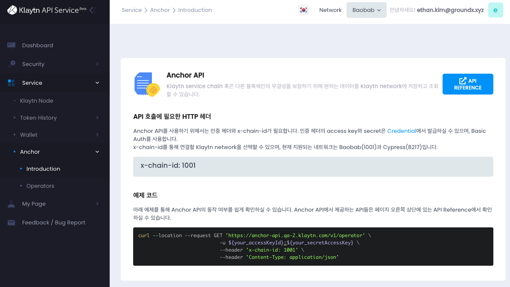
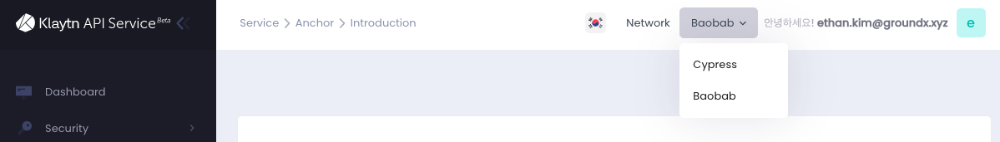
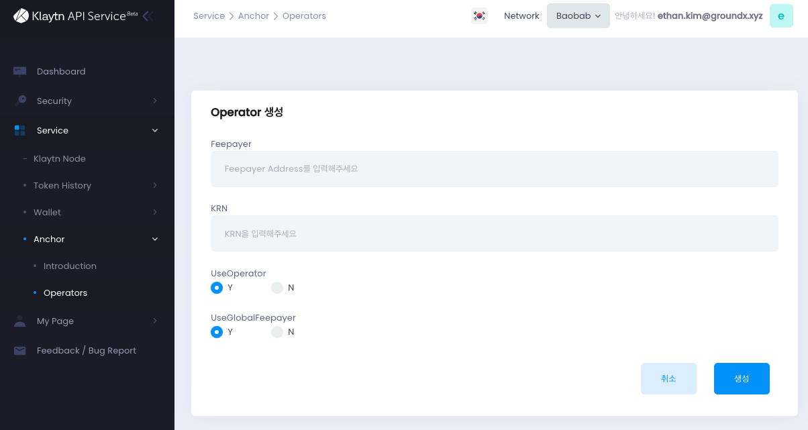
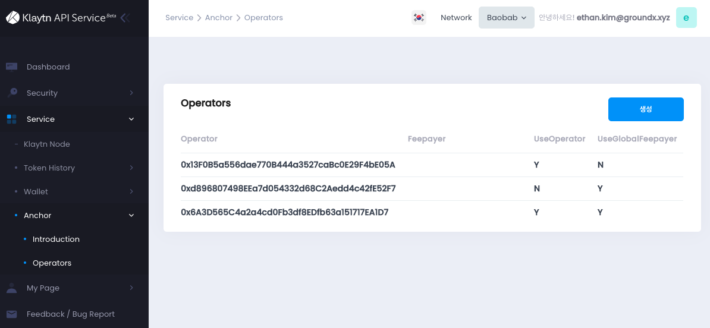
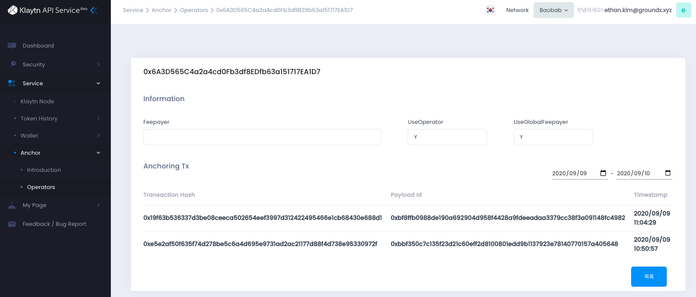

As explained in the design section, Service Chain supports the data anchoring feature.
This page shows how to enable the anchoring function via KAS (Klaytn API Service, https://www.klaytnapi.com).

If it is enabled, Service chain node can anchor periodically the service chain block data to Cypress or Baobab as proof of existence and immutability. 
This ensures the security and credibility of the service chain.

# Preparation with KAS <a id="preparation-with-kas"></a>
This section shows how to prepare with KAS website for anchoring via KAS.

## Register KAS (Klaytn API Service) <a id="register-kas"></a>
First, you need to register KAS on the [KAS console website](https://www.klaytnapi.com) to get the KAS account.
Visit the website and register your own account.

[](https://www.klaytnapi.com)

[](https://www.klaytnapi.com)

## Create credential <a id="check-credential"></a>
After login, you can create your credential like below.
The `AccessKey ID`, `Secret AccessKey`, and `Authorization` will be used to call KAS APIs.
Please note securely the information. 



## Anchor API <a id="anchor-api"></a>
To anchor via KAS, your service chain node will use Anchor API below.
Please refer the API reference and examples.



## Create operator address <a id="create-kas-credential"></a>
Before you sets up the service node, you need to create an operator address in KAS console.
Please select the chain where you want to anchor. 
You can create an operator for each chain (Cypress/Baobab).

Note that you cannot share operators for both chains.



Then you can create operator like below.



After then, you can check your operator list like below.
Please note an operator address for setting your service chain node.



## Configure Service chain node <a id="configure-service-chain-node"></a>
Now, you are ready to set up your service chain node.
You need to edit the configuration file (`kscnd.conf`, `kspnd.conf`, `ksend.conf`) of your service chain node like below.

You should set `SC_SUB_BRIDGE=1` and all `SC_KAS_` prefix items.

```bash
...
# service chain options setting
...
SC_SUB_BRIDGE=1
...

SC_KAS_ANCHOR=1                                                         # 1: enable, 0: disable
SC_KAS_ANCHOR_PERIOD=10                                                 # Anchoring block period
SC_KAS_ANCHOR_URL="https://anchor-api.klaytn.com/v1/anchor"             # Anchor API URL
SC_KAS_ANCHOR_OPERATOR="0x6A3D565C4a2a4cd0Fb3df8EDfb63a151717EA1D7"     # Operator address
SC_KAS_ANCHOR_ACCESS_KEY="KAJM4BEIR9SKJKAW1G3TT8GX"                     # Credential Access key
SC_KAS_ANCHOR_SECRET_KEY="KyD5w9ZlZQ7ejj6lDF6elb61u8JH/mXdKqhgr3yF"     # Credential Secret key
SC_KAS_ANCHOR_X_CHAIN_ID=1001                                           # Cypress: 8217, Baobab: 1001
...
```

## Run Service chain node <a id="run-service-chain-node"></a>
All preparation finished, you can run your own service chain node.
Then you can see the log message related with KAS anchor API like below.

```bash
...
INFO[09/10,18:09:28 +09] [5] Imported new chain segment                number=86495 hash=5a20d6…cbca1b blocks=1  txs=3 elapsed=2.387ms  trieDBSize=5.10kB mgas=0.063 mgasps=26.383
INFO[09/10,18:09:28 +09] [53] Anchored a block via KAS                  blkNum=86495
INFO[09/10,18:09:29 +09] [5] Imported new chain segment                number=86496 hash=8897bc…4ea7e7 blocks=1  txs=3 elapsed=2.158ms  trieDBSize=5.10kB mgas=0.063 mgasps=29.188
INFO[09/10,18:09:29 +09] [53] Anchored a block via KAS                  blkNum=86496
INFO[09/10,18:09:30 +09] [5] Imported new chain segment                number=86497 hash=44b319…7d4247 blocks=1  txs=3 elapsed=2.346ms  trieDBSize=5.43kB mgas=0.063 mgasps=26.848
INFO[09/10,18:09:30 +09] [53] Anchored a block via KAS                  blkNum=86497
INFO[09/10,18:09:31 +09] [5] Imported new chain segment                number=86498 hash=0b98ba…73d654 blocks=1  txs=3 elapsed=2.235ms  trieDBSize=5.61kB mgas=0.063 mgasps=28.186
INFO[09/10,18:09:31 +09] [53] Anchored a block via KAS                  blkNum=86498
INFO[09/10,18:09:32 +09] [5] Imported new chain segment                number=86499 hash=4f01ab…3bc334 blocks=1  txs=3 elapsed=3.319ms  trieDBSize=5.61kB mgas=0.063 mgasps=18.977
INFO[09/10,18:09:32 +09] [53] Anchored a block via KAS                  blkNum=86499
...
```

## List of Transaction <a id="list-of-transaction"></a>
In KAS console website, you can retrieve all anchoring transaction which your service chain node required in operators menu like below.


