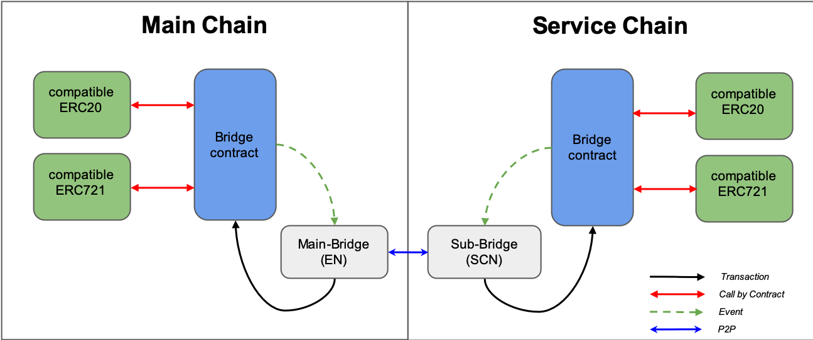

As explained in Design section, Service Chain supports value (KLAY, ERC20, and ERC721) transferring between parent chain & child chain.
This page shows how to setup value transferring feature in SCN.

After setup EN/SCN, the following brief procedure are needed to support value transferring between chains.

1. Check bridge operator account address and Charge bridge operator accounts.
2. Deploy bridge contracts on parent/child chain
3. Deploy token(ERC20/721) contract on parent/child chain (if needed)
4. Register token(ERC20/721) contracts on sub-bridge of SCN.
5. Subscribe bridge contracts on sub-bridge of SCN.

To explain the procedure, system architecture is introduced in the next section.

# System architecture
Figure 1 shows the system architecture of Service Chain with bridge/token contracts, and bridge nodes.

Below contracts communicate with each other via main/sub-bridge to process user's value transfer requests. 
- bridge contract
- ERC20 contract (if needed)
- ERC721 contract (if needed)



# Bridge operator account
For Service Chain, there are two operator accounts : parent chain account, service chain account. Each bridge operator is used to sign transactions for each chain.
When user makes request value transfer transactions, Sub-Bridge node makes handle value transfer transactions by signed bridge operator.
Therefore, parent chain bridge operator needs balance for gas fee of handle transactions. 
If service chain gas price is not zero, service chain bridge operator also needs the balance for gas fee.
  
## keystore and password file
When SCN is booted, parent/child operator keystore files and password files are automatically generated if keys don't exist. 
But if you want to set specific account key, you can set the below files before booting. 
The password file should have a password string of the keystore file.
The password file name is the account address of the corresponded keystore file. 

**files**
- keystore file : ```UTC--2019-10-21T04-05-41.493850000Z--2ed72a9d7fe5da7672fd21567e07302431649b0b```
- password file : ```0x2eD72a9D7fe5da7672fD21567e07302431649B0B```

**file path**
- Parent chain bridge operator : $datadir/parent_bridge_account
- Child chain bridge operator : $datadir/child_bridge_account

```javascript
>pwd
/$dataDIR/child_bridge_account

>ls
0x2eD72a9D7fe5da7672fD21567e07302431649B0B                                    
UTC--2019-10-21T04-05-41.493850000Z--2ed72a9d7fe5da7672fd21567e07302431649b0b

> cat 0x2eD72a9D7fe5da7672fD21567e07302431649B0B 
%S~f5qqM38cB47jL% 

cat UTC--2019-10-21T04-05-41.493850000Z--2ed72a9d7fe5da7672fd21567e07302431649b0b 
{"address":"2ed72a9d7fe5da7672fd21567e07302431649b0b","crypto":{"cipher":"aes-128-ctr","ciphertext":"6486509e8158bf4984608cbc5562cf2c9a27cd988a98e543731b39251144e633","cipherparams":{"iv":"96d7e5b6a936278c0797faae6cb3d903"},"kdf":"scrypt","kdfparams":{"dklen":32,"n":262144,"p":1,"r":8,"salt":"8928ba41b8228af19390ec881c51452fa3ea973ad2c253ca0f5bc9197a8b24c4"},"mac":"9c8ec63694c20a473e0ea33840e7d16e9f1a20afc52b3244b703a3ac0a66cfa3"},"id":"9ae10527-7fd3-4aae-a4eb-316af211494e","version":3}
```
## Check bridge operator addresses
If you run SCN successfully, you can check the parent/child chain bridge operator address vi RPC like the following.

```
$ kscn attach ~/kscnd_home/klay.ipc
Welcome to the Klaytn JavaScript console!

instance: Klaytn/vvX.X.X/XXXX-XXXX/goX.X.X

 datadir: ~/kscnd_home
 modules: admin:1.0 bridge:1.0 debug:1.0 governance:1.0 istanbul:1.0 klay:1.0 miner:1.0 net:1.0 personal:1.0 rpc:1.0 servicechain:1.0 txpool:1.0
 > bridge.parentOperator
 "0xA057995175B93Ee0D1bdfA54f078Ad0F0116130b"
 > bridge.childOperator
 "0x5C1C757a6Cb6c6FcEFE398674D8209FDA2A74Df4"
```

You can refer [subbridge API](../../bapp/json-rpc/api-references/subbridge.md#subbridge_parentOperator) more details.
  
## Charge KLAY to bridge operators
Like anchoring feature, you need to charge KLAY to parent chain bridge operator.
If your service chain gas price is not zero, you should also charge KLAY to service chain bridge operator,

After charging you can check the balance of parent/child chain bridge operator like below.

**Parent chain bridge operator**
```
$ kscn attach ~/kscnd_home/klay.ipc
Welcome to the Klaytn JavaScript console!

 instance: Klaytn/vvX.X.X/XXXX-XXXX/goX.X.X
 datadir: ~/kscnd_home
 modules: admin:1.0 bridge:1.0 debug:1.0 klay:1.0 miner:1.0 net:1.0 personal:1.0 rpc:1.0 txpool:1.0 web3:1.0

> subbridge.parentOperatorBalance
1e+50
```

**Child chain bridge operator**
```
$ kscn attach ~/kscnd_home/klay.ipc
Welcome to the Klaytn JavaScript console!

 instance: Klaytn/vvX.X.X/XXXX-XXXX/goX.X.X
 datadir: ~/kscnd_home
 modules: admin:1.0 bridge:1.0 debug:1.0 klay:1.0 miner:1.0 net:1.0 personal:1.0 rpc:1.0 txpool:1.0 web3:1.0

> subbridge.childOperatorBalance
1e+50
```
  
# Bridge contract
For value transferring, parent/child chain bridge contract should be deployed on each parent/child chain.
Users can request KLAY transfer to each bridge contract to send their KLAY to opposite chain.
Also, if token contracts are registered on the bridge contract, bridge contracts support token transferring between parent/child chain. 

## Deployment
Sub-bridge provides the bridge contract deploy API. You can deploy bridge contracts on both chain once via RPC like below.
Before this, you should connected main-bridge and sub-bridge first. Please check [Connection](./single-node-service-chain/installation-guide/connect-to-main-chain.md) again.

```javascript
$ kscn attach ~/kscnd_home/klay.ipc
Welcome to the Klaytn JavaScript console!

instance: Klaytn/vvX.X.X/XXXX-XXXX/goX.X.X

 datadir: ~/kscnd_home
 modules: admin:1.0 bridge:1.0 debug:1.0 governance:1.0 istanbul:1.0 klay:1.0 miner:1.0 net:1.0 personal:1.0 rpc:1.0 servicechain:1.0 txpool:1.0
 
> bridge.deployBridge()
["0x27caeba831d98b5fbb1d81ce0ed20801702f443a", "0x22c41ae528627b790233d2e59ea520be12350eb5"]

> bridge.listBridge
[{
    localAddress: "0x27caeba831d98b5fbb1d81ce0ed20801702f443a",
    remoteAddress: "0x22c41ae528627b790233d2e59ea520be12350eb5",
    subscribed: false
}]
```
You can refer [subbridge API](../../bapp/json-rpc/api-references/subbridge.md#deployBridge) more details.

Then, you can get the service/parent chain bridge contract address and check the status.
Sub-bridge save the list of bridge contract address on a file and after rebooting, it can reload the bridge contract list.  

## Subscribing
After deploying bridge contract, you should subscribe the deployed bridge contracts via RPC API to enable value transferring like below.

```javascript
> bridge.subscribeBridge("0x27caeba831d98b5fbb1d81ce0ed20801702f443a", "0x22c41ae528627b790233d2e59ea520be12350eb5")
null

> bridge.listBridge
[{
    localAddress: "0x27caeba831d98b5fbb1d81ce0ed20801702f443a",
    remoteAddress: "0x22c41ae528627b790233d2e59ea520be12350eb5",
    subscribed: true
}]
```

## Checking Status
After subscribing bridge contract pair, SCN can procedure user's request value transfer transactions automatically.
This section explain how to check the bridge contract status.

In a bridge contact, there are two nonces. Each nonce means like below.
- requestNonce : the request count number of user's value transfer request to this bridge contract from this chain to the opposite chain.
- lowerHandleNonce : the lower handle nonce of this bridge contract. It is the minimum nonce that the sub-bridge will handle.
- handleNonce : the upper handle count number of this bridge contract. It is the maximum handle nonce that the sub-bridge handled. 

Therefore, if nonces are updated like below, value transfer feature works well. 
- parent chain bridge contract's handle / lower handle nonce chase the request nonce of child chain bridge contract.
- child chain bridge contract's handle / lower handle nonce chase the request nonce of parent chain bridge contract.  

If a handle nonce is same with a request nonce of opposite bridge contract, all users' requests was processed.
 
### Log
SCN log shows the status like below.

```
INFO[05/31,18:32:19 +09] [45] broadcastServiceChainTx ServiceChainTxData  len(txs)=3    len(peers)=1
INFO[05/31,18:32:19 +09] [45] Bridge(Main -> Service Chain)             bridge=0x27caEbA831d98b5FBb1D81ce0Ed20801702f443A requestNonce=0 lowerHandleNonce=0 handleNonce=0 diffNonce=0
INFO[05/31,18:32:19 +09] [45] Bridge(Service -> Main Chain)             bridge=0x22c41Ae528627B790233D2e59Ea520be12350EB5 requestNonce=0 lowerHandleNonce=0 handleNonce=0 diffNonce=0
INFO[05/31,18:32:20 +09] [49] Successfully sealed new block             number=15009 hash=4a3085…dc1094
INFO[05/31,18:32:20 +09] [49] Successfully wrote mined block            num=15009 hash=4a3085…dc1094 txs=0
INFO[05/31,18:32:20 +09] [45] blockAnchoringManager: Success to generate anchoring txs  successCnt=1    startBlockNumber=15009 latestBlockNum=15009
INFO[05/31,18:32:20 +09] [49] Commit new mining work                    number=15010 txs=0 elapsed=867.499µs
INFO[05/31,18:32:20 +09] [45] broadcastServiceChainTx ServiceChainTxData  len(txs)=3    len(peers)=1
INFO[05/31,18:32:20 +09] [45] Bridge(Main -> Service Chain)             bridge=0x27caEbA831d98b5FBb1D81ce0Ed20801702f443A requestNonce=0 lowerHandleNonce=0 handleNonce=0 diffNonce=0
INFO[05/31,18:32:20 +09] [45] Bridge(Service -> Main Chain)             bridge=0x22c41Ae528627B790233D2e59Ea520be12350EB5 requestNonce=0 lowerHandleNonce=0 handleNonce=0 diffNonce=0
```

### RPC API 
You can check the status of a bridge contract by RPC API like below.
You can refer [subbridge API](../../bapp/json-rpc/api-references/subbridge.md#getBridgeInformation) more details.

```javascript
> bridge.getBridgeInformation("0x27caeba831d98b5fbb1d81ce0ed20801702f443a")
{
  counterPart: "0x22c41ae528627b790233d2e59ea520be12350eb5",
  handleNonce: 0,
  isRunning: true,
  isSubscribed: true,
  onServiceChain: true,
  pendingEventSize: 0,
  requestNonce: 0
}
``` 

# Token contract (ERC20/721)
Service Chain supports also ERC20/721 value transferring. 
To support them, service chain compatible ERC20/721 token contracts should be deployed on parent/child chain.
For more detail the service chain compatible ERC20/721 token contract code, 
you can refer [Token standard](../../smart-contract/token-standard.md). 

## Deployment 
SCN does not support to deploy ERC20/721 contract yet. But you can deploy service chain compatible ERC20/721 via Caver-js.
When you deploy service chain compatible ERC20/721, you should set the right bridge operator address to each token contracts.
If a token contract has wrong bridge contract address, value transferring will not work and you need to deploy right token contract again. 

## Register 
After deployment token contracts, you can register token contracts on sub-bridge via RPC like below.
```javascript
> bridge.registerToken("0x27caeba831d98b5fbb1d81ce0ed20801702f443a", "0x22c41ae528627b790233d2e59ea520be12350eb5", "0x376b72abe1b29cace831bd3f5acdfa967814c9cd", "0x53160735f7cc6ff75e48619f368bb94daff66a1b")
null
```

This command registers child chain token ("0x376b72abe1b29cace831bd3f5acdfa967814c9cd") and parent chain token ("0x53160735f7cc6ff75e48619f368bb94daff66a1b") to child chain bridge contract ("0x27caeba831d98b5fbb1d81ce0ed20801702f443a") parent chain bridge contract ("0x22c41ae528627b790233d2e59ea520be12350eb5").

You can refer [Service Chain API](../../bapp/json-rpc/api-references/subbridge.md#registerToken) more details.

# Request Value transfer
This section explains the method of contract for user to request value transfer.
All request transaction does not allow zero value (KLAY/ERC20).

## KLAY transfer
User can make request value transfer transaction to **bridge contract** by below methods.

### fallback
 
If user call the fallback function of bridge, this request KLAY transfer to same account address of user in opposite chain.

```solidity
function () external payable;
```

### requestKLAYTransfer

If user call this bridge contract function with `_to`, this request KLAY transfer to `_to` address in opposite chain.

```solidity
function requestKLAYTransfer(address _to, uint256 _value, bytes calldata _extraData) external payable
```

## ERC20 transfer

### 2-Step request via Bridge contract
User can make request value transfer transaction to Bridge contract by below method after approving the token to Bridge contract.
```solidity
function requestERC20Transfer(address _tokenAddress, address _to, uint256 _value,uint256 _feeLimit,bytes memory _extraData) external
```

### 1-Step request via ERC20 contract
User can make request value transfer transaction to **compatible ERC20 contract** by below methods without approving.
But to use this method, the ERC20 contract has the function. 

```solidity
function requestValueTransfer(uint256 _amount, address _to, uint256 _feeLimit, bytes calldata _extraData) external
```

## ERC721 transfer

### 2-Step request via Bridge contract
User can make request value transfer transaction to Bridge contract by below method after approving the token to Bridge contract.
```solidity
function requestERC721Transfer(address _tokenAddress, address _to, uint256 _tokenId, bytes memory _extraData) external
```

### 1-Step request via ERC721 contract
User can make request value transfer transaction to **compatible ERC721 contract** by below methods without approving.
But to use this method, the ERC20 contract has the function.

```solidity
function requestValueTransfer(uint256 _uid, address _to) external
```

# Collecting Fee for KLAY/ERC20 transfer
In Service Chain, there is collecting fee feature for KLAY/ERC20 transfer. 

**It will be updated soon.**  

# Customizing your Bridge contract 
In Service Chain, you can use your own customized Bridge contract inherited by original Bridge contract for your own unique service.
This section explain how to customize Bridge contract and show the example.

**It will be updated soon.**
  
