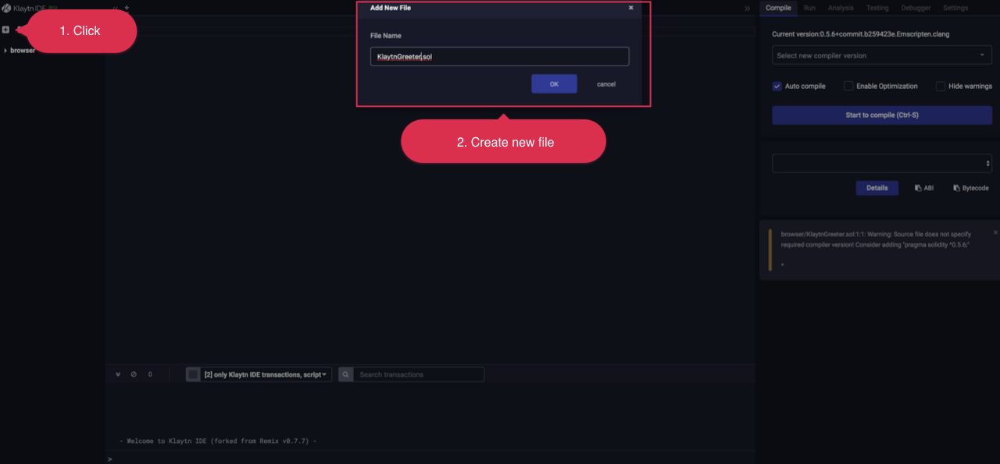
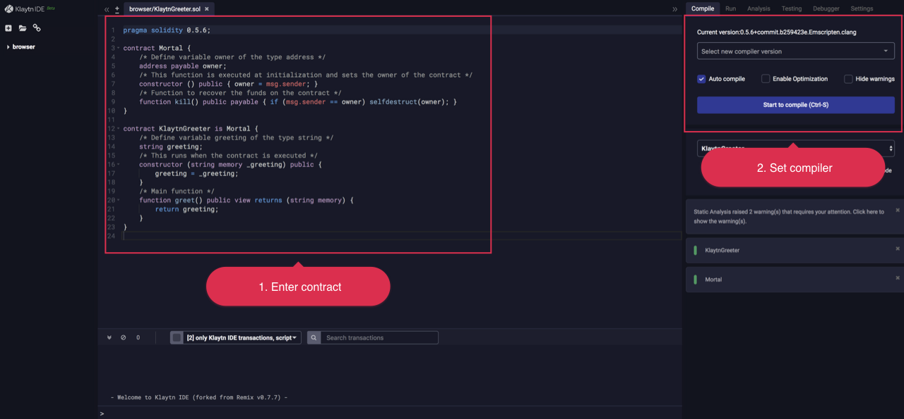
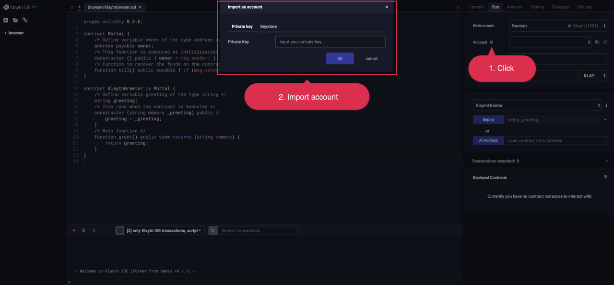
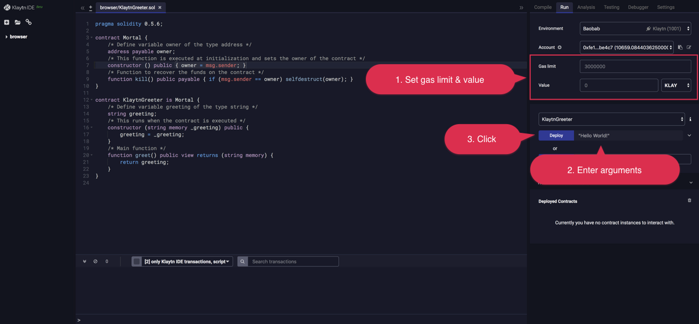
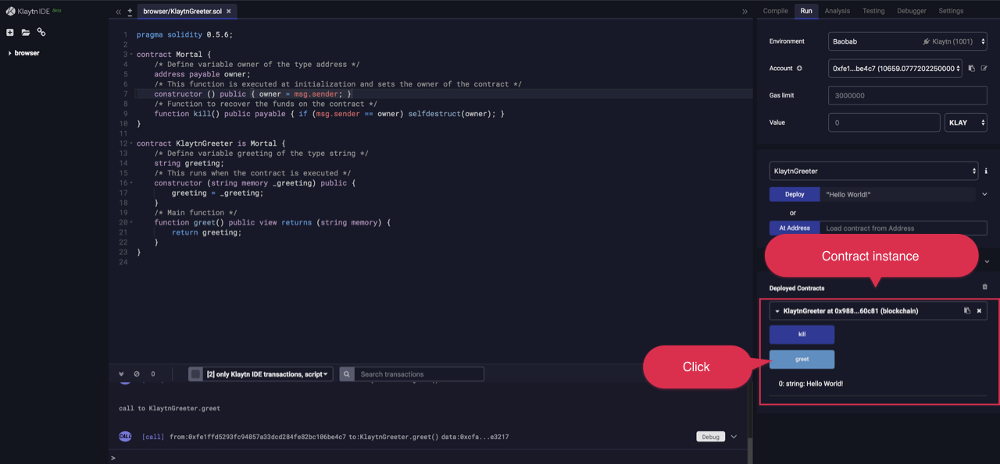

# Deploy Guide <a id="deploy-guide"></a>

There are various ways of deploying a smart contract to Klaytn. This document provides a step-by-step guide to deploy a sample contract using various tools. We assume that you have a Klaytn account with enough KLAY to pay the transaction fee. To create an account, please refer to [Klaytn Wallet](../toolkit/klaytn-wallet.md).

## Klaytn IDE <a id="klaytn-ide"></a>

Open up your internet browser and go to https://ide.klaytn.com  


- Add a new file.




- Copy and paste the following code (or any code you want to deploy).

```
pragma solidity 0.5.6;

contract Mortal {
    /* Define variable owner of the type address */
    address payable owner;
    /* This function is executed at initialization and sets the owner of the contract */
    constructor () public { owner = msg.sender; }
    /* Function to recover the funds on the contract */
    function kill() public payable { if (msg.sender == owner) selfdestruct(owner); }
}

contract KlaytnGreeter is Mortal {
    /* Define variable greeting of the type string */
    string greeting;
    /* This runs when the contract is executed */
    constructor (string memory _greeting) public {
        greeting = _greeting;
    }
    /* Main function */
    function greet() public view returns (string memory) {
        return greeting;
    }
}
```
- Set compiler version. Currently, you can choose between 0.4.24 and 0.5.6. (Default is 0.5.6.)  




- Click Run tab. At `Environment` dropdown, you can choose a target network to deploy the contract. (Baobab is test network and Cypress is main network.)


- After choosing a network, import account by clicking on the plus button next to `Account`. Make sure to import account that has enough `KLAY` to deploy the contract on the network.



- Set Gas limit and Value to send. 
  - You may need to set higher Gas limit if you are deploying a more complicated contract. In this example, you can leave it as it is.
  - Set `Value` to 0 unless you want to send `KLAY` to the contract at the time of deployment.
- Enter "Hello World!" as an argument for constructor function and click on `Deploy` button. If everything goes successful, deployed contract's instance will show up below.



- You can interact with the contract by clicking on the function buttons. Dark blue buttons are `send` functions which can change state on blockchain and consumes gas. Light blue buttons are `call` functions which do not change state and do not require gas fee.   



For more details refer to this [link](../toolkit/klaytn-ide.md).

## Truffle  <a id="truffle"></a>

Truffle is the most popular framework for smart contract deployment and execution. 

- Install via the following command.  

```
$ sudo npm install -g truffle
```

- Set up a project directory, and install .`truffle-hdwallet-provider-klaytn` 

```
$ mkdir hello-klaytn
$ cd hello-klaytn
$ truffle init
$ npm install truffle-hdwallet-provider-klaytn
```

- Create `KlaytnGreeter.sol` under `/contracts` directory and copy the following code.  

```
pragma solidity 0.5.6;

contract Mortal {
    /* Define variable owner of the type address */
    address payable owner;
    /* This function is executed at initialization and sets the owner of the contract */
    constructor () public { owner = msg.sender; }
    /* Function to recover the funds on the contract */
    function kill() public payable { if (msg.sender == owner) selfdestruct(owner); }
}

contract KlaytnGreeter is Mortal {
    /* Define variable greeting of the type string */
    string greeting;
    /* This runs when the contract is executed */
    constructor (string memory _greeting) public {
        greeting = _greeting;
    }
    /* Main function */
    function greet() public view returns (string memory) {
        return greeting;
    }
}
```

- Modify `/migrations/1_initial_migration.js` as in the following.  

```
const Migrations = artifacts.require("./Migrations.sol");
const KlaytnGreeter = artifacts.require("./KlaytnGreeter.sol");
module.exports = function(deployer) {
  deployer.deploy(Migrations);
  deployer.deploy(KlaytnGreeter, 'Hello, Klaytn');
};
```

- Set `truffle-config.js` as below. Make sure you enter the private key of an account that has enough `KLAY` to deploy the contract. 

```
const HDWalletProvider = require("truffle-hdwallet-provider-klaytn");

const privateKey = "0x3de..." // Enter your private key;

module.exports = {
  networks: {
    development: {
      host: "localhost",
      port: 8545,
      network_id: "*" // Match any network id
    },
    testnet: {
      provider: () => new HDWalletProvider(privateKey, "https://your.baobab.en.url:8651"),
      network_id: '1001', //Klaytn baobab testnet's network id
      gas: '8500000',
      gasPrice: null
    },
    mainnet: {
      provider: () => new HDWalletProvider(privateKey, "https://your.cypress.en.url:8651"),
      network_id: '8217', //Klaytn mainnet's network id
      gas: '8500000',
      gasPrice: null
    }
  },
  compilers: {
    solc: {
      version: "0.5.6"
    }
  }
};
```
*NOTE*: This example is not recommended for production use. Be very careful when dealing with private keys.  

- Deploying on Klaytn testnet.

```
$ truffle deploy --network testnet
```

- Deploying on Klaytn mainnet.

```
$ truffle deploy --network mainnet
```

For more details refer to this [link](../toolkit/truffle.md).

## VVISP <a id="vvisp"></a>
vvisp is an easy-to-use CLI tool/framework for developing smart contracts, provided by HEACHI LABS. You can easily set environment, deploy and execute Klaytn smart contracts with a single command. Refer to the following link for more details. 
- https://henesis.gitbook.io/vvisp/deploying-smart-contracts

## solc & caver-js <a id="solc-caver-js"></a>

Another way to deploy contracts is manually compiling contracts with solc and deploying them with caver-js.

- Create `KlaytnGreeter.sol` and write the following code.  

```
pragma solidity 0.5.6;

contract Mortal {
    /* Define variable owner of the type address */
    address payable owner;
    /* This function is executed at initialization and sets the owner of the contract */
    constructor () public { owner = msg.sender; }
    /* Function to recover the funds on the contract */
    function kill() public payable { if (msg.sender == owner) selfdestruct(owner); }
}

contract KlaytnGreeter is Mortal {
    /* Define variable greeting of the type string */
    string greeting;
    /* This runs when the contract is executed */
    constructor (string memory _greeting) public {
        greeting = _greeting;
    }
    /* Main function */
    function greet() public view returns (string memory) {
        return greeting;
    }
}
```

- Install solc 0.5.6.  

```
$ sudo npm install -g solc@0.5.6
```

- Compile the contract.  

```
$ solcjs KlaytnGreeter.sol --bin
```

- Install caver-js.  

```
$ npm install caver-js.
```

- Create `deploy.js` in the same directory with the following code.  

```
const Caver = require("caver-js");
const caver = new Caver("https://your.en.url:8651")

const walletInstance = caver.klay.accounts.privateKeyToAccount(
  '0x3de0c9...' // enter your private key to deploy contract with
);
caver.klay.accounts.wallet.add(walletInstance);

const fs = require('fs')
const bytecode = fs.readFileSync('./KlaytnGreeter_sol_KlaytnGreeter.bin') // compiled output

const constructorType = ['string']  // enter appropriate constructor type
const constructorValue = ['Hello, Klaytn!']

const params = caver.klay.abi.encodeParameters(constructorType, constructorValue);

caver.klay.sendTransaction({
  from: caver.klay.accounts.wallet[0].address,
  gas: "50000000",
  data: bytecode.toString() + params.substring(2, params.length)
})
.once("receipt", receipt => {
  console.log(receipt)
})
.once("error", error => {
  console.log(error);
})
```
*NOTE*: This example is not recommended for production use. Be very careful when dealing with private keys.  

- Deploy the contract using node environment.  

```
$ node deploy.js
```

