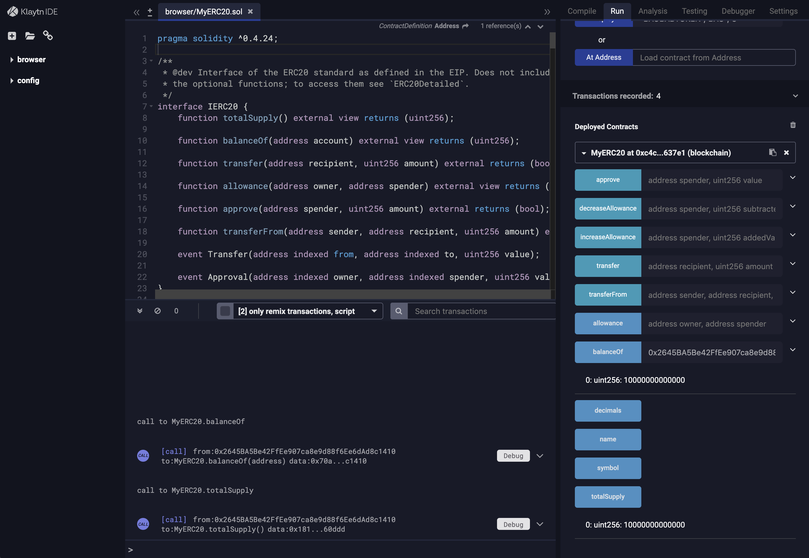

# 2. Deploying Smart Contract

You can use Klaytn IDE or use truffle to deploy `MyERC20` smart contract.

## 2.1 Deploying smart contract using Klaytn IDE <a id="2-1-deploying-smart-contract-using-klaytn-ide"></a>

* Please visit the Klaytn IDE website and create a `MyERC20` contract. The complete source code was given at [Writing ERC-20 Smart Contract](1-erc20.md).
* Prepare your account which will be used to deploy the contract. 
  * If you do not have an account yet, create one at [https://baobab.wallet.klaytn.com/create](https://baobab.wallet.klaytn.com/create)
  * Get some test KLAY from the faucet - [https://baobab.wallet.klaytn.com/faucet](https://baobab.wallet.klaytn.com/faucet)
* Let's deploy `MyERC20.sol` with the deploy parameters of `BAOBABTOKEN`, `BAO` and `8`.


After deploying, you can invoke `balnaceOf` with your account which was used to deploy the contract. You will find there are `10000000000000` tokens available in your account as below. Because you gave `decimal` to be `8` when deploying the contract above, it minted the fixed number of `100000` tokens in the constructor and one token has the decimal value of `10^8`. `totalSupply` method will return the total supply of tokens minted which should be also `10000000000000`.



Now `MyERC20` is live !

## 2.2 Deploying smart contract using truffle <a id="2-2-deploying-smart-contract-using-truffle"></a>

You should have installed [node.js](https://nodejs.org/) in your environment. Please take a look at [Installing Node.js via package manager](https://nodejs.org/en/download/package-manager/) to install node.js using package manager in various environment.

```text
$ mkdir klaytn
$ cd klaytn
$ npm init # initialize npm at the erc20token directory
$ npm install truffle@4.1.15
$ npm install caver-js@latest # installing caver-js
$ ln -s node_modules/truffle/build/cli.bundled.js truffle
$ export PATH=`pwd`:$PATH
```

Now you have installed truffle and caver-js which are required to deploy smart contract.

Let's prepare `truffle` and a smart contract `MyERC20.sol`.

```text
$ mkdir myerc20
$ cd myerc20
$ truffle init
```

Now you will have following directory structures.

```text
.
├── contracts
│   ├── Migrations.sol
├── migrations
│   └── 1_initial_migration.js
└── truffle-config.js
```

Now write `MyERC20.sol` and locate it to `contracts` directory.

Also edit `1_initial_migration.js` as below to deploys `MyERC20` contract with initial parameters of `BAOBABTOKEN`, `BAO` and `8`. The token name is set to `BAOBABTOKEN` and the token symbol to `BAO`. Token has decimal value `10^8`. Note that when you query the `totalSupply` of `BAOBABTOKEN` for example, it returns `10^13`, not `10^5`, because solidity does not support floating point, the number of tokens always represented as a natural number in the smallest denomination.

```javascript
const Migrations = artifacts.require("./Migrations.sol");
const MyERC20 = artifacts.require("./MyERC20.sol");
module.exports = function(deployer) {
  deployer.deploy(Migrations);
  deployer.deploy(MyERC20, 'BAOBABTOKEN', 'BAO', 8);
};
```

You also have to edit `truffle-config.js` as shown below to deploy a smart contract to Klaytn network. This is the same step described at [Deploying a Smart Contract using Truffle](../../../getting-started/quick-start/deploy-a-smart-contract.md#deploying-a-smart-contract-using-truffle)

```text
// truffle-config.js
module.exports = {
    networks: {
        baobab: {
            host: '127.0.0.1',
            port: 8551,
            from: '0xabcdabcdabcdabcdabcdabcdabcdabcdabcdabcd', // enter your account address
            network_id: '1001', // Baobab network id
            gas: 20000000, // transaction gas limit
            gasPrice: 25000000000, // gasPrice of Baobab is 25 Gpeb
        },
    },
    compilers: {
      solc: {
        version: "0.5.6"    // Specify compiler's version to 0.5.6
      }
  }
};
```

Now you are all ready and can deploy `MyERC20.sol` as below.

```text
$ truffle deploy --network baobab --reset
Compiling ./contracts/MyERC20.sol...
Writing artifacts to ./build/contracts

Using network 'baobab'.

Running migration: 1_initial_migration.js
  Replacing Migrations...
  ... 0x5a947f076f4570dff8ff18b1ae3557e27dd69c92ce38a3c97fad8f5355914066
  Migrations: 0x0d737e9865e5fc4c1ff53744fd2c13c52a44b9bc
  Deploying MyERC20...
  ... 0x1571e80552dab1d67260e8914e06d9b16ccae16fb698c750f6a09aab12517bc1
  MyERC20: 0xc4c8257ED9B4eB6422fDe29B1eCe5Ce301e637e1
Saving successful migration to network...
  ... 0x5b984b3f79c425d80470a96d5badb857fc05e7f31d94423044ae3119c639aa77
Saving artifacts...
```

It shows that the transaction hash for deploying `MyERC20` is `0x1571e80552dab1d67260e8914e06d9b16ccae16fb698c750f6a09aab12517bc1` and the address of `MyERC20` is `0xc4c8257ED9B4eB6422fDe29B1eCe5Ce301e637e1`.

Now `MyERC20` is live !

