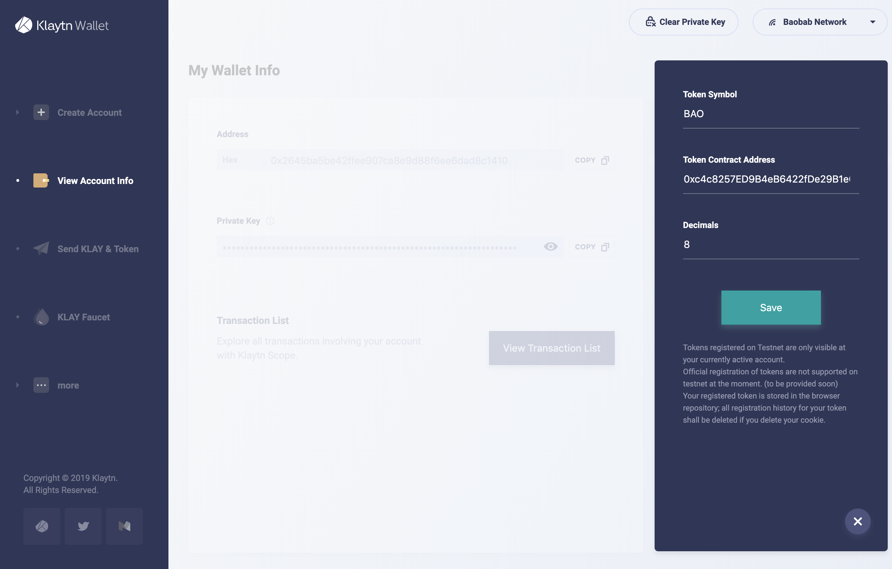

# 3. Interacting with ERC-20 token from Klaytn Wallet

You can use [Baobab Klaytn Wallet](https://baobab.wallet.klaytn.com) to query your balance and transfer the ERC-20 compatible `BAOBABTOKEN` you just deployed.

You can add ERC-20 compatible token in your wallet with the address of the deployed `MyERC20` contract as below.

After adding the ERC-20 token in the wallet app, the balance of your `BAOBABTOKEN` will be shown in addition to the balance of KLAY as below. You can see there is `100000` `BAO` tokens in the account.

