# Klaytn IDE <a id="klaytn-ide"></a>

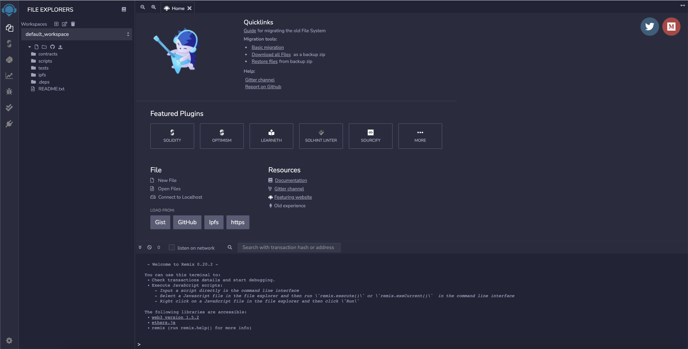

Klaytn IDE is a browser-based application compatible with Ethereum. It has been forked from Remix 0.20.0. It supports a fast development cycle through various plug-ins and an intuitive GUI. You can write, test, and deploy Klaytn smart contracts using Solidity. You can use Klaytn IDE at https://ide.klaytn.com.

This document covers Klaytn IDE’s main features and instructions on how to use it. For more information, please visit  Remix Documentation.

## 1. Layout <a id="layout"></a>

Below is the layout for Klaytn IDE. The icon panel (A), where you can select the plug-in to be displayed in the side panel (B). The GUI for most plug-ins will be displayed on the side panel. On the main panel (C), you will see the plugins or you can edit the files to be compiled by the IDE. In Terminal (D), you can see the result of your interactions with the GUI, or run scripts.

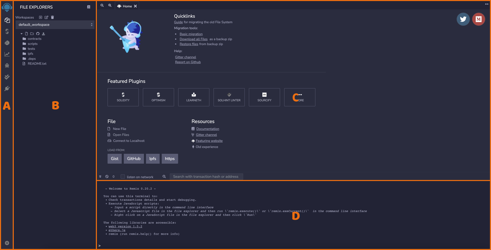

## 2. Default Modules <a id="default-modules"></a>

The default modules when you first open Klaytn IDE are File Explorer, Plugin Manager, and Editor.

### File Explorer <a id="file-explorer"></a>

The File Explorer icon is at the top of the icon panel.

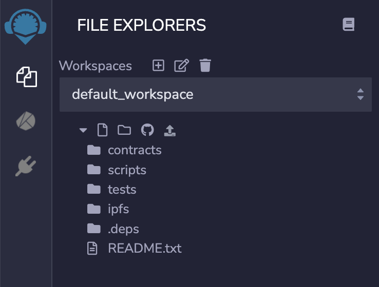

The file explorer on the left side of the workspace shows the list of smart contract files stored in your browser. Please be aware that clearing the browser storage will permanently delete all smart contract files you wrote. You can add, rename, and delete files from the file explorer.

Klaytn IDE stores all files in Workspaces, the browser’s local storage. You can’t restore the files once they are deleted from the local storage. If you use Remixd, you can connect to the local file system.

Workspaces contain contracts, scripts, tests folders and README.txt by default.

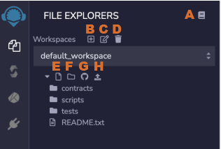

Let’s go over the icons one by one. 

**A** Klaytn IDE is forked from Ethereum’s Remix. Clicking this icon will redirect you to the documents containing the instructions for using Remix <br> 
**B** Create a Workspace.<br>
**C** Change the name of a Workspace.<br>
**D** Delete a Workspace.<br>
**E** Create a new file. The created file will appear in the editor.<br>
**F** Create a new folder.<br>
**G** Send Workspace to gist.<br>
**H** Send a file to browser storage.<br>

### Plugin Manager <a id="plugin-manager"></a>

Klaytn IDE runs based on plugins. To use its diverse features, you have to activate the modules in the Plugin Manager. The default modules in the Icon Panel are File Explorer, Compile, Deploy&Run. We will explain more about Compile and Deploy&Run in [3. Common Modules] below. 


### Code Editor <a id="code-editor"></a>

In the Main Panel’s Code Editor, you can write and edit code. If you make changes to an existing code, it needs to be compiled again. If you have autocompile checked, the code will automatically be compiled every time a file is changed or another file is selected. It also supports highlights for syntaxes mapped to Solidity keywords.

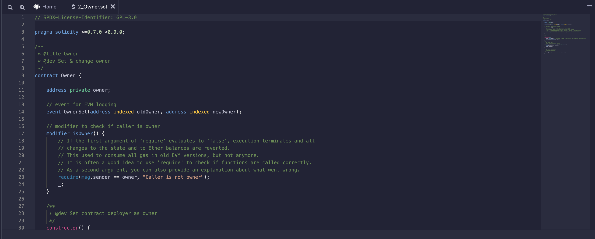

### Terminal <a id="terminal"></a>

In the terminal you can check the compile result, error, deployment status and transaction information. Click on the checked transaction to see details. On the terminal you can enter a transaction hash or contract address.

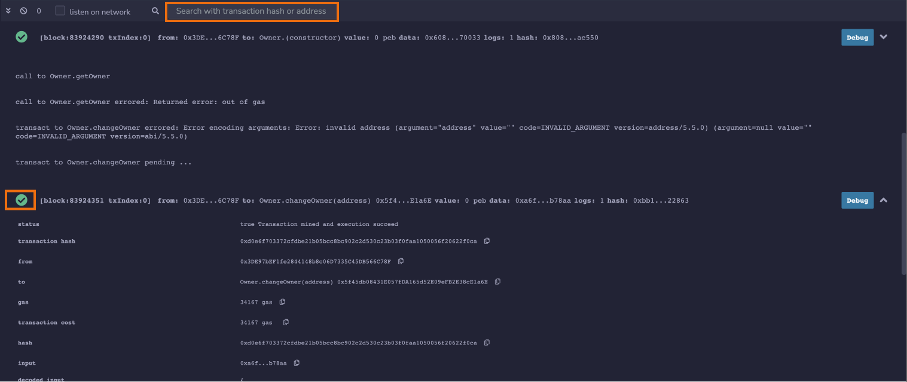

## 3. Common Modules <a id="3-common-modules"></a>

Let’s take a look at the four common modules used in Klaytn IDE: Compile, Deploy&Run, Analyze, and Testing. As mentioned earlier, you have to activate the non-default modules in the plugin manager.

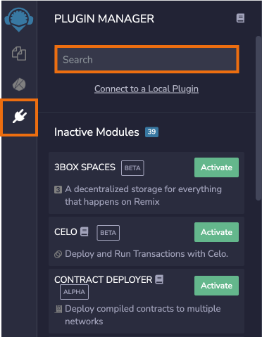

You can activate SOLIDITY COMPILER, SOLIDITY STATIC ANALYSIS, SOLIDITY UNIT TESTING in the plugin manager. The function of each module is summarized as follows:

- Compile: In order to deploy Solidity source code, you have to compile it first. You can set the compiler version and various options.<br>
- Deploy & Run: You can deploy the compiled smart contract and execute functions. You can also manage transaction’s parameters.<br>
- Analysis: You can execute static runtime code analysis based on the checklist.<br>
- Testing: You can create and run a unit test.<br>

### Compile <a id="compile"></a>

If you finished your code, use Compile to check for any errors or warnings. It’s only after you compile the contract that you can deploy it.

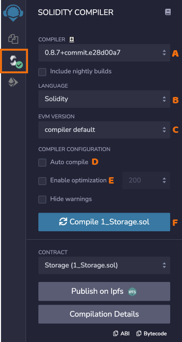

Click Compile (F). In Compiler (A), select the compiler version that corresponds to the one stated in the Solidity file. You can select the language of your choice in B. If you want the file to be automatically compiled every time it is saved or another file is selected, you can check Auto compile (D). But be aware that contracts with a lot of dependencies may take a long time.

#### EVM <a id="evm-version"></a>

Select the EVM Version you want in the dropdown menu (C).


You will find the EVM versions applied for Klaytn Baobab testnet and Cypress mainnet, so choose the appropriate version. You can check the current EVM version in Compilation Details, Metadata > Settings.

#### Optimization <a id="optimization"></a>

With Optimization (E), you can reduce the code size and execution costs, thereby saving gas required for contract deployment and calls. For more details, please refer to [Optimizer Options](https://docs.soliditylang.org/en/latest/using-the-compiler.html?highlight=optimize-runs#optimizer-options).


#### Compilation Details <a id="compilation-details"></a>

In Compilation Details you can find the bytecode and ABI. A single file may contain multiple contracts, and a single contract may import other contracts, so often, multiple contracts get compiled. But you can only check the Compilation Details for one contract at a time. Select a contract you want.


#### Upload on IPFS <a id="upload-on-ipfs"></a>

You can also publish the contracts on IPFS if they are non-abstract. If you publish a contract that imports other contracts, all contracts including the main contract will be uploaded to each address. The uploaded data will include ABI and Solidity source code.

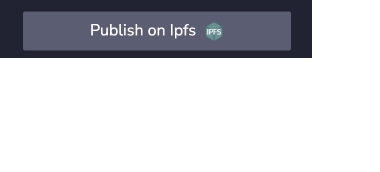

#### Compilation Error and Warning <a id="compilation-error-and-warning"></a>

Any errors or warnings will appear below the contract section.


In the `Gas Limit` controller, you can fill the maximum amount of gas which will be used for calling a smart contract function.


### Deploy & Run <a id="deploy-and-run"></a>

If the contract is compiled, select the KLAY icon (A) in the Icon Panel to deploy it.

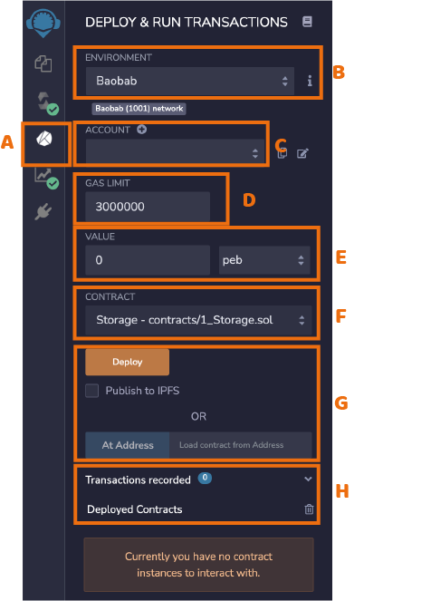

ou can set the environment for the contract deployment in the dropdown menu (B).

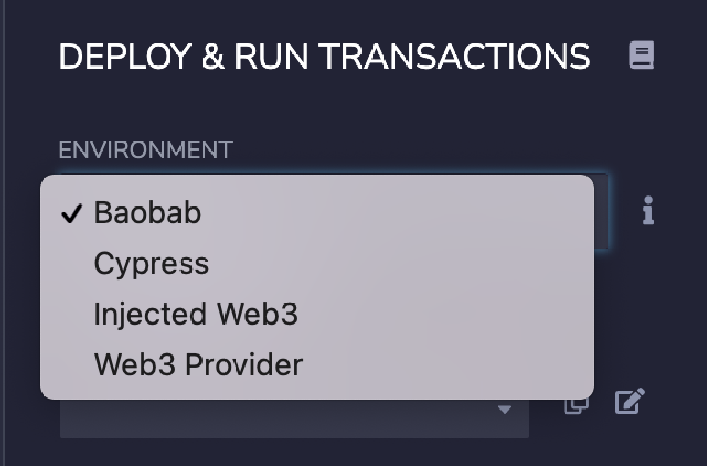

- Baobab: Klaytn testnet. You will be connected to the Klaytn public node.
- Cypress: Klaytn mainnet. You will be connected to the Klaytn public node.
- Injected Web3: Klaytn IDE will be connected to the Web3 Provider provided by extensions like MetaMask.
- Web3 Provider: Customize a node where you will deploy the contract.

#### Account <a id="account"></a>

You can import the contracts from the respective deployment environment (C). For example, if you selected Injected Web3, you can use your MetaMask account.

#### Gas Limit <a id="gas-limit"></a>

In Gas Limit (D), you can set the maximum amount of gas to be used to call the contract functions.

#### Value <a id="value"></a>

Value (E), you can choose the amount of peb, ston, mKLAY, KLAY to be sent to the contract or function. It will be reset to 0 after each transaction.

#### Deploy & AtAddress <a id="deploy-and-ataddress"></a>

In the Contracts drop-down list (F), you will find the list of compiled contracts. The Deploy button (G) will create a transaction that deploys the contract. Once the contract is deployed, you will see the contract address and the functions. You can use atAddress to select a contract that has already been deployed.

There are two types of functions: one that records data on the blockchain and one that reads data from the blockchain. The former is shown in orange, and the latter in dark blue. Transactions and contracts that simply read data will not incur any gas fees.

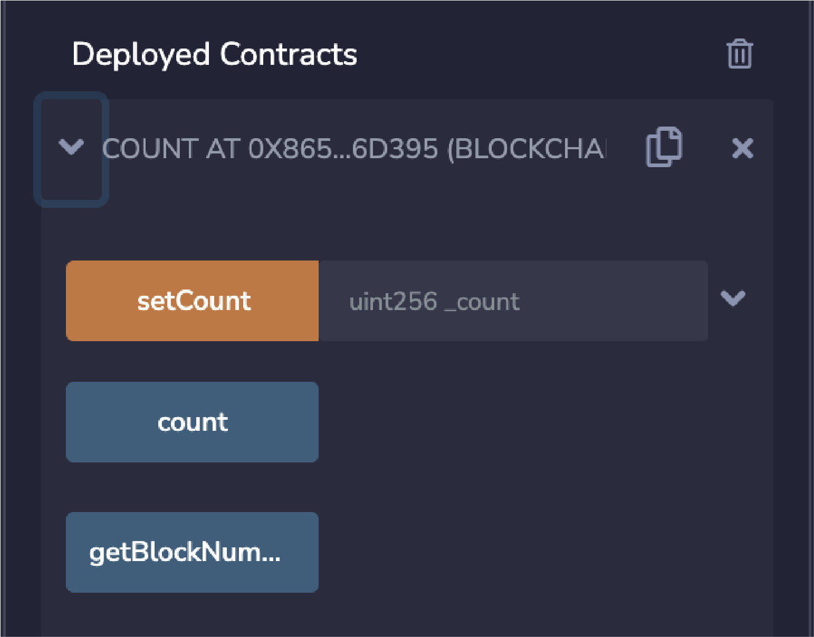

You can use AtAddress to use already deployed contracts. Since you are accessing contracts that have already been deployed, it won’t cost any gas fee. To use AtAddress, the contract’s source code or ABI must be open on Editor. For more information about ABI, please refer to this [link](https://docs.soliditylang.org/en/latest/abi-spec.html).

#### Recorder

Recorder allows you to store a batch of transactions to execute them in another environment. Executing a contract may involve multiple transactions, and you can automate their execution using this feature. Or you can test a contract you used on Baobab in a different environment like Injected Web3 using the scenario.json file.

Below you see the default state of the recorder, with 0 transactions executed.

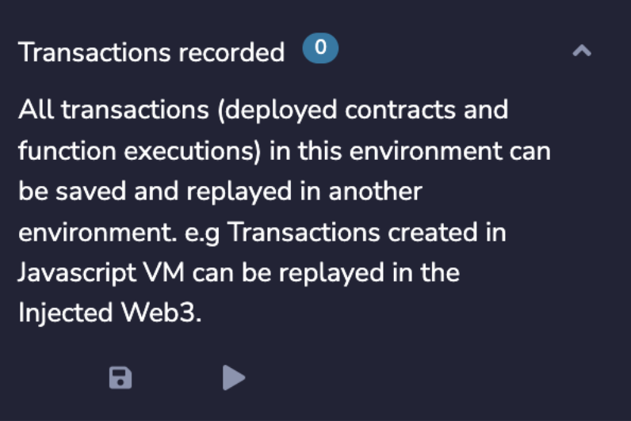

After deploying two contracts Count and Owner, you can see that the number went up to 2. Click on the disk icon and the transactions will be stored in a scenario.json file.

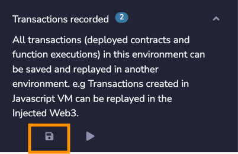

The file looks like this:

```
{
  "accounts": {
    "account{0}": "0xeC45d4724A4148B95528BD5F9ED56F2Ef80CB61C"
  },
  "linkReferences": {},
  "transactions": [
    {
      "timestamp": 1647916002296,
      "record": {
        "value": "0",
        "parameters": [],
        "abi": "0xf64e9d2538e9b682f0efcc4e652b9ef7c4057549fa1ea612b04794d55beaf4c1",
        "contractName": "Storage",
        "bytecode": "608060405234801561001057600080fd5b50610150806100206000396000f3fe608060405234801561001057600080fd5b50600436106100365760003560e01c80632e64cec11461003b5780636057361d14610059575b600080fd5b610043610075565b60405161005091906100d9565b60405180910390f35b610073600480360381019061006e919061009d565b61007e565b005b60008054905090565b8060008190555050565b60008135905061009781610103565b92915050565b6000602082840312156100b3576100b26100fe565b5b60006100c184828501610088565b91505092915050565b6100d3816100f4565b82525050565b60006020820190506100ee60008301846100ca565b92915050565b6000819050919050565b600080fd5b61010c816100f4565b811461011757600080fd5b5056fea2646970667358221220bafbb6967d7f4b37b93bfe2fe5938ed3a2d511abf3d5775fa6190843b2db7b8264736f6c63430008070033",
        "linkReferences": {},
        "name": "",
        "inputs": "()",
        "type": "constructor",
        "from": "account{0}"
      }
    }
  ],
  "abis": {
    "0xf64e9d2538e9b682f0efcc4e652b9ef7c4057549fa1ea612b04794d55beaf4c1": [
      {
        "inputs": [
          {
            "internalType": "uint256",
            "name": "num",
            "type": "uint256"
          }
        ],
        "name": "store",
        "outputs": [],
        "stateMutability": "nonpayable",
        "type": "function"
      },
      {
        "inputs": [],
        "name": "retrieve",
        "outputs": [
          {
            "internalType": "uint256",
            "name": "",
            "type": "uint256"
          }
        ],
        "stateMutability": "view",
        "type": "function"
      }
    ]
  }
}
```

Now click on the play button, which will play the scenario of the transactions in the terminal.

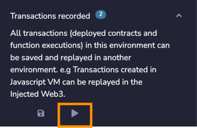

### Static Analysis <a id="static-analysis"></a>

Static analysis allows you to debug without executing the code. As with other modules, you can activate it in the Plugin Manager.

As default, all Security boxes are checked. With Autorun, the analysis will be conducted every time a contract is compiled.

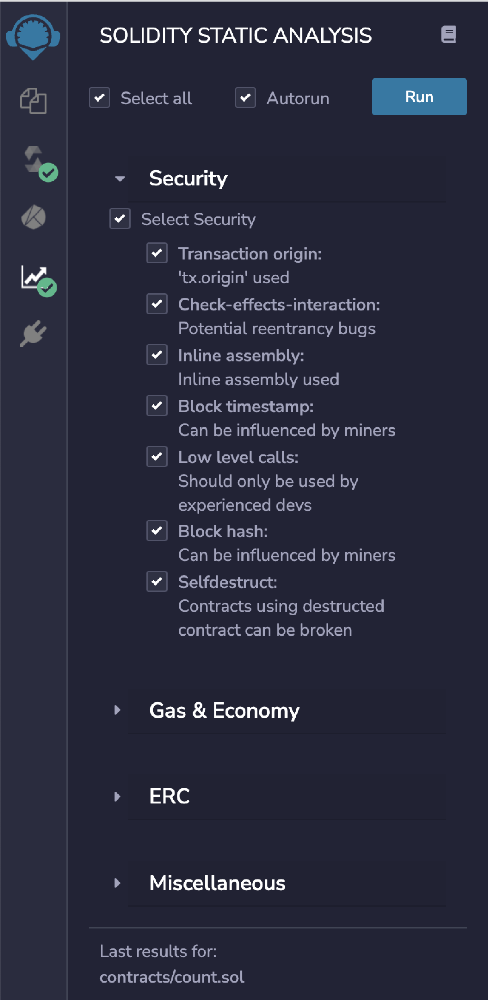


For more details on the Security categories, please refer to [Remix Docs > Analysis Modules](https://remix-ide.readthedocs.io/en/latest/static_analysis.html#analysis-modules).

### Testing <a id="testing"></a>

Activate the Unit Testing module in the Plugin Manager.

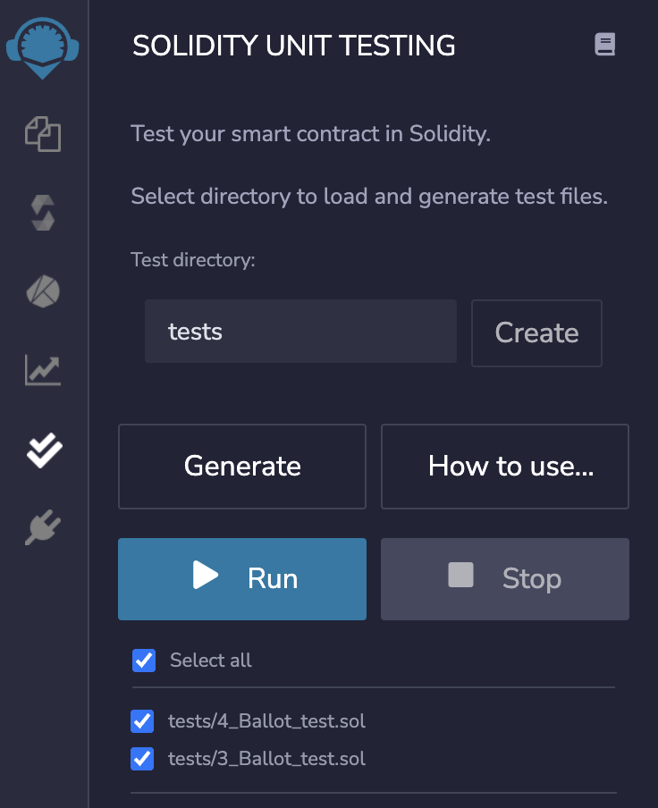

You can set the test directory, the workspace that will be used with the Testing module.

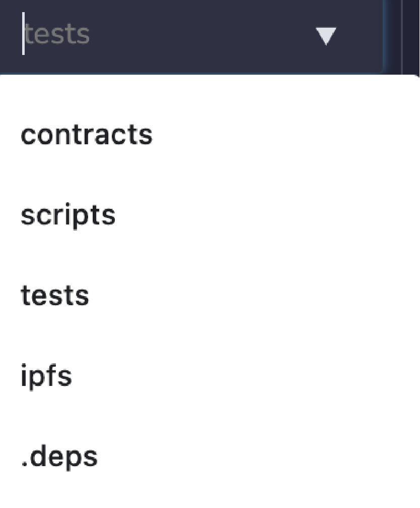

And then select the file you want to test and click Generate. It will create a test file in the selected directory. If you haven’t selected a specific file, a new file with the name `newFile_test.sol` will be created.


Now write and test different unit tests in the file. For more details, please check [Remix Docs > Solidity Unit Test Plugin](https://remix-ide.readthedocs.io/en/latest/unittesting.html#unit-testing-plugin).

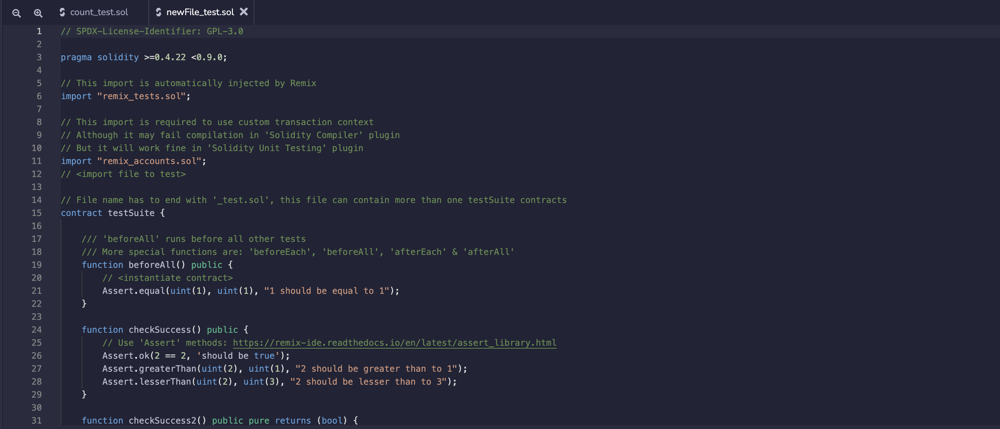

## 4. Accessing Local File System <a id="access-local"></a>

You can use Remixd to let Klaytn IDE access the folders in your computer. Remixd is a websocket plugin designed to be used with Remix IDE. You can create a websocket connection with your local file system. To do this, you need the Remixd plugin and the remixd cli/npm module. For more details, please refer to [Remix](https://remix-ide.readthedocs.io/en/latest/remixd.html).

### Remixd Plugin <a id="remixd-plugin"></a>

You can activate the Remixd plugin in the Plugin Manager, or have it automatically activated by selecting “connect to localhost” in Workspaces.


`remixd` can be globally installed using the following command: After installation, start `remixd`. `-s` option gives the IDE access to the given folder. In the given folder, you will install OpenZeppelin and place your contract source code.

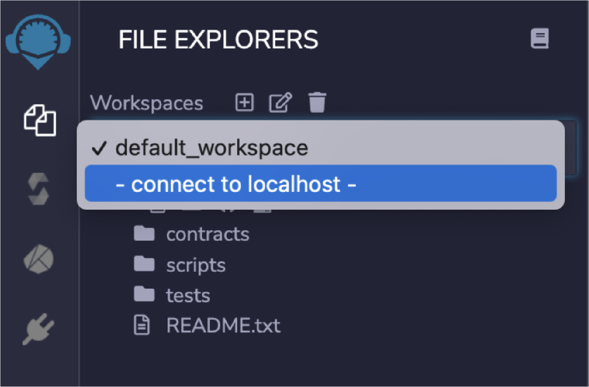

When you click “connect to localhost”, you will see a popup message like this:

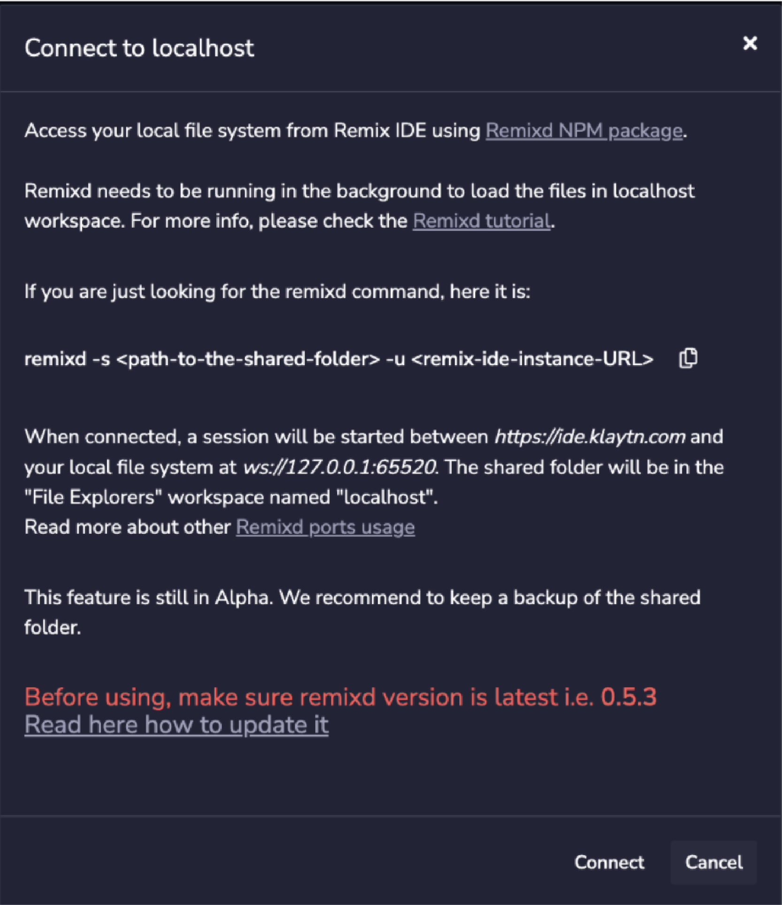

But before clicking Connect, you have to have the remixd NPM module installed.

### Install and Run remixd <a id="install-and-run-remixd"></a>

You can install remixd using the following command:

```
npm install -g @remix-project/remixd
```

After installing, you have to permit access to the desired folder. Enter the command line as shown below:

```
remixd -s {absolute path folder} --remix-ide https://ide.klaytn.com
```

{absolute path folder} is where you specify the absolute path of the desired folder.

You have to distinguish between `http` and `https` depending on your browser. 


### Connect <a id="connect"></a>

When `remixd` is activated, you will see the popup message like below. You have to click Connect when the remixd from the previous step is running in the background.


And then select a file in the localhost to work on.

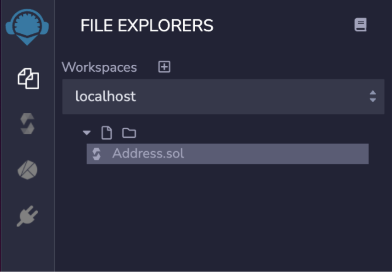

To close the session, use the command `ctrl-c` in the terminal where remixd is running.

## 5. Using OpenZepplin <a id="using-openzepplin"></a>

[OpenZeppelin](https://openzeppelin.com/) is a library for developing secure smart contracts. You can implement the standards [ERC20](https://eips.ethereum.org/EIPS/eip-20) or [ERC721](https://eips.ethereum.org/EIPS/eip-721) as is, or modified. It also supports solidity components that allow you to create customized contracts or more decentralized systems.

You can import them using npm or through GitHub URL, by using the `import` statement in your contract. The imported files will be stored in the `.deps` folder under Workspaces. For more details on the `import` keyword, please refer to [Solidity documentation](https://docs.soliditylang.org/en/latest/layout-of-source-files.html?highlight=import#importing-other-source-files).

```
import "@openzeppelin/contracts/token/ERC20/ERC20.sol";
```

```
import "@openzeppelin/contracts@4.2.0/token/ERC20/ERC20.sol";
```

You can also import it from GitHub. Make sure to only use their officially released code.

```
import "https://github.com/OpenZeppelin/openzeppelin-contracts/blob/v2.5.0/contracts/math/SafeMath.sol";
```

## Learn More <a id="need-more-information"></a>

Klaytn IDE offers almost identical features with Remix. For more instructions, please refer to [Remix Documentation](https://remix-ide.readthedocs.io/en/latest/).

## Send us Your Feedback! <a id="send-us-feedback"></a>

For any inquiries or suggestions regarding Klaytn IDE, please leave them on our [Discord](https://discord.com/invite/aY8mrCGANk) or [Klaytn Developers Forum](https://forum.klaytn.com/).


