# Introduction 

In a typical blockchain platform like Klaytn, most users are familiar with single key wallet systems such as Kaikas and MetaMask, which are also known as externally owned accounts (EOA). These accounts make use of traditional key pairs, i.e., public keys and private keys, which isn’t ideal as the private key creates a single point of failure. 

This makes EOAs unsuitable for organisational use, as a compromised private key could lead to the organisation losing all of its crypto funds—such was the case in the Wintermute hack where $162.5 million was lost. 

This is where multisig wallets like Klaytn Safe come in. Unlike single key wallets, a multi-sig wallet needs multiple parties' private keys to sign and execute a transaction, removing the single point of failure and providing greater security for organisational use cases.

# What are MultiSig Wallets? 

As the name implies, a multi-signature wallet is a digital wallet that requires two, three, or more private keys from different sources to confirm and execute a crypto transaction.

For example: You can imagine a multi-signature wallet as a safe that has three locks, and the three keys required to open the safe are with three different individuals, thus requiring their joint consent to open.

Here are the main benefits of multisig wallets:

* Store assets/funds securely: Companies and protocols can store their funds safely without worrying about a private key leak or one bad actor moving funds without authorization.

* Enable decentralised decision making: Companies and business executives can make on-chain decisions on which transactions to execute.

* Two-factor authentication: With the help of multisig wallets, businesses and individuals can make sure that only those with access to the necessary keys can execute transactions.

Next, we will dive into the Klaytn Safe multisig wallet for Klatyn, and how to use it to manage your funds and transactions.

# What is Klaytn Safe? 

Klaytn Safe is a multisig wallet for the Klaytn ecosystem. It is a fork of the well-known Ethereum multisig wallet [Safe](https://gnosis-safe.io/). 

Currently, Klaytn Safe is a collection of tools to create and manage multi-signature wallets, viz:

* **Safe React:** This is a react web app to create and interact with a multi-sig wallet.
* **Safe Transaction Service:** This keeps track of transactions sent via safe contracts and listens to events from recent blocks in Cypress and Baobab. Transactions can also be sent to the service to allow off-chain collecting of signatures or to inform the owners about a transaction that is pending to be sent to the blockchain.
* **Safe Config Service:** This provides configuration information of the Klaytn Safe clients environment, e.g configs of all chain details and APIs.
* **Safe Client Gateway:** This is a gateway between the Klaytn Safe client and the backend services (transaction service and Klaytn Nodes)
* **Safe Infrastructure:** This is a  cluster setup to deploy the backend services (Safe-Transaction, Safe-Config, Safe-Client gateway). 

# Benefits 

* **Store and transfer KLAY and KCTs (KIP7, KIP17)**: Users can deposit and transfer cryptocurrencies (KLAY) and tokens (fungible or non-fungible).
 
* **Flexibility and security:** The confirmation threshold gives users more flexibility and control over which transactions should be executed, and removes the single point of failure.

* **Safe apps:** Klaytn Safe's functionality is expanded by the addition of custom apps that enable batch transactions and interaction with other dApps. One example of this safe app is the Transaction Builder which combines and executes multiple transactions as a batch transaction.

* **Account recovery:** In the event of lost keys, Klaytn Safe accounts can be recovered as long as the confirmation threshold can still be met by the remaining keys.

# Getting started with Klaytn Safe 
Here you will learn how to create a Safe and evaluate its features on the Klaytn Testnet (Baobab). Let's get started!

## Create a Safe 

**Step 1:** Navigate to [Klaytn Safe App](https://safe.klaytn.foundation/).

**Step 2:** Connect your signer wallet to start creating your Safe.

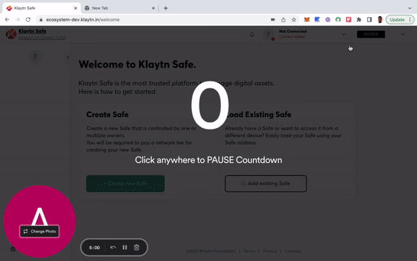

**Step 3:** Once your wallet is connected, click "Create New Safe" and give your new Safe a name.

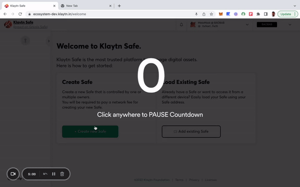

**Step 4:** Add owners/signers by inputting the addresses that have permission to submit and approve transactions.You can add as many signers as you want and remove or replace any of them at any time.

**Step 5:** Choose how many signer confirmations a transaction in your Safe account needs to be approved, as shown below.

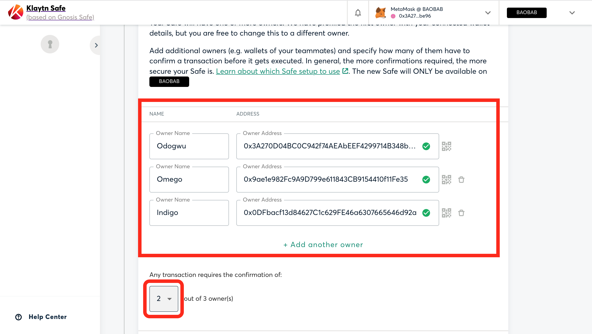

**Step 6:** Review and deploy Safe: Once you are completely satisfied with all of your Safe parameters, you can submit the creation of your Safe account and proceed with the on-screen instructions to complete the account creation.

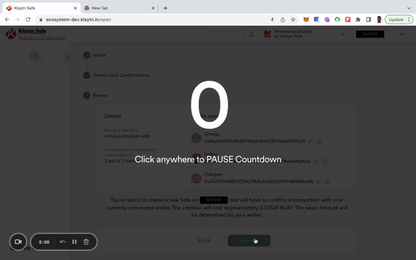

Congratulations on successfully creating your Klaytn Safe account!

## Fund your Safe account 
In this section, you'll learn how to fund your newly created safe account with KLAY and tokens.

* **KLAY Deposits**

**Step 1:** Copy your Safe address from your account dashboard.

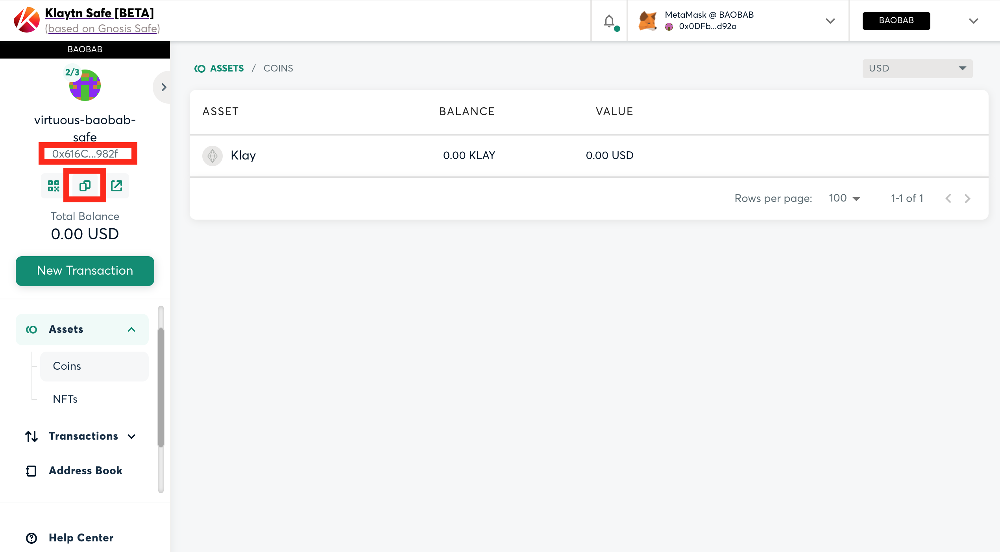

**Step 2:** Open your Metamask Wallet and click **“send”**.

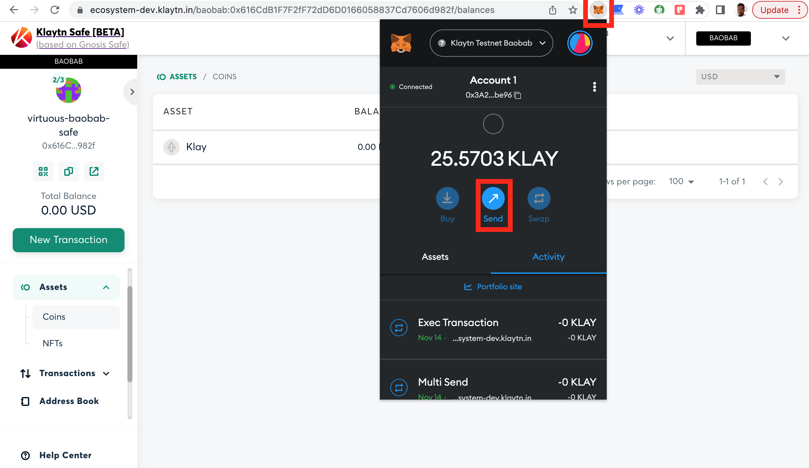

**Step 3:** Paste your safe address in the search field as seen below.

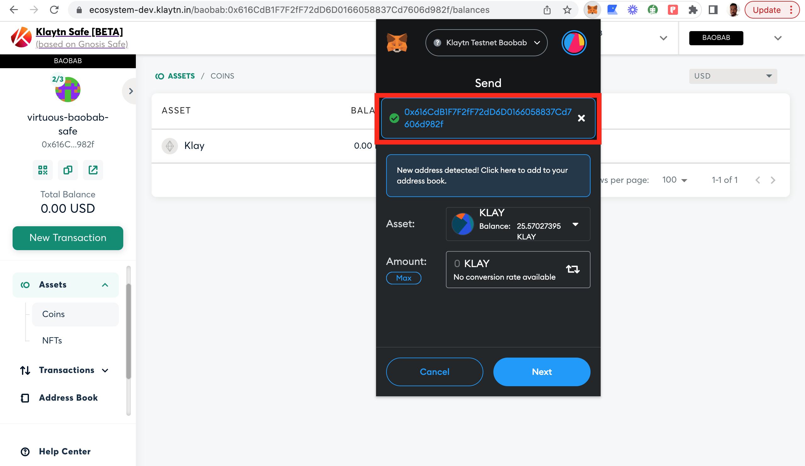

**Step 4:** Input amount and click next.

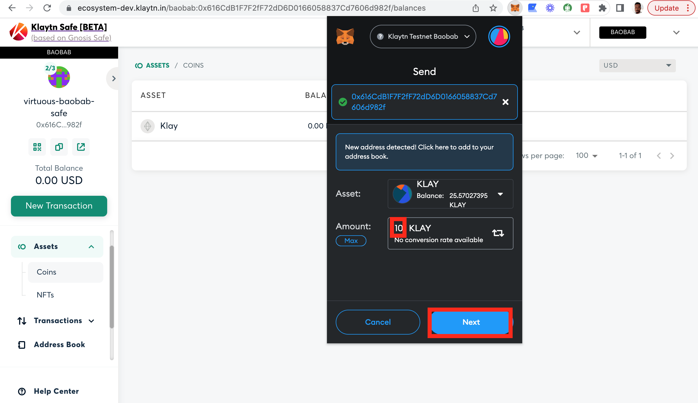

**Step 5:** Confirm the transaction and check your asset dashboard.

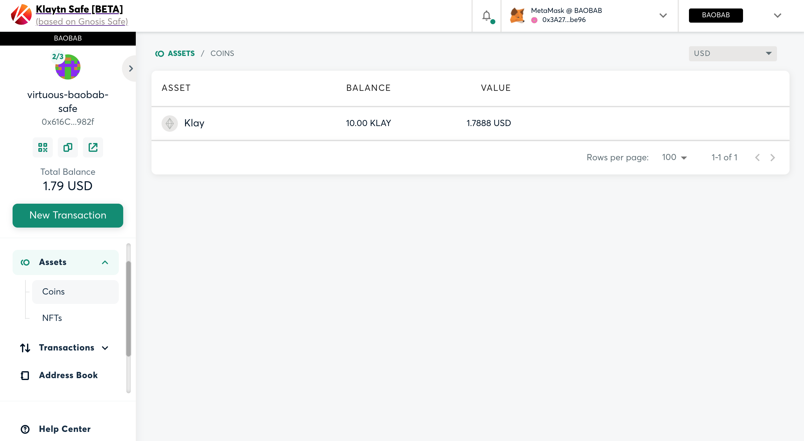

* KIP-7 Deposits

**Step 1:** Copy your Safe address from your account dashboard.

**Step 2:** Open your Metamask Wallet and navigate to **“assets”** tab.

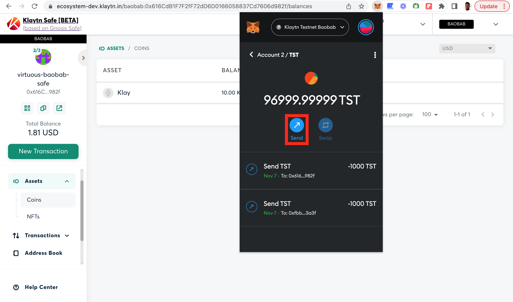

**Step 3:** Select the token you will love to send and click **“send”**.

Step 4: Repeat step **3**, **4**, **5** of **KLAY** Deposits.

Step 5: View your assets dashboard.

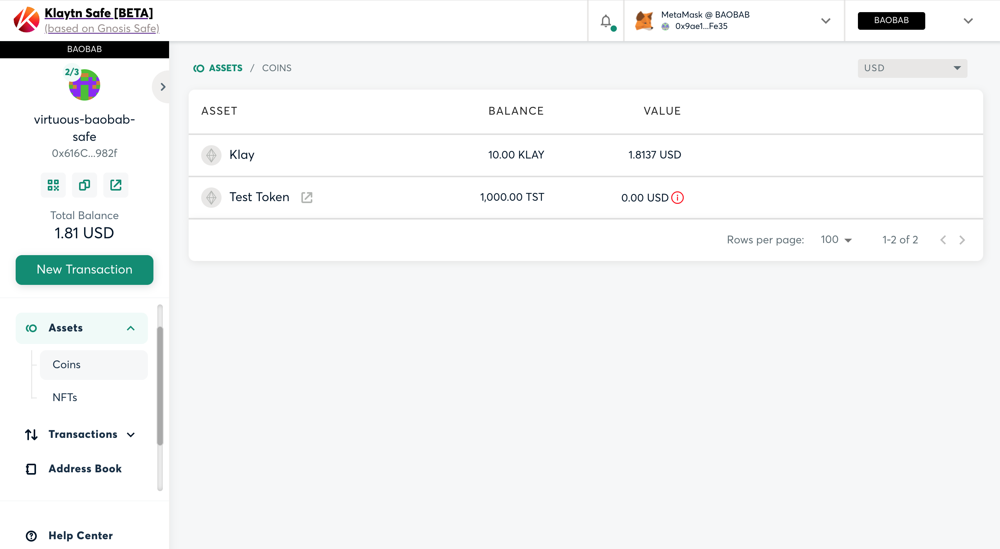

* KIP-17 Tokens (NFTs)

To fund the safe account with NFT’s, you will need to mint or send tokens to the safe address.

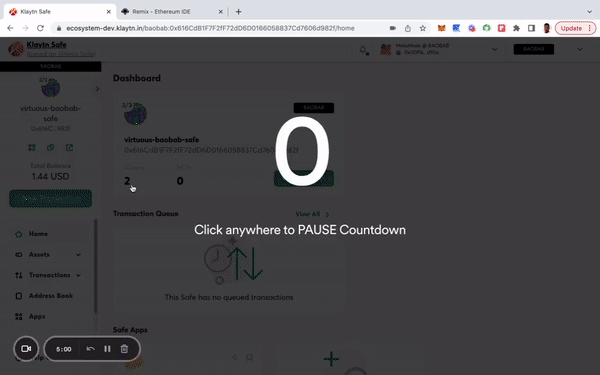

The following sections will teach you how to use your newly created safe to execute transactions. In Klaytn Safe, transactions are divided into three categories:

* Send Funds: send KLAY and other klaytn compatible tokens.
* Send NFT: send your non-fungible tokens.
* Contract interaction: invoke a function and interact with an already deployed contract.

## Send Funds 

In this section, you'll learn how to send KLAY and KIP-7 tokens from your Klaytn Safe account.

**Step 1:** Click the **"New Transaction"** button in the side menu and select **"Send funds"** to begin a new asset transfer.

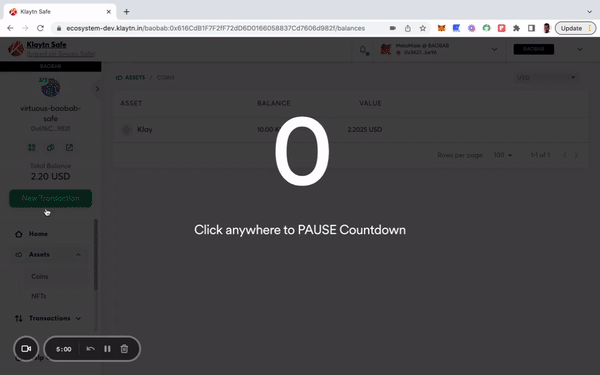

**Step 2:** Choose assets to transfer

* **KLAY**

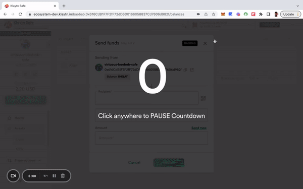
  
* **KIP-7 Tokens**

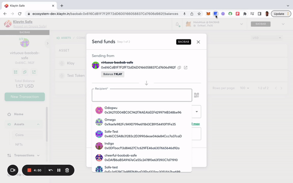
  

**Step 3:** Review and submit the transaction. You will need to sign the transaction with your signer wallet, and it will be executed once the confirmation threshold is reached.

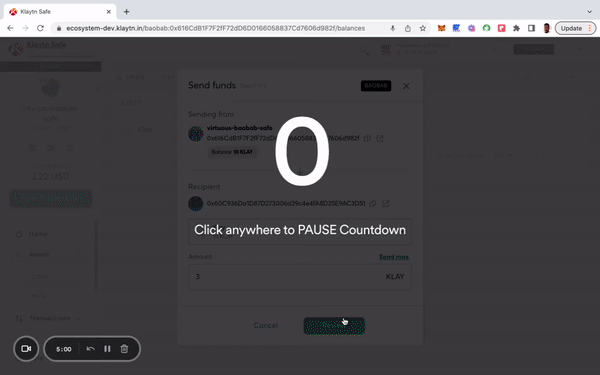

## Send NFTs 

In this section, you'll learn how to send your non-fungible tokens from your Klaytn Safe account. 

**Step 1:** Click the **"New Transaction"** button in the side menu and select **"Send NFT"** to begin a new asset transfer.

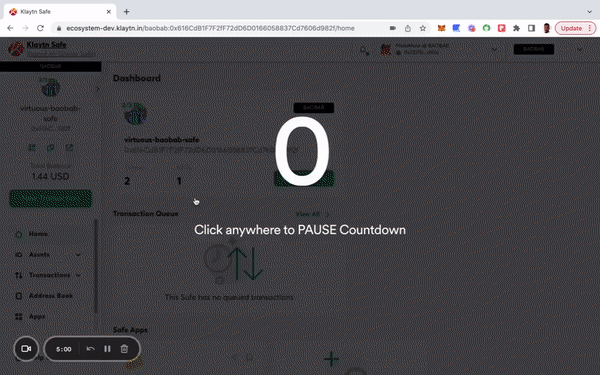

**Step 2:** Choose assets to transfer.

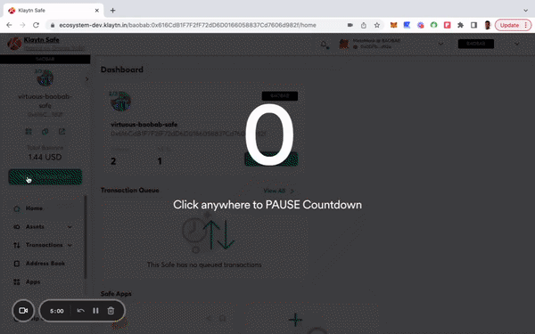

**Step 3:** Review and submit the transaction. You will need to sign the transaction with your signer wallet, and it will be executed once the confirmation threshold is reached.

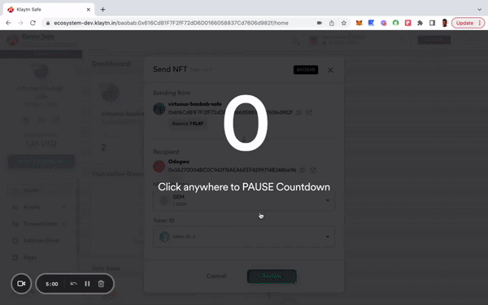

## Contract Interaction 

In this section, you will be interacting with and sending a transaction to a simple contract deployed on Baobab using our newly created multisig wallet. 

**Pre-requisites**
* [Metamask](https://metamask.io/download/) & [Klaytn Metamask Config](https://docs.klaytn.foundation/dapp/tutorials/connecting-metamask#send-klay)
* [Remix](https://remix.ethereum.org/) & [Klaytn Remix Plugin](https://klaytn.foundation/using-klaytn-plugin-on-remix/)
* Obtain test KLAY from the [Faucet](https://baobab.wallet.klaytn.foundation/faucet)

**Step 1:** Navigate to [Remix](https://remix.ethereum.org/)

**Step 2:** Compile and deploy the sample **storage contract**.

The contract must first be deployed before you may interact with it in your multisig wallet. This sample contract contains a simple uint “number” variable that can be updated by calling the **store** method and retrieved by calling the **retrieve** method.

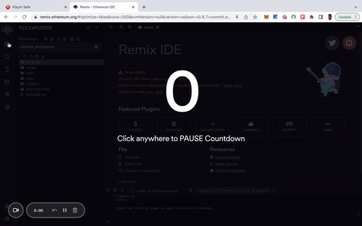

**Step 3:** Initiate a new transaction. 

To interact with a smart contract in your safe wallet, click **"New Transaction"** To complete this step, you will need your already deployed contract address and ABI, as illustrated in the previous step.

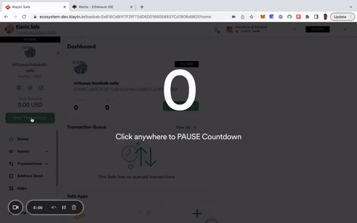

**Step 4:** Review and submit the transaction. You will need to sign the transaction with your signer wallet, and it will be executed once the confirmation threshold is reached.

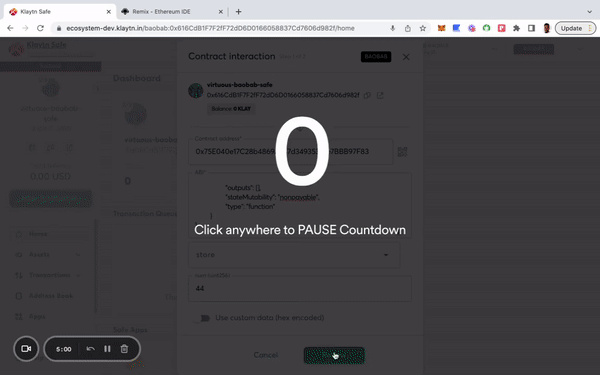

## Transaction Builder 

This is a custom app in Klaytn Safe that is responsible for batching transactions. This means that when we want to execute several transactions, instead of having to confirm a set of transactions one after the other, they can be bundled together into a single transaction so users just have to confirm and execute once.

With transaction builder, you can compose transactions from token transfers to complex contract interactions and batch them into a single transaction.

**Illustration**

A real world example is when you want to airdrop tokens to a long list of addresses, say 100 DRIP tokens to 10 addresses. Instead of having to create 10 transactions, which the owners of your safe have to confirm and execute one after the other, the transaction builder puts all these transfers into a single transaction.

Please keep in mind that, for the purposes of this guide, we have minted DRIP tokens to the Safe address.

Let’s get started with this simple example using Transaction Builder!

**Step 1:** Open Safe Apps.

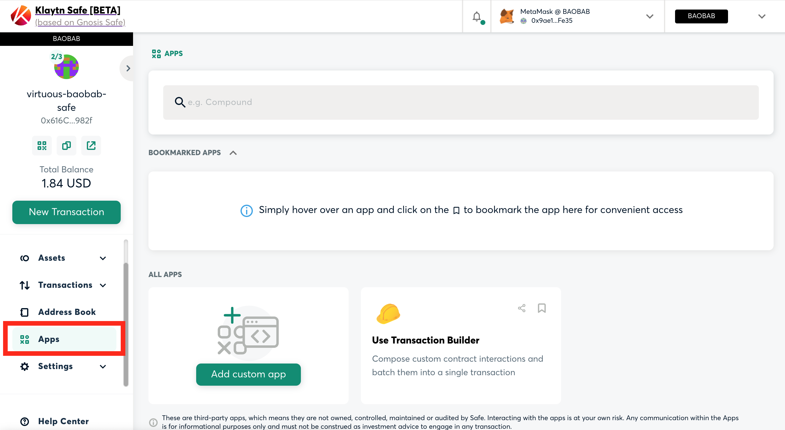

**Step 2:** Open the Transaction Builder Safe app

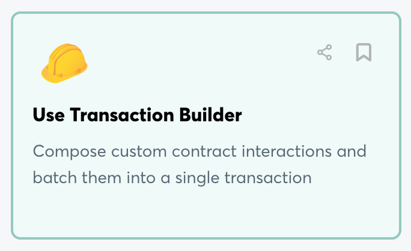

**Step 3:** Enter your token contract address and ABI. In this example, DRIP contract address and ABI will be used. You can copy and paste your ABI into the “Enter ABI” field.

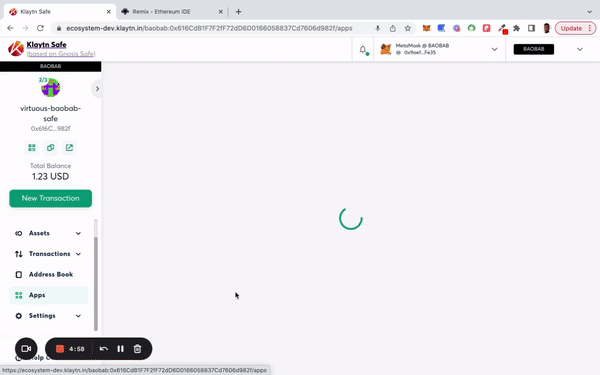

**Step 4:** Select a method and fill the transaction information

From the drop-down you can select a method. In this case, we select the  transfer method. For this step to be completed, you have to fill out the transaction information, such as **to(address)** and **amount(uint256)**.

Please note: The value is an unsigned integer without any decimals. In this example, the DRIP token has 18 decimals. So if you want to send 1 DRIP, you have to enter 1000000000000000000. 

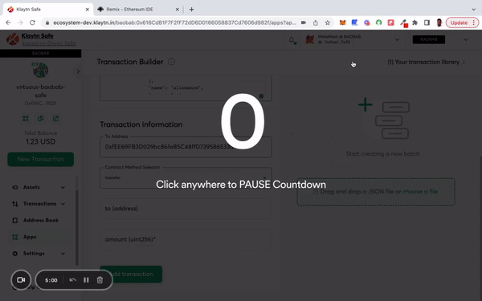

**Step 5:** Click **"Add transaction"**
 
**Step 6:** Repeat steps **4**, **5**, and **6** for every recipient address.
 
**Step 7:** Once you added all operations to the batch click "Create Batch"

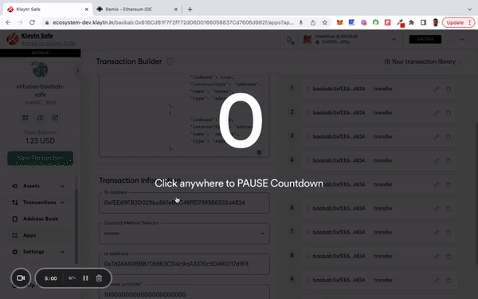

**Step 8:** Review and submit transaction

You'll be able to review the whole batch. Once ready, click "Send Batch" to submit and execute the transaction just like any other Safe transaction.

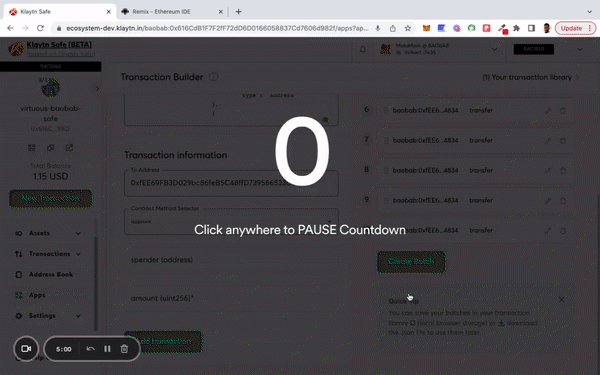

# Important Notes 

The following are things you will want to keep in mind while using Klaytn Safe:

## Transaction Fees 
Klaytn Safe transactions, whether asset transfers or contract interactions, incur a fee that will be paid by the signer that executes the transaction (usually the last signer to reach the required threshold of signatures).

## Safe Nonce 

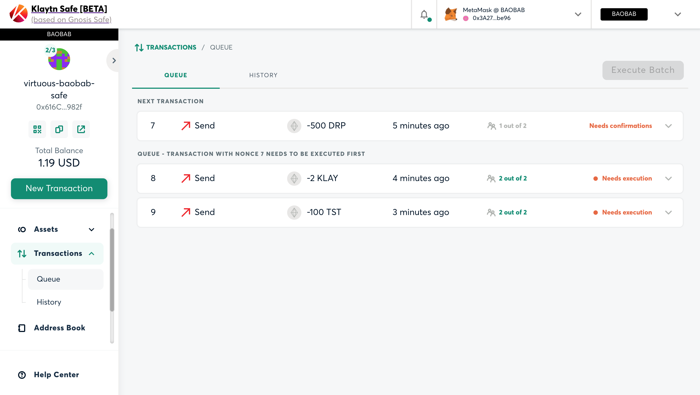

For security reasons, transactions made with Safe need to be executed in order. To achieve this, a number called **nonce** is assigned to a transaction to ensure that each transaction can be executed once. 

At any given time, only transactions with a nonce of **last executed transaction +1** can be executed. Transactions with a higher nonce are queued for execution. So, whenever a transaction is completed, the next transaction in the queue is made available for execution, provided it has accumulated enough signatures.

## Chain-specific addresses 

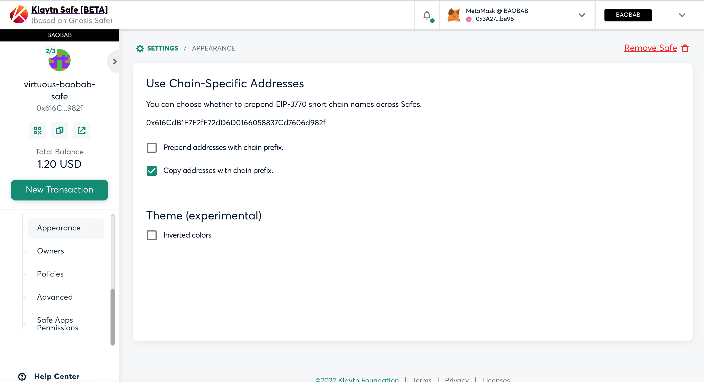

You can choose whether to prepend short chain names across Safes.

* Prepend addresses with chain prefix: You can prepend the chain name “baobab” to the address by clicking the first check box or otherwise.

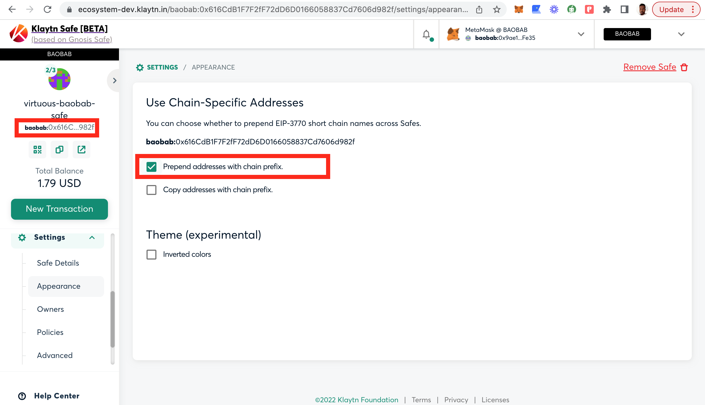

* Copy addresses with chain prefix:

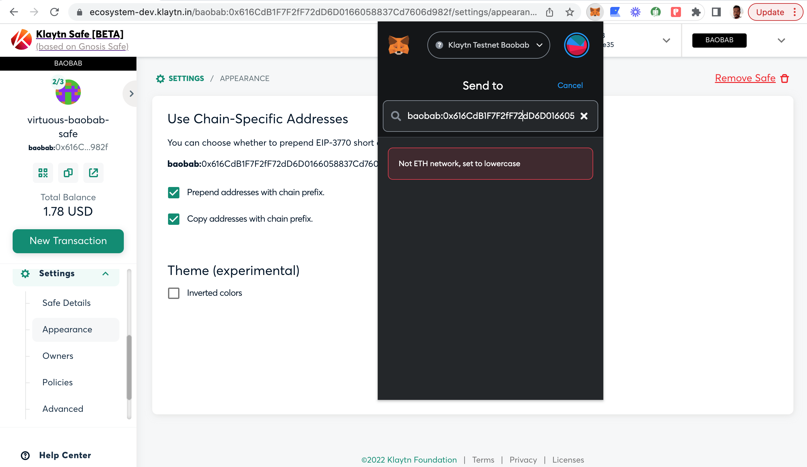

When copying your safe address from your dashboard to paste in your wallet as seen above, you can either choose to add the chain name or not by clicking the checkbox. It is suggested that you leave it unchecked to avoid the error above.

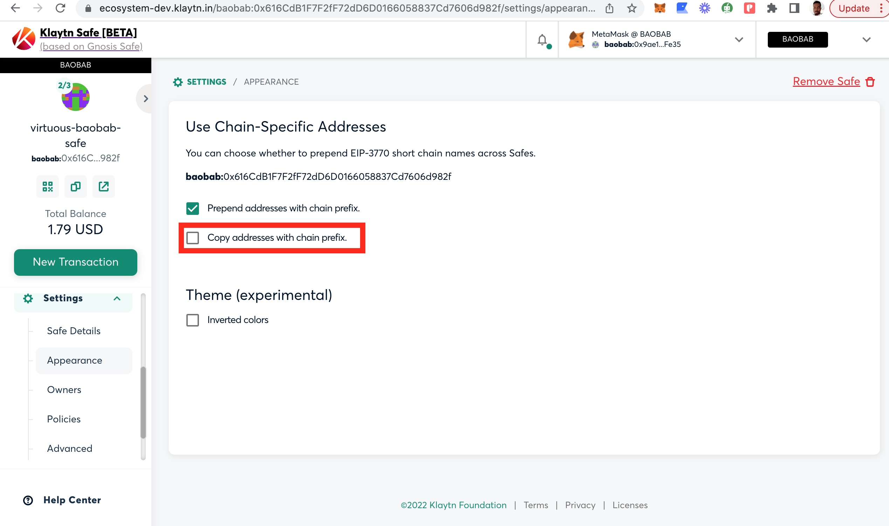

Klaytn Safe is an extremely powerful tool for the management of your projects, company funds, and transaction automation. Creating a Safe account provides security against private key hacks and other unforeseen situations that may cause your funds to be lost.

With Klaytn Safe, you don't have to worry about understanding smart contracts to explore multi signature wallet functionalities. Klaytn Safe provides a smooth UI that enables you to easily configure multisig wallets according to your needs.

