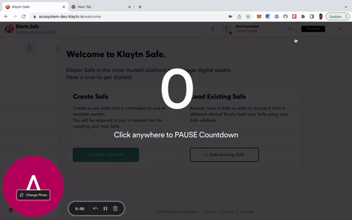
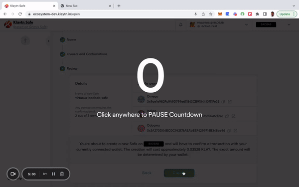

Here you will learn how to create a Safe and evaluate its benefits on the Klaytn Network. Let's get started!

**Step 1:** Navigate to [Klaytn Safe App](https://safe.klaytn.foundation/). By navigating to the application on your web browser, you can explore the functionality of Klaytn Safe.

**Step 2:** Connect your [wallet](https://docs.ethhub.io/using-ethereum/wallets/intro-to-ethereum-wallets/). At the moment, Klaytn Safe has support for [MetaMask](https://docs.klaytn.foundation/dapp/tutorials/connecting-metamask) wallet. Make sure you have Klaytn networks([Cypress](https://docs.klaytn.foundation/dapp/tutorials/connecting-metamask#connect-to-klaytn-cypress-network-mainnet) or [Baobab](https://docs.klaytn.foundation/dapp/tutorials/connecting-metamask#connect-to-klaytn-baobab-network-testnet)) added to your MetaMask wallet to connect successfully.

**Step 3:**  Once your wallet is connected, click **"Create New Safe"** and give your new Safe a **name**. This name is linked to your safe account, which is a multi-signature wallet that holds and stores all of your funds.

**Step 4:** Add owners/signers by inputting the addresses that have permission to submit and approve transactions. You can add as many signers as you want and remove or replace any of them at any time.

**Step 5:** Choose how many signer confirmations a transaction in your Safe account needs to be approved. It is important to note that by default our app allows one signer confirmation. But it is advisable to use a threshold higher than 1 to ensure a secured safe account. Good practice is to use a threshold of 51% of the total owners e.g, 2 out of 3, 3 out of 5 etc as shown below:

**Step 6:** Review and deploy Safe: Once you are completely satisfied with all of your Safe parameters, you can submit the creation of your Safe account and proceed with the on-screen instructions to complete the account creation.

Congratulations on successfully creating your Klaytn Safe account!

