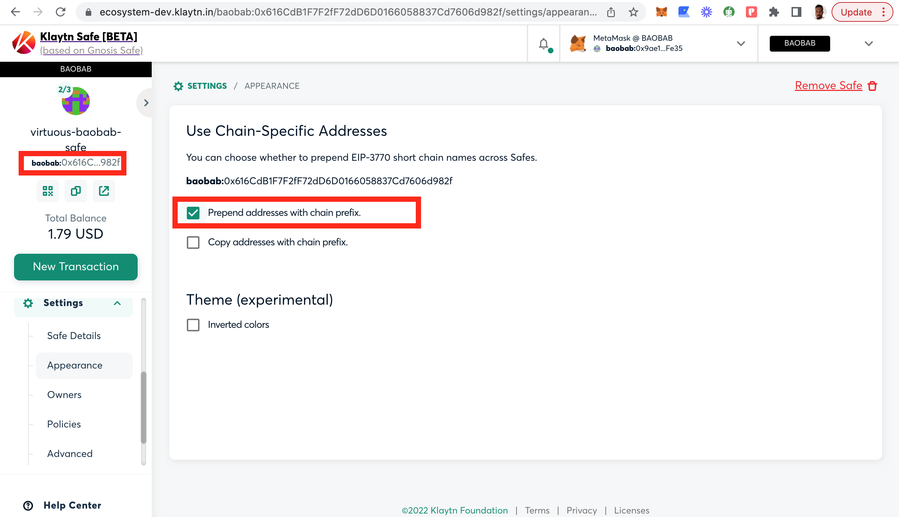
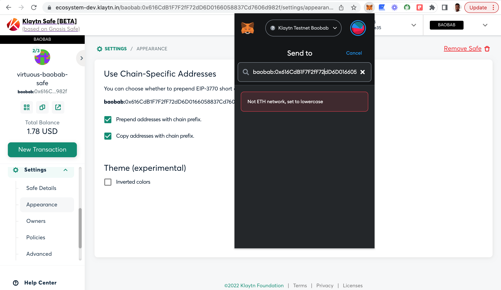
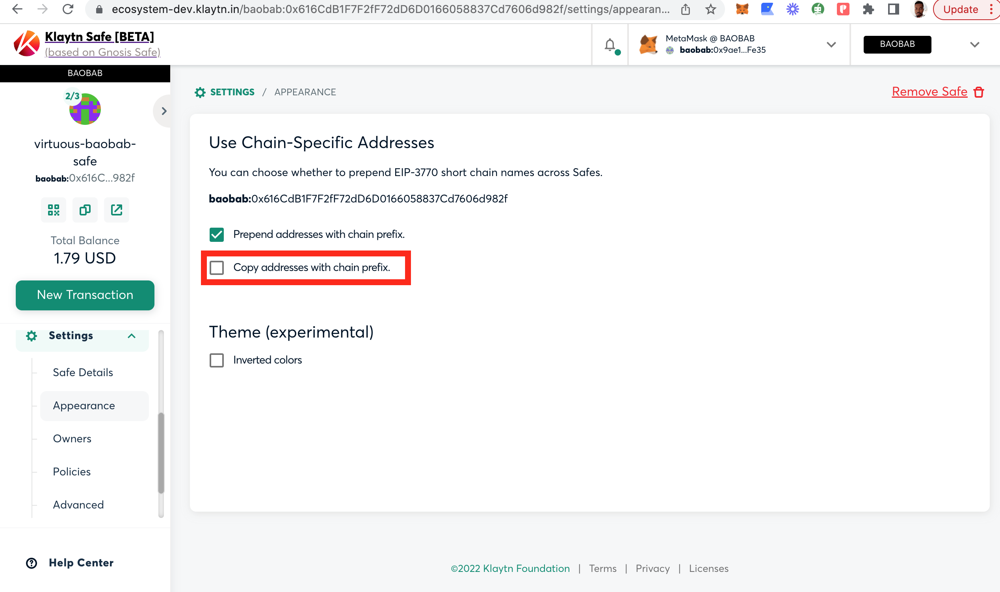

# Points to Note 

The following are things you will want to keep in mind while using Klaytn Safe:

# Transaction Fees 

Klaytn Safe transactions, whether asset transfers or contract interactions, incur a fee that will be paid by the signer that executes the transaction (usually the last signer to reach the required threshold of signatures).

# Safe Nonce 

For security reasons, transactions made with Safe need to be executed in order. To achieve this, a number called **nonce** is assigned to a transaction to ensure that each transaction can be executed once. 

At any given time, only transactions with a nonce _last executed transaction +1_ can be executed. Transactions with a higher nonce are queued for execution. So, whenever a transaction is completed, the next transaction in the queue is made available for execution, provided it has accumulated enough signatures.

# Chain-specific addresses 

You can choose whether to prepend short chain names across Safes.

* Prepend addresses with chain prefix: You can prepend the chain name “baobab” to the address by clicking the first check box or otherwise.

* Copy addresses with chain prefix:

When copying your safe address from your dashboard to paste in your wallet as seen above, you can either choose to add the chain name or not by clicking the checkbox. It is suggested that you leave it unchecked to avoid the error above.

