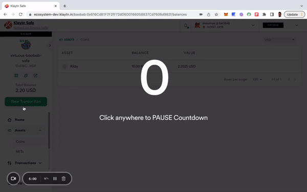
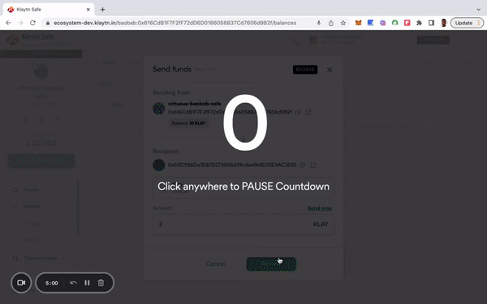
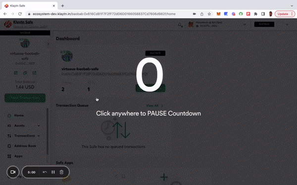
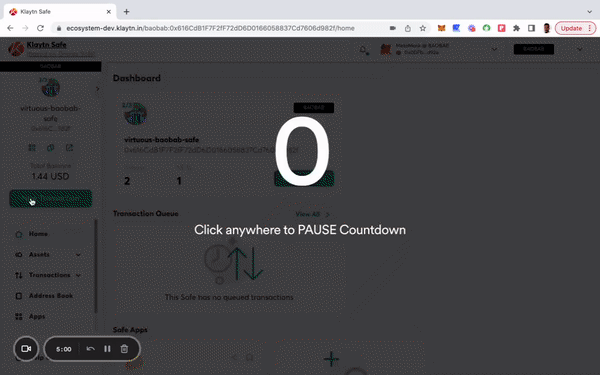
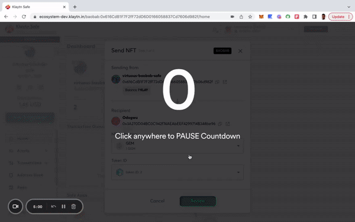

In this section, you'll learn how to send KLAY and KIP-7 tokens from your Klaytn Safe account.

## Send KLAY 

**Step 1:** Click the **"New Transaction"** button in the side menu and select **"Send funds"** to begin a new asset transfer.

**Step 2:** Choose assets to transfer. 

* **KLAY**
  Note: Add the **recipient address** and the **amount** of KLAY to send the transfer KLAY.

  
* **KIP-7 Tokens**
Note: Add the recipient address and the number of tokens to transfer KIP7 tokens.

  

**Step 3:** Review and submit the transaction. You will need to sign the transaction with your signer wallet, and it will be executed once the confirmation threshold is reached.

## Send NFTs 

In this section, you'll learn how to send your non-fungible tokens from your Klaytn Safe account. 

**Step 1:** Click the **"New Transaction"** button in the side menu and select **"Send NFT"** to begin a new asset transfer.

**Step 2:** Choose assets to transfer.

**Step 3:** Review and submit the transaction. You will need to sign the transaction with your signer wallet, and it will be executed once the confirmation threshold is reached.

