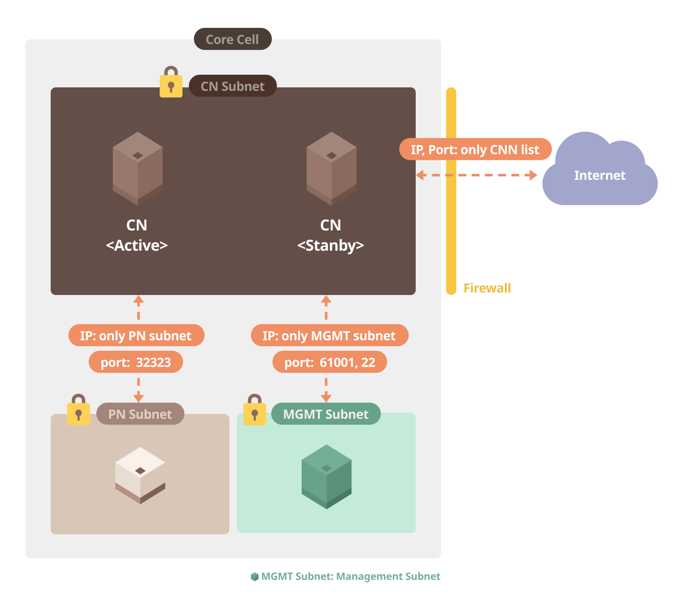
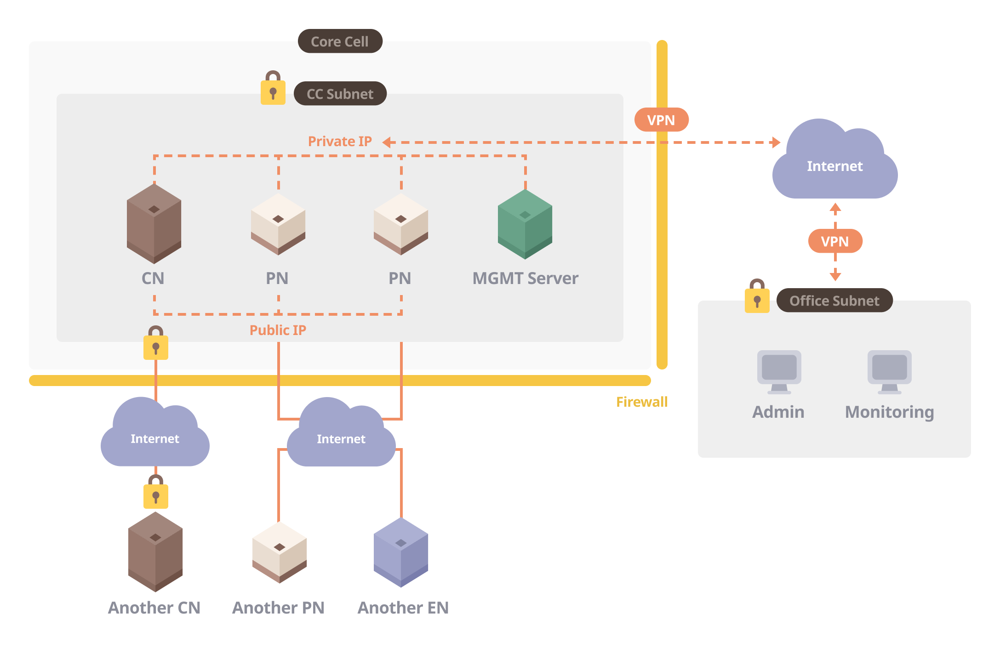

# ネットワーク設定 

コアセルは以下から構成できます。

* 複数のサブネット（推奨）
* 1つのサブネット

## 複数のサブネットを持つコアセル 

DB + AppServer や Proxy Web Server などの一般的な Web サービスで使用される 2 層サブネットを持つことをお勧めします。 サブネットのこの設計には、セキュリティ上のより多くの利点があります。

監視サーバーは、別のレイヤーとしてすべてのサーバーを管理するためにも必要です。 次のセクションでは、3層サブネットを持つコアセルの設定方法について説明します。

3層サブネットは以下のようになります。

* CN サブネット
* PN Subnet
* 管理 (Mgmt) サブネット

### CN サブネット 

CN サブネットは、コアセル内のCNサーバーで構成されます。 コアセルで動作するCNは1つのみですが、スペアは高可用性のために準備する必要があります。 コアセルネットワーク(CCN)内のすべてのCNのIP/ポートは、コアセルの外側から他のCNに接続しようとするため、互いに開く必要があります。 (この接続情報は Baobab オペレーターから受信できます。 コアセル内の他のサブネットとの内部通信では、PNサブネットのPNに接続するために、デフォルトのポート(323:デフォルトのKlaytn P2Pポート番号)を開く必要があります。 さらに、 モニタリングサーバー用のCNモニタリングポート(61001)、管理目的のSSHポート(22)などの他のポートを開く必要があります。 マルチチャンネル機能が使用されている場合、別のポート(32324:デフォルトのマルチチャンネル ポート)も同様に開く必要があります。

| 原点サブネット   | ターゲットサブネット     | Ingress                    | Egress |
|:--------- |:-------------- |:-------------------------- |:------ |
| CN Subnet | PN Subnet      | P2P: 32323 (マルチハンネル用32324) | すべて    |
| CN Subnet | Mgmt Subnet    | SSH: 22, モニタリング: 61001     | All    |
| CN Subnet | パブリック（インターネット） | 各 CN's IP と P2Pポート         | All    |

### PN Subnet 

PNサブネットは、外部ENに接続するためにサービスを提供するPNサーバで構成されています。

PNサブネットが次のノードに接続されています:

* コアセル内の CNs
* いくつかのコアセルのPNs
* コアセル管理サーバー (Mgmt, モニタリング)
* EN nodes

| Origin Subnet | Target Subnet     | Ingress                             | Egress |
|:------------- |:----------------- |:----------------------------------- |:------ |
| PN Subnet     | CN Subnet         | P2P: 32323 (32324 for multichannel) | All    |
| PN Subnet     | Mgmt Subnet       | SSH: 22, Monitoring: 61001          | All    |
| PN Subnet     | Public (Internet) | P2P: 32323                          | All    |

### Mgmt Subnet 

Mgmt Subnetは、sshを通じてコアセルノードに入るためのゲートウェイサブネットです。 監視サーバーとコアセルノードを管理するためのツールでインストールされた管理サーバーと一緒に接続するには、VPNサーバーが必要な場合があります。

| Origin Subnet | Target Subnet     | Ingress                         | Egress |
|:------------- |:----------------- |:------------------------------- |:------ |
| Mgmt Subnet   | CN Subnet         | All                             | All    |
| Mgmt Subnet   | PN Subnet         | All                             | All    |
| Mgmt Subnet   | Public (Internet) | VPN (tcp): 443, VPN (udp): 1194 | All    |

## 単一サブネットを持つコアセル 

コアセルの 1 つのサブネットは、開発/テスト目的または複数のサブネットを作成するための困難な状況下で構築されます。

すべてのノードは単一のCCサブネットの下でセットアップされます。 また、CNN内でP2Pポート(マルチチャネルオプションの場合は3232324)を使用してCNN内の他のCNに接続するためにもファイアウォールの設定が必要です。 PNのP2Pポートは、エンドポイントノードネットワーク(ENN)とコアセルネットワーク(CNN)のPNに接続するために開かれます。 また、オプションのVPNと監視サーバーは、リモートで管理する必要があります。

