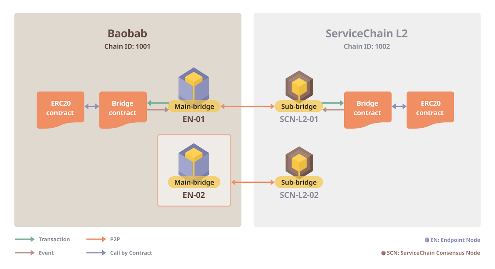

ServiceChainで1つのブリッジのみを使用すると、そのブリッジは1つの障害点になります。 これを解決するために、2つ以上のブリッジを持つHAシステムを構築する方法を説明します。 以下の図に示すように、ブリッジを少なくとも2つのペアで接続するように設定します。 たとえ1つの橋の接続に問題があったとしても チェーン間のデータアンカーと値の伝達は、他のブリッジを通しても正常に機能します。


## Prerequisites <a id="prerequisites"></a>
 - ENのメインブリッジとSCNのサブブリッジが接続されています。 そうでない場合は、 [Baobab connection](en-scn-connection.md) を参照して接続を確立してください。
 - このセクションでは、BaobabとServiceChainの間に追加のブリッジを追加する方法について説明します。 同じように、別のブリッジを追加することでHAを設定することもできます。

## ステップ 1: EN-SCN の間に別のブリッジを追加する <a id="step-1-adding-another-bridge-between-en-scn"></a>

[Baobab](en-scn-connection.md)への接続では、ENとSCNはそれぞれEN-01とSCN-L2-01としてブリッジで接続されていると仮定します。 このセクションでは、EN-02とSCN-L2-02の間に別のブリッジを追加します。 同じ手順に従っているので、簡単に説明します。


EN-02 をビルドした後、 `SC_MAIN_BRIDGE` を `conf/kend.conf` で 1 に設定し、EN-02 で ken を再起動します。

```console
MAIN_BRIDGE=1
```

EN-02のKNI情報を以下のコマンドで確認します。


```console
EN-02$ ken attach --datadir ~/data
> mainbridge.nodeInfo.kni
"kni://eb8f21df10c6562...25bae@[::]:50505?discport=0"
```

SCN-L2-02にログインし、EN-02のKNIで `main-bridges.json` を作成します。 JSON配列形式で角括弧を使用していることを確認してください。


```console
SCN-L2-02$ echo '["kni://eb8f21df10c6562...25bae@192.168.0.5:50505?discport=0"]' > ~/data/main-bridges.json
```

SCN-L2-02 のシェルで `kscn-XXXXXXX-amd64/conf/kscnd.conf` を以下に説明します。 ブリッジを接続するには、 `SC_SUB_BRIDGE` を 1 に設定します。 `SC_PARENT_CHAIN_ID` は Baobob の `chainID` 1001に設定されている。 `SC_ANCHORING_PERIOD` は、アンカー取引を親チェーンに送信する期間を決定するパラメータである。 この例では、アンカートランザクションは、10 個の子ブロックごとに、親チェーン (Baobab) に送信されます。
```
...
SC_SUB_BRIDGE=1
...
SC_PARENT_CHAIN_ID=1001
...
SC_ANCHORING_PERIOD=10
...
```


EN-02でkenを再起動した場合 EN-02とSCN-L2-02の間でブリッジが自動的に接続され、下図のように接続が行われた位置からデータアンカーが開始されます。

EN-02とSCN-L2-02の間にブリッジを追加すると、以下のようにノード間の接続が確立されていることがわかります。



## ステップ 2: ブリッジコントラクトの登録と購読 <a id="step-2-registering-and-subscribing-the-bridge-contract"></a>

上図に示すように、ブリッジコントラクトはEN-01とSCN-L2-01にのみ登録されています。

SCN-L2-02コンソールに接続し、ブリッジ登録、ブリッジ登録、トークン登録のAPIを実行します。 ブリッジとトークンのコントラクトは、 [クロスチェーン値転送](value-transfer.md)のステップ2でEN-01およびSCN-L2-01とのブリッジコントラクトをデプロイ中に作成されました。

```
$ kscn attach --datadir ~/data
> subbridge.registerBridge("0xCHILD_BRIDGE_ADDR", "0xPARENT_BRIDGE_ADDR")
null
> subbridge.subscribeBridge("0xCHILD_BRIDGE_ADDR", "0xPARENT_BRIDGE_ADDR")
null
> subbridge.registerToken("0xCHILD_BRIDGE_ADDR", "0xPARENT_BRIDGE_ADDR", "0xCHILD_TOKEN_ADDR", "0XPARENT_TOKEN_ADDR")
null
```


ブリッジコントラクトでは、追加のブリッジ追加に関する情報を更新する必要があります。 Write the child operator and parent operator information of the added extra bridge in the `erc20/erc20-addOperator4HA.js` file of [service-chain-value-transfer-example](https://github.com/klaytn/servicechain-value-transfer-examples) and execute `node erc20-addOperator4HA.js`.

```
// register operator
await conf.child.newInstanceBridge.methods.registerOperator("0xCHILD_BRIDGE_ADDR").send({ from: conf.child.sender, gas: 100000000, value: 0 });
await conf.parent.newInstanceBridge.methods.registerOperator("0xPARENT_BRIDGE_ADDR").send({ from: conf.parent.sender, gas: 100000000, value: 0 });
```

複数のブリッジが存在する場合は、閾値を設定することで、より安全に値伝送を行うことができます。 値転送は、通常しきい値を超える演算子が値転送を要求した場合にのみ有効にできます。 例えば、現在の例のように、ブリッジペアが 2 つあり、しきい値が 2 に設定されている場合。 両方が通常要求されている場合に限り、値の伝達は提供できます。 すなわち、1つの橋が攻撃されて、異常な要求を送信しても、それを防ぐことができます。 閾値のデフォルト値は1です。 In the `erc20/erc20-addOperator4HA.js` file of [service-chain-value-transfer-example](https://github.com/klaytn/servicechain-value-transfer-examples), uncomment the code below and set the threshold value and then run it to change the threshold for the bridge contract.

```
// set threshold
// await conf.child.newInstanceBridge.methods.setOperatorThreshold(0, "your threshold number").send({ from: conf.child.sender, gas: 100000000, value: 0 });
// await conf.parent.newInstanceBridge.methods.setOperatorThreshold(0, "your threshold number").send({ from: conf.parent.sender, gas: 100000000, value: 0 });
```


登録が完了すると、下図のようにEN-02とSCN-L2-02の両方にブリッジ契約が登録され、HAを設定します。


HAに2つ以上のブリッジペアが接続されると、同じブロックのデータアンカートランザクションが複数回発生します。 価値転送トランザクションも複数回発生する可能性があります つまり、追加料金が必要です。