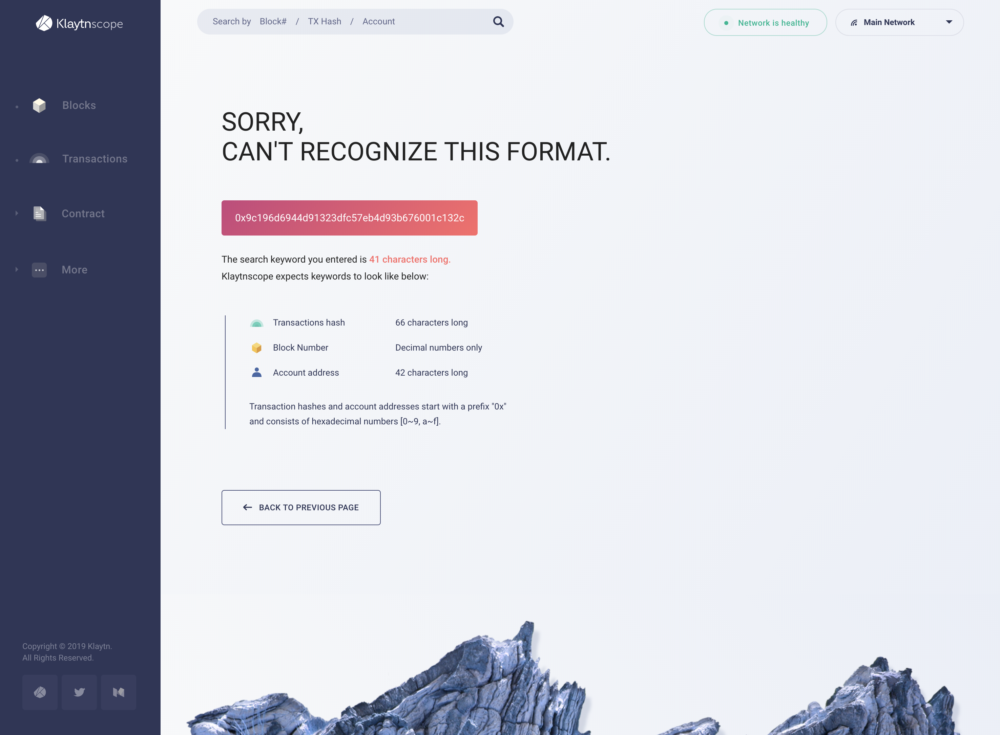

# Klaytnscope 

Klaytnscopeは、Klaytn Networkのブロックエクスプローラです。 Klaytnscopeは、ネットワークの健全性を監視し、Klaytnネットワークのさまざまな統計情報を提供することで、Klaytnネットワークに関する洞察を提供します。 また、ブロックとトランザクションデータ、Klaytnネットワーク上のスマートコントラクトのリストを調べることもできます。

* Baobabネットワークについては、 [https://baob.scope.klaytn.com](https://baobab.scope.klaytn.com) をご覧ください。
* メインネットについては、 [https://scope.klaytn.com](https://scope.klaytn.com) を参照してください。

## 主な機能 

一部の機能は開発中ですのでご注意ください。

* ネットワークの概要
* 検索をブロック
* トランザクション検索
* アカウント検索
* イベントログ検索
* 提案者情報をブロック

その後のセクションでは、Klaytnscopeの主要な機能とスクリーンショットをご覧ください。 ダッシュボード、リストビュー、詳細ビュー、検索の4つのカテゴリで関数をグループ化します。

## ダッシュボード 

ネットワーク情報はダッシュボードに表示されます。 情報には、平均ブロック生成時間、ブロック内の平均取引数、コンセンサスノード数、およびトランザクションの最新トレンドが含まれます。

* ブロック高さ: 最新のブロック高さ。 これは、遺伝子から生成されたブロックの数を示しています。
* ネットワークパフォーマンス: 4つのインジケータでKlaytnのネットワークパフォーマンスを示します。
  * コンセンサスノード:上の図は、合意プロセスに15ノードが参加していることを示しています。
  * 平均ブロック時間 \(1時間\): 直近1時間の平均ブロック生成時間を示します。
  * 平均ブロック時間\(24時間\): 直近24時間の平均ブロック生成時間を示します。
  * ブロックごとの平均取引数 \(24時間\): 過去24時間にわたって1ブロックに含まれる平均取引数。
* トランザクション履歴 \(14 日間\): グラフは、過去 14 日間の毎日のトランザクション数を示しています。 過去2週間の取引量でトレンドを確認できます。

### 最近のブロック & 取引 

これらのリストは、最近作成されたブロックとトランザクションをそれぞれ表示します。 画面の右上隅にある更新ボタンをクリックすると、最新の情報を取得できます。 リストの一番下にある「すべて表示」ボタンをクリックすると、 [リストビュー](klaytnscope.md#list-view)に移動します。

### ネットワークの状態 & ネットワークの選択 

サイトの右上隅には、ネットワークステータスインジケーターとネットワークセレクターのドロップダウンがあります。

* ネットワーク状態インジケーター：
  * ネットワークは健康的です: Klaytnscopeは健康で完全に動作します。 ネットワークの状態は正常です。
  * データのレイテンシ: Klaytnscopeはシステムメンテナンス中です。 データは遅延状態です。
  * データの精度: Klaytnscope はデータを同期しています。お待ちください。
* ネットワークセレクターのドロップ ダウン
  * メニューからKlaytn mainnetとBaobab testnetを選択できます。

## 一覧表示 

Klaytnネットワークの状況を詳しく確認したい場合。 最近生成されたブロックとトランザクションのリストを確認できます。 リストページにアクセスするには、画面の左側にあるナビゲーションバーのボタンをクリックします。

### ブロック 

最近生成されたブロックのリスト。 情報を更新するには、更新をクリックしてください。

* ブロック: ブロックの一意の数。 0 \(genesis block\) から始まり、ブロックが生成されるたびに順番に与えられます。
* 時間: ブロックが生成されてからの時間。 これにカーソルを合わせると、正確な日時を確認できます。
* Total TXs: ブロックに含まれるトランザクションの合計数。
* ブロック提案:ブロックを提案したコンセンサスノードをランダムで決定的に選択しました。 アドレスをクリックすると、簡単に詳細ページに移動できます。
* 報酬: 新しく鋳造された KLAY\(6.4 KLAY\' の集計とブロックで使用された取引手数料。 このリストには、Klaytn Governance Council Reward、Proof Contribution、Klaytn Improvement Reserveの合計のみが表示されます。 ブロックの詳細ページのブロック報酬セクションにカーソルを合わせると、詳細な情報が表示されます。 ブロック報酬分配システムの詳細は、 [Klaytn Token Economy][] を参照してください。
* サイズ: バイト単位で測定されたブロックのサイズ。 トランザクションが多いほど、ブロックサイズが大きくなります。

### 取引 

最近実行されたトランザクションのリスト。 情報を更新するには、更新をクリックしてください。

* TX ハッシュ : トランザクションの一意の識別子 詳細については、ハッシュをクリックして詳細ページに移動します。 トランザクションに失敗すると、その隣に赤い感嘆符が表示されます。
* Block \#: このトランザクションを含むブロックの数。 数字をクリックすると、ブロックの詳細ページに移動します。
* 時間: トランザクションが実行されてからの期間。 これにカーソルを合わせると、正確な日時を確認できます。
* From -&gt; To: The addresses of sender and receiver. アドレスをクリックすると、簡単に詳細ページに移動できます。 ファイルアイコンがアドレスの横に表示されている場合、アドレスがコントラクトであることを意味します。
* TX の種類: トランザクションのタイプ。 特定のタイプのトランザクションを取得するためにフィルターを適用できます。 詳細については、 [トランザクション][] をご覧ください。
* 金額: トランザクションを通じて転送される値の量。
* TX手数料: トランザクションの処理に使用される実際のコスト。

## 詳細表示 

ブロック、取引、アカウント、契約に関する詳細は、このページをご覧ください。 詳細ビューに移動するには、検索バーからエンティティを検索するか、リストビューから項目をクリックします。

### ブロック 

#### 概要 

ブロックの全体的な情報。

* 時間: ブロック生成からの経過時間 その隣には正確なdatetimeも表示されます。
* ハッシュ: ブロックの一意の識別子。 コピーボタンを押すと簡単にハッシュをコピーできます。
* 親ハッシュ: 前のブロックの一意の識別子。 ハッシュをクリックすると、親ハッシュの詳細ビューが表示されます。
* Total TXs: ブロックに含まれるトランザクションの合計数。
* ブロック報酬: 新しく鋳造された KLAY\(6.4 KLAY\' の集計と、ブロック内に集められた取引手数料。 ホバリングすると、Klaytn Governance Council Reward、Proof Contribution and Klaytn Improvement Reserveの詳細情報が表示されます。 ブロック報酬分配システムの詳細については、 [Klaytn Token Economy][] を参照してください。
* ブロックサイズ:バイト単位で測定されたブロックサイズ。 トランザクションが多いほど、ブロックサイズが大きくなります。

#### 委員会 

ブロックを提案し、検証したコンセンサスノードのリスト。

* Block Proposer: ブロックを提案したコンセンサスノードをランダムで決定的に選択しました。 アドレスをクリックすると、ノードの詳細ビューに簡単に移動できます。
* Validators: ブロックを検証したコンセンサスノード。 アドレスをクリックすると、ノードの詳細ビューに簡単に移動できます。

#### 取引 

ブロックに含まれるトランザクションのリストです。

### 取引 

#### 概要 

トランザクションに関する全体的な情報。

* ステータスインジケータ:右上隅にあります。 トランザクションが成功したかどうかを示します。
* TX の種類: トランザクションのタイプ。 詳細については、 [トランザクション][] を参照してください。
* Block \#: このトランザクションを含むブロックの数。 数字をクリックすると、ブロックの詳細ビューに移動します。
* From -&gt; To: The addresses of sender and receiver. アドレスをクリックすると、アカウントの詳細ビューに移動できます。 アドレスの横にファイルアイコンが表示されている場合は、アドレスがコントラクトであることを意味します。
* 手数料支払者:TXタイプが手数料委任または手数料比率委任のいずれかの場合に表示されます。 手数料支払者のアドレスをクリックすると、アカウントの詳細ビューに移動できます。
* 時間: トランザクションが実行されてからの経過時間
* format@@0: 送信者のアドレスから送信されたトランザクションの番号。 ゼロから開始すると、トランザクションが送信されるたびに順次増加します。
* 金額: このトランザクションで転送される値の量。
* ガス価格:KLAYで測定されたガス当たりのコスト。 Klaytnネットワークでは、ガス価格が固定されています。
* 使用ガス:トランザクションの実行に使用された正確なガス。
* ガス制限:送信者がこの取引に支払う意思がある最大ガス。
* TX手数料: トランザクションの処理に使用される実際のコスト。 ガス価格をガス使用量で掛け算して計算します。
* 送信者によるTX手数料:TXタイプが手数料比率で委任された場合に表示されます。 送信者が支払うTX手数料の一部。
* 手数料別TX手数料 支払者:TXタイプが手数料で委任された場合に表示されます。 手数料支払者によって支払われるTX手数料の部分。

#### Input Data 

送信者またはコントラクトによって提供される追加データ。

### アカウント 

#### 概要 

アカウントの全体的な情報。

* アドレス \(Hex\): アカウントの固有のアドレス。
* 残高: この口座が持つKLAYの合計金額。
* Total TXs: このアカウントが送受信した取引の合計数。
* HRA: このアカウントの種類がHRAかどうかを通知します。 \(TBD\)

#### 取引 

このアカウントに関連する取引のリスト。 矢印の色は、アカウントが送信者または受信者であるかどうかを示します。

### 契約 

#### 概要 

契約に関する全体的な情報。

* アカウント \(Hex\): コントラクトの固有のアドレス。
* バランス: このコントラクトが持つKLAYの合計金額。
* Contract Creator: この契約をデプロイしたアカウント。 アドレスをクリックすると、アカウントの詳細ビューに移動できます。
* Total TXs: この契約が受領した取引の合計数。
* コントラクト作成TX: このコントラクトをデプロイしたトランザクション。 ハッシュをクリックすると、トランザクションの詳細ビューに移動します。
* HRA: 口座タイプがHRAかどうかを通知します。 \(TBD\)

#### 取引 

この契約に関連する取引のリスト。

## 検索 

Klaytnscopeを通じて、口座、契約、取引、ブロックに関する情報を検索できます。 検索バーはすべてのページに配置され、簡単にアクセスできます。 有効なキーワードを入力すると、エンティティの詳細ビューに移動します。

### キーワードを検索 

メインネット版では、検索可能なキーワードは以下のとおりです。

* ブロック \#
* TXハッシュ
* アドレス \(アカウント、契約者)
* Human Readable Address \(.klaytn\) \(TBD\)

### Keyword Format 

それぞれのキーワードを区別する固有の特性は以下の通りです。

#### ブロック 

* 小数点のみ \[0~9\]

#### TXハッシュ 

* 66文字以上
* プレフィックス `0x`で開始
* 16進数のみ \[0~9, a~f\]

#### 住所 

* 42文字以上
* プレフィックス `0x`で開始
* 16進数のみ \[0~9, a~f\]

#### Human Readable Address \(TBD\) 

* 12〜20文字以上
* `.klaytn` で終了

### 検索エラー 

指定された形式に合致しないキーワードや情報がまだ生成されていないキーワードを検索すると、結果ページは表示されません。

#### 間違ったフォーマット \(TXハッシュ/アドレス\) 

* 不正な文字数
* プレフィックス `0x`で始まりません
* 特殊文字または16進数でない文字 \[g~z\] が含まれています

#### 存在しない 

* ブロックはまだ生成されていません \（入力されたブロック番号が最近生成されたブロック番号よりも高い場合）
* Non-existent TX Hash

[トランザクション]: ../klaytn/design/transactions/README.md
[Klaytn Token Economy]: ../klaytn/design/token-economy.md
