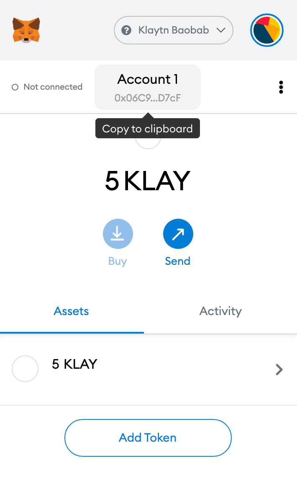

# Connecting MetaMask 

> **참고**: MetaMask는 주로 이더리움 지갑으로서 사용되지만, 동일한 주소 구조를 지닌 Klaytn과도 호환 가능합니다. Klaytn은 브라우저 익스텐션 지갑 [Kaikas](../developer-tools/README.md#kaikas)도 지원합니다. 따라서 Remix를 제외하면 MetaMask와 거의 동일한 기능을 제공합니다.

## 1단계: 메타마스크 설치하기 

* Chrome 웹브라우저 기준으로 설명합니다. ([**크롬 설치하기**](https://www.google.com/intl/en_us/chrome/))

* Chrome 확장 프로그램 탭에서 [**MetaMask 확장 프로그램**](https://chrome.google.com/webstore/detail/metamask/nkbihfbeogaeaoehlefnkodbefgpgknn?hl=en)을 추가합니다.

  > **참고:** 다른 브라우저를 사용하는 경우 별도 설치가 필요할 수 있습니다.

* Chrome 검색 바 오른쪽 아이콘을 클릭하면 메타마스크를 실행시킬 수 있습니다.

## 2단계: 메타마스크 지갑 생성 

* [지갑 생성] 버튼을 클릭합니다.
* 암호를 생성합니다.
* 12개의 단어로 구성된 시드 구문이 주어지면 이를 안전한 곳에 적습니다.

  > **참고:** 해당 구문을 알아야만 지갑 복구가 가능합니다. 타인에게 노출 시 계정의 자금을 모두 잃을 수 있습니다. 그렇기에 시드 구문은 수기로 적어두거나 외부 연결이 차단된 장치에 기록하기를 권장합니다.

## 3단계: Klaytn 네트워크 연결 

* 이더리움 메인넷 상태인 네트워크 탭을 클릭해 [맞춤형 RPC]를 선택합니다.

* 연결할 Klaytn 체인의 EN 정보를 입력합니다.

  * Baobab
    * 네트워크 이름: Klaytn Baobab
    * 새 RPC URL: [https://api.baobab.klaytn.net:8651](https://api.baobab.klaytn.net:8651) (Default: [http://localhost:8551](http://localhost:8551/))
    * Block Explorer URL: [https://baobab.scope.klaytn.com/](https://baobab.scope.klaytn.com/)
    * 체인 ID: 1001
  * Cypress
    * 네트워크 이름: Klaytn Cypress
    * 새 RPC URL: (Default: [http://localhost:8551](http://localhost:8551/))
    * Block Explorer URL: [https://scope.klaytn.com/](https://scope.klaytn.com/)
    * 체인 ID: 8217
  * 공통
    * 통화 기호: KLAY

    > **참고:** 예제는 테스트넷(Baobab)의 Public EN으로 네트워크에 연결하였습니다. 현재는 메인넷(Cypress)에서 Public EN을 제공하고 있지 않으니 테스트넷(Baobab)으로 테스트를 진행해 주세요.

* Click [Save] to add Klaytn Baobab Network.

## 4단계: 송금에 필요한 KLAY 획득하기 

* Klaytn Wallet의 연동 상태를 확인하기 위해서는 송금에 사용될 KLAY가 필요합니다.
* 우측 상단 아이콘 아래 탭에서 [계정 세부 정보]를 클릭합니다.
* Click [Export Private Key] to obtain your private key.

* When using Baobab Testnet, you can obtain Test Klay in [**Klaytn Faucet**](https://baobab.wallet.klaytn.com/access?next=faucet).
* Enter your private key on Klaytn Wallet and log in by clicking [Access]. (Attach 0x in front of the private key.)
* Click [Run Faucet]. 5 Testnet KLAY will be sent to your account and the balance will be updated accordingly. You can claim Testnet KLAY from Faucet once every 24 hours per account.

* Come back to MetaMask and confirm the KLAY that you received.

## 5단계: 송금하기 

* Click on the round icon in the top right corner, and select [Create Account] in the menu to create a new account.
* Copy the account address to clipboard.

* In the drop-down menu, change to the first account.
* On [Send], enter the recipient's account address as well as the amount of KLAY and then click [Next] to proceed. > **Note:** The gas price on Klaytn is fixed. Arbitrarily changing the price may result in a transaction failure.You can view your transaction history in the [Activity] tab.

