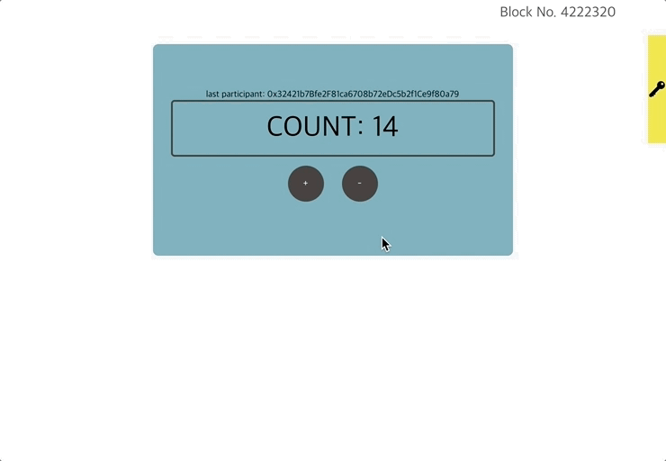

# 5-3. Count 컴포넌트

`src/components/Count.js`에 대한 설명입니다.

## `Count` 컴포넌트

1\) 전체 코드  
2\) `Count` 컴포넌트의 역할  
3\) 스마트 컨트랙트와 상호작용하는 방법  
4\) 스마트 컨트랙트와의 상호작용: `getCount` 메서드  
5\) 스마트 컨트랙트와의 상호작용: `setPlus` 메서드  
6\) 트랜잭션의 라이프 싸이클

### 1\) 전체 코드

```javascript
import React, { Component } from 'react'
import cx from 'classnames'

import { cav } from 'klaytn/caver'

import './Count.scss'

class Count extends Component {
  constructor() {
    super()
    // ** 1. 스마트 컨트랙트 인스턴스 생성 **
    // 예시: new cav.klay.Contract(DEPLOYED_ABI, DEPLOYED_ADDRESS)
    // 이 인스턴스를 통해 스마트 컨트랙트 메서드를 호출할 수 있습니다.
    // Now you can access the instance by `this.countContract` variable.
    this.countContract = DEPLOYED_ABI
      && DEPLOYED_ADDRESS
      && new cav.klay.Contract(DEPLOYED_ABI, DEPLOYED_ADDRESS)
    this.state = {
      count: '',
      lastParticipant: '',
      isSetting: false,
    }
  }

  intervalId = null

  getCount = async () => {
    // ** 2. 스마트 컨트랙트 메서드 호출 (CALL) **
    // 예시: this.countContract.methods.methodName(arguments).call()
    // 위와 같이 스마트 컨트랙트 메서드(CALL)를 호출할 수 있습니다.
    // For example, your contract has a method called `count`.
    // You can call it like below:
    // ex:) this.countContract.methods.count().call()
    // It returns promise, so you can access it by .then() or, use async-await.
    const count = await this.countContract.methods.count().call()
    const lastParticipant = await this.countContract.methods.lastParticipant().call()
    this.setState({
      count,
      lastParticipant,
    })
  }

  setPlus = () => {
    const walletInstance = cav.klay.accounts.wallet && cav.klay.accounts.wallet[0]

    // Need to integrate wallet for calling contract method.
    if (!walletInstance) return

    this.setState({ settingDirection: 'plus' })

    // 3. ** 스마트 컨트랙트 메서드 호출 (SEND) **
    // 예시: this.countContract.methods.methodName(arguments).send(txObject)
    // 위와 같이 스마트 컨트랙트 메서드(SEND)를 호출할 수 있습니다.
    // For example, your contract has a method called `plus`.
    // You can call it like below:
    // ex:) this.countContract.methods.plus().send({
    //   from: '0x952A8dD075fdc0876d48fC26a389b53331C34585', // PUT YOUR ADDRESS
    //   gas: '200000',
    // })
    this.countContract.methods.plus().send({
      from: walletInstance.address,
      gas: '200000',
    })
      .once('transactionHash', (txHash) => {
        console.log(`
          Sending a transaction... (Call contract's function 'plus')
          txHash: ${txHash}
          `
        )
      })
      .once('receipt', (receipt) => {
        console.log(`
          Received receipt! It means your transaction(calling plus function)
          is in klaytn block(#${receipt.blockNumber})
        `, receipt)
        this.setState({
          settingDirection: null,
          txHash: receipt.transactionHash,
        })
      })
      .once('error', (error) => {
        alert(error.message)
        this.setState({ settingDirection: null })
      })
  }

  setMinus = () => {
    const walletInstance = cav.klay.accounts.wallet && cav.klay.accounts.wallet[0]

    // 스마트 컨트랙트 메서드 호출을 위해 지갑을 연동해야 합니다.
    if (!walletInstance) return

    this.setState({ settingDirection: 'minus' })

    // 3. ** 스마트 컨트랙트 메서드 호출 (SEND) **
    // 예시: this.countContract.methods.methodName(arguments).send(txObject)
    // 위와 같이 스마트 컨트랙트 메서드(SEND)를 호출할 수 있습니다.
    // For example, your contract has a method called `minus`.
    // You can call it like below:
    // ex:) this.countContract.methods.minus().send({
    //   from: '0x952A8dD075fdc0876d48fC26a389b53331C34585', // PUT YOUR ADDRESS
    //   gas: '200000',
    // })

    // It returns event emitter, so after sending, you can listen on event.
    // Use .on('transactionHash') event,
    // : if you want to handle logic after sending transaction.
    // Use .once('receipt') event,
    // : if you want to handle logic after your transaction is put into block.
    // ex:) .once('receipt', (data) => {
    //   console.log(data)
    // })
    this.countContract.methods.minus().send({
      from: walletInstance.address,
      gas: '200000',
    })
      .once('transactionHash', (txHash) => {
        console.log(`
          Sending a transaction... (Call contract's function 'minus')
          txHash: ${txHash}
          `
        )
      })
      .once('receipt', (receipt) => {
        console.log(`
          Received receipt which means your transaction(calling minus function)
          is in klaytn block(#${receipt.blockNumber})
        `, receipt)
        this.setState({
          settingDirection: null,
          txHash: receipt.transactionHash,
        })
      })
      .once('error', (error) => {
        alert(error.message)
        this.setState({ settingDirection: null })
      })
  }

  componentDidMount() {
    this.intervalId = setInterval(this.getCount, 1000)
  }

  componentWillUnmount() {
    clearInterval(this.intervalId)
  }

  render() {
    const { lastParticipant, count, settingDirection, txHash } = this.state
    return (
      <div className="Count">
        {lastParticipant && (
          <div className="Count__lastParticipant">
            last participant: {lastParticipant}
          </div>
        )}
        <div className="Count__count">COUNT: {count}</div>
        <button
          onClick={this.setPlus}
          className={cx('Count__button', {
            'Count__button--setting': settingDirection === 'plus',
          })}
        >
          +
        </button>
        <button
          onClick={this.setMinus}
          className={cx('Count__button', {
            'Count__button--setting': settingDirection === 'minus',
          })}
        >
          -
        </button>
        {txHash && (
          <div className="Count__lastTransaction">
            <p className="Count__lastTransactionMessage">
              You can check your last transaction in klaytn scope:
            </p>
            <a
              target="_blank"
              href={`https://baobab.scope.klaytn.com/tx/${txHash}`}
              className="Count__lastTransactionLink"
            >
              {txHash}
            </a>
          </div>
        )}
      </div>
    )
  }
}

export default Count
```

### 2\) `Count` 컴포넌트의 역할

`'Count'` 컴포넌트의 역할은 Klaytn 블록체인에 배포된 Count 스마트 컨트랙트와 상호작용하는 것입니다.

Count.sol에 다음과 같이 여러 변수 및 함수가 선언되어 있습니다.  
1.`count`  
2.`lastParticipant`  
3.`plus` - 스토리지 변수 `count`를 1만큼 증가시킵니다. \(count = count + 1\)  
4.`minus` - 스토리지 변수 `count` 1만큼 감소시킵니다. \(count = count - 1\)

Count.js 컴포넌트에는 Count 스마트 컨트랙트의 함수 및 변수와 상호작용하는 메서드가 있습니다.

### 3\) 스마트 컨트랙트와 상호작용하는 방법

스마트 컨트랙트와 상호작용하기 위해서 배포된 스마트 컨트랙트의 인스턴스가 필요합니다.  
스마트 컨트랙트의 인스턴스는 caver-js의 `caver.klay.Contract(ABI, contractAddress)` API를 통해 생성할 수 있습니다. 자세한 내용은 [caver.klay.Contract](https://docs.klaytn.com/sdk/caverjs/caver.klay.Contract#new-contract)을 참고해주세요.

caver는 `Contract ABI`\(Application Binary Interface\)를 사용하여 스마트 컨트랙트의 메서드를 로컬 함수처럼 호출할 수 있습니다.  
예시\)  
`contractInstance.methods.count().call()`  
`contractInstance.methods.plus().send({ ... })`  
`contractInstance.methods.minus().send({ ... })`

`Contract address`는 해당 스마트 컨트랙트의 컴파일 및 배포 이후에 `build/contracts/Count.json` 파일에서 찾을 수 있습니다. 여러분의 편의를 위해 Klaytn 테스트넷에 해당 스마트 컨트랙트를 배포하고 `deployedABI`와 `deployedAddress` 파일을 디렉토리에 넣어두었습니다. 그 두 파일은 Count 스마트 컨트랙트의 ABI와 배포된 스마트 컨트랙트의 주소를 담고 있습니다.  
웹팩 설정 덕분에 변수를 통해 이들 파일에 접근할 수 있습니다. \(`DEPLOYED_ADDRESS`, `DEPLOYED_ABI`\)

예시\)  
`DEPLOYED_ADDRESS`는 배포된 스마트 컨트랙트의 주소를 반환합니다.  
`DEPLOYED_ABI`는 Count 스마트 컨트랙트의 ABI를 반환합니다.

```javascript
constructor() {
  super()
  // ** 1. 스마트 컨트랙트 인스턴스 생성 **
    // 예시: new cav.klay.Contract(DEPLOYED_ABI, DEPLOYED_ADDRESS)
    // 이 인스턴스를 통해 스마트 컨트랙트 메서드를 호출할 수 있습니다.
  // Now you can access the instance by `this.countContract` variable.
  this.countContract = DEPLOYED_ABI
    && DEPLOYED_ADDRESS
    && new cav.klay.Contract(DEPLOYED_ABI, DEPLOYED_ADDRESS)
  ...
}
```

`this.countContract = new cav.klay.Contract(DEPLOYED_ABI, DEPLOYED_ADDRESS)`는 `DEPLOYED_ABI`와 `DEPLOYED_ADDRESS`를 `cav.klay.Contract` API에 전달하여 배포된 `Count` 스마트 컨트랙트와 상호작용할 스마트 컨트랙트 인스턴스를 생성합니다. 그리고 이 스마트 컨트랙트 인스턴스는 `this.countContract`에 저장됩니다.

### 4\) 스마트 컨트랙트와의 상호작용: `getCount` 메서드

```javascript
getCount = async () => {
  // ** 2. 스마트 컨트랙트 메서드 호출 (CALL) **
    // 예시: this.countContract.methods.methodName(arguments).call()
    // 위와 같이 스마트 컨트랙트 메서드(CALL)를 호출할 수 있습니다.
  // For example, your contract has a method called `count`.
  // You can call it like below:
  // ex:) this.countContract.methods.count().call()
  // It returns promise, so you can access it by .then() or, use async-await.
  const count = await this.countContract.methods.count().call()
  const lastParticipant = await this.countContract.methods.lastParticipant().call()
  this.setState({
    count,
    lastParticipant,
  })
}
```

스마트 컨트랙트 인스턴스가 있으므로 스마트 컨트랙트 메서드를 호출할 수 있습니다. 스마트 컨트랙트 인스턴스에는 `methods` 속성이 있습니다.  
해당 속성은 `count`, `lastParticipant`, `plus`, `minus` 등 스마트 컨트랙트의 여러 함수를 담고 있습니다.

스마트 컨트랙트 함수 호출이 프로미스 객체를 반환하기 때문에 위 코드에서 `getCount` 함수는 `async`로 선언되었습니다. `this.countContract.methods.count().call()`를 호출하여 `count`를 불러올 수 있습니다.  
`this.countContract.methods.lastParticipant().call()`를 호출하여 `lastParticipant`의 주소를 불러올 수 있습니다.  
위 변수들로 불러온 값을 setState의 인자로 전달합니다.

스마트 컨트랙트 메서드 호출에 대한 자세한 안내는 [caver.klay.Contract](https://docs.klaytn.com/sdk/caverjs/caver.klay.Contract#methods)를 참고해주세요.

```javascript
componentDidMount() {
  this.intervalId = setInterval(this.getCount, 1000)
}

componentWillUnmount() {
  clearInterval(this.intervalId)
}
```

이때 `count` 변수를 1초마다 불러오고 싶은데요, 이는 `setInterval`으로 가능합니다.   
`caver.klay.getBlockNumber()`를 주기적으로 호출하던 `BlockNumber.js`의 `getBlockNumber`에서 했던 방법과 동일합니다.

### 5\) 스마트 컨트랙트와의 상호작용: `setPlus` 메서드

```javascript
setPlus = () => {
  const walletInstance = cav.klay.accounts.wallet && cav.klay.accounts.wallet[0]

  // Need to integrate wallet for calling contract method.
  if (!walletInstance) return

  this.setState({ settingDirection: 'plus' })

  // 3. ** 스마트 컨트랙트 메서드 호출 (SEND) **
    // 예시: this.countContract.methods.methodName(arguments).send(txObject)
    // 위와 같이 스마트 컨트랙트 메서드(SEND)를 호출할 수 있습니다.
  // For example, your contract has a method called `plus`.
  // You can call it like below:
  // ex:) this.countContract.methods.plus().send({
  //   from: '0x952A8dD075fdc0876d48fC26a389b53331C34585', // PUT YOUR ADDRESS
  //   gas: '200000',
  // })
  this.countContract.methods.plus().send({
    from: walletInstance.address,
    gas: '200000',
  })
    .once('transactionHash', (txHash) => {
      console.log(`
        Sending a transaction... (Call contract's function 'plus')
        txHash: ${txHash}
        `
      )
    })
    .once('receipt', (receipt) => {
      console.log(`
        Received receipt! It means your transaction calling plus function is in klaytn block(#${receipt.blockNumber})
      `, receipt)
      this.setState({ settingDirection: null })
    })
    .once('error', (error) => {
      alert(error.message)
      this.setState({ settingDirection: null })
    })
}
```

`setPlus` 함수는 Count 컴포넌트에서 가장 중요한 부분입니다. 이 함수는 스마트 컨트랙트 함수인 `plus`를 호출하여 스마트 컨트랙트와 상호작용합니다. 이 함수 또한 스마트 컨트랙트 메서드이므로 `this.counterContract.methods`에 있습니다.  
그러나 단순히 데이터를 읽어오는 `count`, `lastParticipant`와 달리, `plus` 함수는 Klaytn 블록체인에 **데이터를 씁니다**.  
데이터를 읽어오는 것은 무료이지만 데이터를 쓰는 것은 연산 및 저장하는 데에 비용이 발생합니다. 그리고 그 비용은 사용한 `gas`의 양에 따라 측정됩니다.

따라서 트랜잭션을 보내려면 트랜잭션 비용을 담당하는 Klaytn 노드에게 `from:` 속성을 알려야 합니다. `gas:` 트랜잭션 발신자가 트랜잭션을 보낼 때 지불하고자 하는 최대 가스량을 나타내는 속성입니다.

```javascript
this.countContract.methods.plus().send({
  from: walletInstance.address,
  gas: '200000',
})
```

트랜잭션을 보내려면 `.call()` 대신 `.send()`을 사용하는 것이 좋습니다.

```javascript
.send({
  from: ...,
  gas: ...
})
```

### 6\) 트랜잭션의 라이프 싸이클

```javascript
.once('transactionHash', (txHash) => {
  console.log(`
    Sending a transaction... (Call contract's function 'plus')
    txHash: ${txHash}
    `
  )
})
.once('receipt', (receipt) => {
  console.log(`
    Received receipt! It means your transaction calling plus function is in klaytn block(#${receipt.blockNumber})
  `, receipt)
  this.setState({ settingDirection: null })
})
.once('error', (error) => {
  alert(error.message)
  this.setState({ settingDirection: null })
})
```

트랜잭션을 보내고 나면 보낸 트랜잭션이 라이프 싸이클 중 어느 상태인지 확인할 수 있습니다.  
트랜잭션 해시를 받으면 `transactionHash` 이벤트가 시작되는데, 네트워크에 트랜잭션을 보내기 전에 사용할 수 있습니다.  
트랜잭션 영수증을 받으면 `receipt`가 시작됩니다. 이는 트랜잭션이 블록에 들어갔음을 의미합니다. `receipt.blockNumber`를 통해 보낸 트랜잭션이 포함된 블록 번호를 확인할 수 있습니다.  
트랜잭션을 보내는 동안 에러가 발생한 경우 `error`가 시작됩니다.

참고\) `settingDirection`는 로딩 표시기\(gif\)를 보여주는 데에 사용됩니다. 트랜잭션이 블록에 포함되면 `settingDirection`을 `null`로 설정하여 로딩 표시기를 제거하세요.

```javascript
<button
  onClick={this.setPlus}
  className={cx('Count__button', {
    'Count__button--setting': settingDirection === 'plus',
  })}
>
  +
</button>
```

+ 버튼을 클릭하여 이 기능을 호출할 수 있게 됩니다.

+ 버튼을 누른 후의 과정을 요약하면 다음과 같습니다.

1. 스마트 컨트랙트 메서드인 `plus`를 호출하여 트랜잭션을 보냅니다. 
2. 트랜잭션을 보낸 직후에 트랜잭션 해시를 받습니다.  
    3-a. 트랜잭션이 처리되어 블록에 포함되면 트랜잭션 영수증을 받습니다.  
    3-b. 트랜잭션을 보내는 동안 에러가 발생하면 에러 메세지를 받습니다. 그리고 `receipt` 블록은 호출되지 않습니다.

`plus` 메서드를 호출하는 전체 코드는 다음과 같습니다.

```javascript
this.countContract.methods.plus().send({
  from: walletInstance.address,
  gas: '200000',
})
  .once('transactionHash', (txHash) => {
    console.log(`
      Sending a transaction... (Call contract's function 'plus')
      txHash: ${txHash}
      `
    )
  })
  .once('receipt', (receipt) => {
    console.log(`
      Received receipt! It means your transaction calling plus function is in klaytn block(#${receipt.blockNumber})
    `, receipt)
    this.setState({ settingDirection: null })
  })
  .once('error', (error) => {
    alert(error.message)
    this.setState({ settingDirection: null })
  })
```

### 블록체인에서 어떻게 트랜잭션을 확인할 수 있나요?



트랜잭션을 보낸 후 Klaytn scope를 사용하여 보낸 트랜잭션의 자세한 내용을 확인할 수 있습니다.  
자세한 안내는 `https://baobab.scope.klaytn.com/tx/${txHash}`에서 확인하시기 바랍니다.