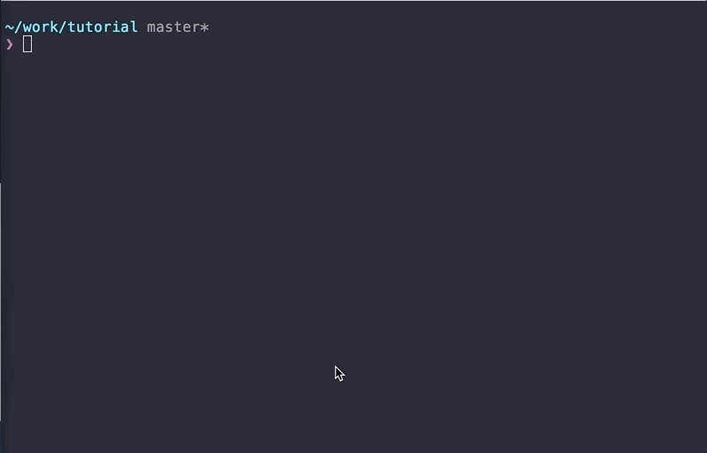

# 6. 스마트 컨트랙트 배포

1\) Truffle 환경 설정  
2\) 배포 설정  
3\) 배포

## 1\) Truffle 환경 설정

`truffle-config.js`는 컨트랙트 코드를 어떻게 배포할지에 대한 파일입니다. truffle-config.js에서 다음 항목들을 설정할 수 있습니다.

**1\) 컨트랙트를 배포할 주체\(컨트랙트를 배포할 Klaytn 계정\)  
2\) 컨트랙트를 배포할 네트워크  
3\) 컨트랙트를 배포하는 데에 지불할 가스의 양**

컨트랙트를 배포하는 데에는 `개인키`를 이용하는 방법과 `잠금 해제된 계정`을 이용하는 방법 두 가지가 있습니다. 

### 배포 방법 1: 개인키

*경고: 개인키를 노출하면 안 됩니다. 만약 노출할 경우 계정이 해킹될 수도 있습니다.*

개인키를 사용하여 컨트랙트를 배포하려면 `provider` 옵션이 필요합니다.

1\) 개인키를 `new HDWalletProvider()`의 첫 번째 인자로 전달하세요.  
2\) Klaytn 노드의 URL을 `new HDWalletProvider()`의 두 번째 인자로 전달하세요.

예시\)

```javascript
{
 ...,
 provider: new HDWalletProvider(
   'YOUR PRIVATE KEY',
   'https://api.baobab.klaytn.net:8651', // 풀노드를 운용중이라면 운영중인 풀노드의 rpc URL로 설정할 수 있습니다.
  ),
 ...
}
```

```javascript
const HDWalletProvider = require("truffle-hdwallet-provider-klaytn");

const NETWORK_ID = '1001'
const GASLIMIT = '8500000'

/**
 * `URL`, `PRIVATE_KEY`을 상수로 설정하여 쉽게 값을 설정하도록 해줍니다.
 * 여기에 개인키와 Klaytn 노드의 URL을 설정하세요.
 */
const URL = `https://api.baobab.klaytn.net:8651`
const PRIVATE_KEY = '0x48f5a77dbf13b436ae0325ae91efd084430d2da1123a8c273d7df5009248f90c'

module.exports = {
  networks: {
    /**
     * 배포 방법 1: 개인키
     * 개인키를 노출하지 마세요. 노출할 경우 계정이 해킹될 수도 있어요!!
     */
    klaytn: {
      provider: () => new HDWalletProvider(PRIVATE_KEY, URL),
      network_id: NETWORK_ID,
      gas: GASLIMIT,
      gasPrice: null,
    },
  },
}
```

위의 코드에서 `networks` 속성을 봐주세요. 이 속성에는 `klaytn` 키가 있는데, 이 키에는 또 다시 `provider`, `network_id`, `gas`, `gasPrice` 등 4개의 속성이 있습니다.

`provider: new HDWalletProvider(PRIVATE_KEY, URL)` 행은 컨트랙트를 배포하는 계정과 배포 대상 네트워크의 노드 URL을 받아옵니다.

`network_id: NETWORK_ID` 행은 Klaytn에서의 네트워크 ID를 지정합니다. Baobab 네트워크\(testnet\)는 `1001`입니다.

`gas: GASLIMIT` 행은 컨트랙트를 배포하는 데에 얼마까지 가스를 지불할 것인지 한도를 지정합니다.

`gasPrice: null` 행은 1 가스당 지불할 금액을 Truffle에 전달합니다. 현재 Klaytn에서는 1 가스당 가격이 `25000000000`으로 고정되어 있습니다. 이 부분을 `null`로 설정하면 Truffle에서 자동적으로 고정 가스 가격으로 설정합니다.

### 베포 방법 2: 잠금 해제된 계정을 이용\(어려운 방법\)

잠금 해제된 계정으로 컨트랙트를 배포하려면 Klaytn 풀노드가 필요합니다.  
콘솔에 `$ klay attach http://localhost:8551`을 입력하여 Klaytn 풀노드에 접속하세요. 해당 노드에 Klaytn 계정이 없다면 콘솔에 `personal.newAccount()`을 입력하여 계정을 생성하세요.  
계정이 있는 경우 `personal.unlockAccount()`를 입력하여 해당 계정을 잠금 해제하세요.

계정이 잠금 해제된 것을 확인한 후,  
`host`, `port`, `network_id`, `from` 속성을 설정해야 합니다. 1\) `host`, `port`, `network_id`는 배포할 네트워크를 설정하는 속성,  
2\) `from`은 배포할 주체를 설정하는 속성, 3\) `gas`는 배포하는 데에 지불할 가스량의 한도입니다.

잠금 해제한 계정을 `from`에 입력하세요. 자체적으로 Klaytn 풀노드를 운용중이라면 해당 노드의 호스트를 `host`로, 포트 번호를 `port`로 설정하세요.

예시\)

```javascript
{
  host: 'localhost',
  port: 8551,
  from: '0xd0122fc8df283027b6285cc889f5aa624eac1d23',
  network_id: NETWORK_ID,
  gas: GASLIMIT,
  gasPrice: null,
}
```

## 2\) 배포 설정 \(배포할 컨트랙트 설정\)

`migrations/2_deploy_contracts.js`:

```javascript
const Count = artifacts.require('./Count.sol')
const fs = require('fs')

module.exports = function (deployer) {
  deployer.deploy(Count)
    .then(() => {
    // 'deployedAddress' 파일에 최근에 배포된 컨트랙트의 주소를 기록합니다.
    if (Count._json) {
      // deployedABI에 abi 파일을 저장합니다.
      fs.writeFile(
        'deployedABI',
        JSON.stringify(Count._json.abi, 2),
        (err) => {
          if (err) throw err
          console.log(`The abi of ${Count._json.contractName} is recorded on deployedABI file`)
        })
    }

    fs.writeFile(
      'deployedAddress',
      Count.address,
      (err) => {
        if (err) throw err
        console.log(`The deployed contract address * ${Count.address} * is recorded on deployedAddress file`)
    })
  })
}
```

`contracts/` 디렉토리에 어떤 컨트랙트 코드를 배포할 것인지 지정할 수 있습니다.  
먼저 `const Count = artifacts.require('./Count.sol')`  
를 통해 컨트랙트 파일 \(`Count.sol`\)을 이 파일로 불러와야 합니다. 그리고 `deployer.deploy(Count)`를 통해 `deployer`를 사용하여 컨트랙트를 배포하세요.  
컨트랙트 배포 후에 어떤 로직을 실행하려면 `.then()`을 사용하세요.  
이제 컨트랙트의 ABI와 배포된 주소를 파일에 저장합니다. 이때 `fs`라는 node.js의 모듈이 사용됩니다. \(`fs.writeFile(filename, content, callback)`\)  
이러한 과정을 통해 컨트랙트의 주소와 ABI를 각각 디렉토리 내의 `deployedABI`와 `deployedAddress`에 저장합니다.  
`artifacts.`에 대한 자세한 안내는 Truffle 문서를 참고해주세요. [https://truffleframework.com/docs/truffle/getting-started/running-migrations\#artifacts-require-](https://truffleframework.com/docs/truffle/getting-started/running-migrations#artifacts-require-)

## 3\) 배포

컨트랙트를 배포하려면 KLAY가 필요합니다. 테스트넷의 KLAY를 받을 수 있는 방법은 두 가지가 있습니다.

* a. <https://baobab.wallet.klaytn.com/faucet> 링크의 Klaytn Wallet에 접속하면 Klaytn Baobab 테스트넷에서 86400 블록마다 5 KLAY를 제공하는 Faucet이 있습니다. Klaytn 계정을 생성하면 Faucet을 실행하여 5 KLAY를 받으세요.
* b. Klaytn 계정\(주소\)가 이미 있다면 터미널 창에서 다음과 같이 curl을 사용하는 명령을 입력하세요. `$ curl "https://baobab.wallet.klaytn.com/api/faucet/?address=YOUR_ADDRESS"` 예시\) `$ curl "https://baobab.wallet.klaytn.com/api/faucet/?address=0x785172fBc2DB6BD6DA59927E79B43EDAa88d58d4"`



`$ truffle deploy --network klaytn`을 입력하세요.  
이 명령은 `truffle-config.js`와 `migrations/2_deploy_contracts.js`에 정의된 설정에 따라 컨트랙트를 배포합니다.

참고\) `--reset` 옵션  
컨트랙트 배포 후 `$ truffle deploy --network klaytn`을 다시 입력하면 아무 일도 일어나지 않을 것입니다.  
왜냐하면 Truffle은 컨트랙트 코드 내에 변경 사항이 있을 때에만 배포하고, 변경 사항이 없으면 어떠한 작업도 하지 않기 때문입니다.   
어찌되었든 컨트랙트를 재배포하고자 할 경우 `--reset` 옵션을 사용하세요.  
이 옵션이 있다면 컨트랙트 코드에 변경 사항이 없더라도 Truffle이 배포할 것입니다.  
예시\) `$ truffle deploy --reset --network klaytn`

요약하자면 `truffle-config.js`는 `target network`, `deployer account`, `gas limit`를 설정합니다. `migrations/2_deploy_contracts.js`는 배포할 `contract`를 설정합니다.  
`target network`: 컨트랙트를 `https://api.baobab.klaytn.net:8651` 노드 또는 자체적인 풀노드인 `http://localhost:8551`에 배포합니다.  
`deployer account`: '0xd0122fc8df283027b6285cc889f5aa624eac1d23'라는 주소가 이 컨트랙트를 배포합니다.  
`gas limit`: 컨트랙트 배포에 쓰이는 가스량의 한도는 '20000000'입니다.  
`contract`: 컨트랙트 Count를 배포합니다.

터미널 창의 출력에서 배포가 성공했는지 여부를 확인하고 배포된 주소를 찾을 수 있습니다.