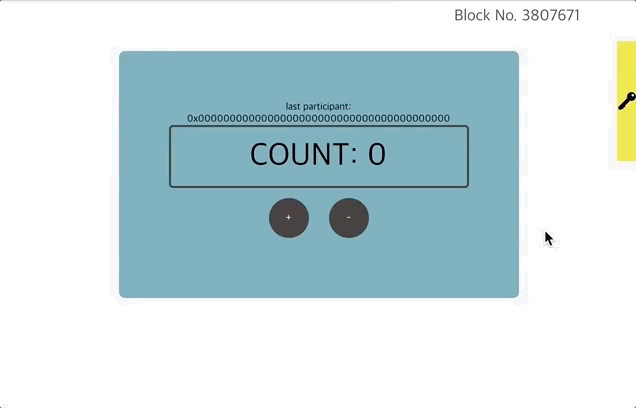

# Count BApp 개발하기

## 목차

* [1. 개발 환경 구성](1.-environment-setup.md)
* [2. Count BApp 복제](2.-clone-count-bapp.md)
* [3. 디렉토리 구조](3.-directory-structure.md)
* [4. 스마트 컨트랙트 작성](4.-write-smart-contract.md)
* [5. 프론트엔드 코드 개요](5.-frontend-code-overview/README.md)
  * [5-1. BlockNumber 컴포넌트](5.-frontend-code-overview/5-1.-blocknumber-component.md)
  * [5-2. Auth 컴포넌트](5.-frontend-code-overview/5-2.-auth-component.md)
  * [5-3. Count 컴포넌트](5.-frontend-code-overview/5-3.-count-component.md)
* [6. 스마트 컨트랙트 배포](6.-deploy-contract.md)
* [7. 어플리케이션 실행](7.-run-app.md)

## 소개

본 튜토리얼은 Klaytn BApp을 구축하기 위한 단계별 가이드를 제공합니다. Klaytn을 다뤄본 경험이 전혀 없으시더라도 괜찮습니다. We will make a simple web app interacting with a basic smart contract, `Count`. Any user who has a Klaytn account can increase and decrease the current value as shown in the above gif.

> **Source Code** Complete source code can be found on GitHub at [https://github.com/klaytn/countbapp](https://github.com/klaytn/countbapp)

## 튜토리얼 대상

본 튜토리얼은 Klaytn에서 블록체인 어플리케이션을 구축하는 방법을 배우고 싶으신 모든 분을 대상으로 합니다. 다만 스마트 컨트랙트와 상호작용하는 웹 어플리케이션을 구축할 것이기 때문에 다음의 개념들에 대해서 익숙하신 분들께 권장드립니다.

* We assume that you have basic knowledge on [React](https://reactjs.org/) and [Redux](https://redux.js.org/). 이 과정은 초보자를 위한 기본적인 설명이 없습니다.
* 솔리디티에 대한 기본 지식과 개발 경험이 있다면 좋습니다. 만약 솔리디티에 대해 잘 모르시더라도 소프트웨어 개발 경험이 어느 정도 있으시다면 튜토리얼의 단계별 가이드라인을 따라 수월하게 완료하실 수 있을 것입니다.

## 테스트 환경

Count BApp은 다음의 환경에서 테스트 되었습니다.

* MacOS Mojave 10.14.5
* Node 10.16.0 \(LTS\)
* npm 6.9.0
* Python 2.7.10

