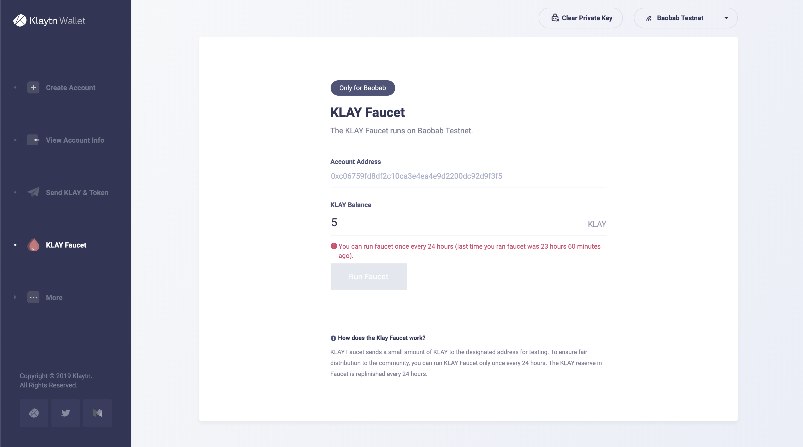
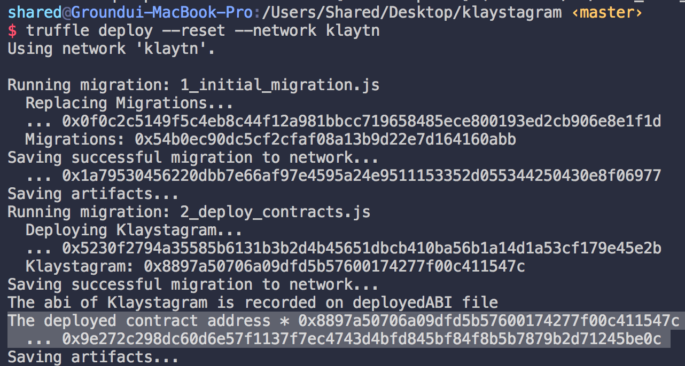

# 5. 스마트 컨트랙트 배포 <a id="5-deploy-contract"></a>

1\) 컨트랙트 배포를 위한 테스트넷 KLAY 획득 2\) 트러플 환경설정 3\) 배포 설정\(배포할 컨트랙트 설정\) 4\) 배포

## 1\) KLAY 획득<a id="1-get-some-klay"></a>

컨트랙트를 배포하려면 가스 가격을 지불하기 위해 계정에 KLAY가 필요합니다. 테스트넷의 Klaytn Wallet에서 5 KLAY를 받을 수 있습니다. 1. [Baobab Klaytn Wallet](https://baobab.wallet.klaytn.com/create)에서 Klaytn 계정을 생성하세요 -&gt; 트러플 환경설정에 `PRIVATE KEY`를 사용할 것입니다. 그러므로 개인키를 어딘가에 따로 복사해놓으세요. 2. Klaytn 계정을 생성했다면 Faucet을 실행하여 [Baobab Klaytn Faucet](https://baobab.wallet.klaytn.com/faucet)에서 5 Baobab 테스트넷 KLAY를 받으세요.



## 2\) 트러플 환경설정 <a id="2-truffle-configuration"></a>

`truffle-config.js`은 배포 설정을 포함한 환경설정 파일입니다. 이전 단계에서 생성한 `Private key`를 사용하여 컨트랙트를 배포할게요. 충분한 KLAY가 있는 계정의 `Private key`를 truffle-config.js에 복사하세요.

_경고: 개인키를 노출하면 안 됩니다. 만약 노출할 경우 계정이 해킹될 수도 있습니다._

```javascript
// truffle-config.js

const HDWalletProvider = require("truffle-hdwallet-provider-klaytn");

/**
 * Klaytn 네트워크에 컨트랙트를 배포하기 위한 트러플 네트워크 변수입니다.
 */
const NETWORK_ID = '1001'

/**
 * URL: URL for the remote node you will be using
 * PRIVATE_KEY: Private key of the account that pays for the transaction (Change it to your own private key)
 */
const URL = 'http://localhost:8551'

// Paste your `Private key` that has enough KLAY to truffle.js
const PRIVATE_KEY = '0x3de0c90ce7e440f19eff6439390c29389f611725422b79c95f9f48c856b58277'

module.exports = {
  networks: {
    klaytn: {
      provider: () => new HDWalletProvider(PRIVATE_KEY, URL),
      network_id: NETWORK_ID,
      gas: '8500000',
      gasPrice: null,
    },
  },

  // Specify the version of compiler, we use 0.5.6
  compilers: {
    solc: {
      version: '0.5.6',
    },
  },
}
```

### `networks` 속성 <a id="networks-property"></a>

위의 코드에서 `networks` 속성을 봐주세요. `klaytn`에는 `provider`, `network_id`, `gas`, `gasPrice` 등 4개의 속성이 있습니다.

* `provider: () => new HDWalletProvider(PRIVATE_KEY, URL)` 이름에서 알 수 있듯이 개인키와 위에 정의된 URL을 삽입합니다.
* `network_id: NETWORK_ID` Klaytn에서 네트워크 ID를 지정합니다. 여기서는 Klaytn Baobab 네트워크 \(testnet\)를 지정하기 위해 `1001`로 설정합니다.
* `gas: GASLIMIT` 지불하고자 하는 최대의 가스양입니다.
* `gasPrice: null` 1 가스당 지불할 가격입니다. 현재 Klaytn에서는 1 가스당 가격이 `25000000000`으로 고정되어 있습니다. 이 부분을 `null`로 설정하면 트러플에서 자동으로 고정 가스 가격으로 설정합니다.

### `compiler` 속성 <a id="compiler-property"></a>

솔리디티 컨트랙트 작성 시 0.5.6 버전을 사용했으므로 컴파일러 버전을 0.5.6으로 지정하세요.

## 3\) 배포 설정<a id="3-deployment-setup"></a>

`migrations/2_deploy_contracts.js`:

```javascript
const Klaystagram = artifacts.require('./Klaystagram.sol')
const fs = require('fs')

module.exports = function (deployer) {
  deployer.deploy(Klaystagram)
    .then(() => {
    if (Klaystagram._json) {
      // 1. 최근에 배포한 컨트랙트의 ABI 파일을 'deployedABI'에 기록합니다.
      fs.writeFile(
        'deployedABI',
        JSON.stringify(Klaystagram._json.abi, 2),
        (err) => {
          if (err) throw err
          console.log(`The abi of ${Klaystagram._json.contractName} is recorded on deployedABI file`)
        })
    }

    // 2. 최근에 배포한 컨트랙트 주소를 'deployedAddress'에 기록합니다.
    fs.writeFile(
      'deployedAddress',
      Klaystagram.address,
      (err) => {
        if (err) throw err
        console.log(`The deployed contract address * ${Klaystagram.address} * is recorded on deployedAddress file`)
    })
  })
}
```

어떤 컨트랙트 코드를 배포할 것인지 `contracts/` 디렉토리에 지정할 수 있습니다.

1. 다음 행을 통해 컨트랙트 파일 \(`Klaystagram.sol`\)을 임포트하세요.

   `const Klaystagram = artifacts.require('./Klaystagram.sol')`

2. 컨트랙트를 배포하려면 다음과 같이 `deployer`를 사용하세요. `deployer.deploy(Klaystagram)`.
3. 컨트랙트 배포 후 추가로 로직을 추가하려면 `.then()`을 사용하세요. \(선택 사항\)
4. 컨트랙트의 `deployedABI`와 `deployedAddress`를 저장하려면 `fs` node.js 모듈을 사용하세요.

   `fs.writeFile(filename, content, callback)` \(선택 사항\)

참고. `artifacts.require()`에 대한 자세한 설명은 [트러플 공식 문서](https://trufflesuite.com/docs/truffle/getting-started/running-migrations#artifacts-require-)를 참고하세요.

## 4\) 배포<a id="4-deploy"></a>



터미널에서 `$ truffle deploy --network klaytn`를 입력하세요. 이 명령은 `truffle-config.js`와 `migrations/2_deploy_contracts.js`의 설정에 따라 컨트랙트를 배포합니다.

배포에 성공하면 터미널 창에 배포된 컨트랙트의 주소가 출력됩니다.

참고\) `--reset` 옵션 이 옵션을 사용하면 컨트랙트가 변경되지 않아도 트러플이 해당 컨트랙트를 재컴파일하고 재배포합니다. 예시\) `$ truffle deploy --reset --network Klaytn`

