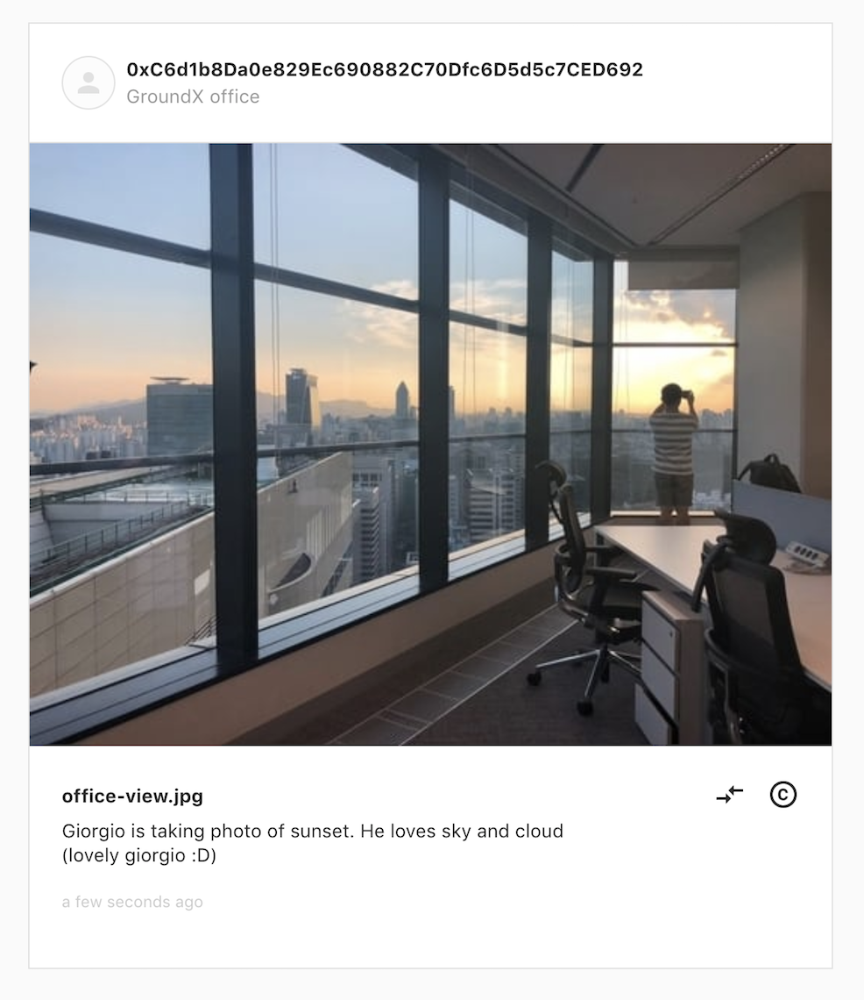

# 7-3. Feed 컴포넌트



1. `Feed` 컴포넌트의 역할
2. 컨트랙트 데이터 읽어오기: `getFeed` 메서드
3. 리덕스 스토어에 데이터 저장: `setFeed` 액션
4. 데이터 출력: `Feed` 컴포넌트

## 1\) `Feed` 컴포넌트의 역할

[4. Klaystagram 스마트 컨트랙트 작성](../4.-write-klaystagram-smart-contract.md)에서 `PhotoData` 구조체를 작성하고 이 구조체를 `_photoList` 맵핑 내에 위치시켰습니다. Feed 컴포넌트의 역할은 다음과 같습니다. 1. Klaystagram 컨트랙트 메서드\(`redux/actions/photos.js`\)를 호출하여 `PhotoData`를 읽어옵니다. 2. `PhotoData`\(피드\)를 소유자의 정보\(`components/Feed.js`\)와 함께 보여줍니다.

## 2\) 컨트랙트 데이터 읽어오기: `getFeed` 메서드

1. 컨트랙트 메서드를 호출합니다: `getTotalPhotoCount()`

   사진이 없는 경우 빈 배열과 함께 `setFeed` 액션을 호출합니다.

2. 컨트랙트 메서드를 호출합니다: `getPhoto(id)`

   사진이 있으면 각 사진 데이터를 프로미스로 가져와 feed 배열에 넣습니다. 모든 프로미스를 배열에 넣으면 feed 배열을 반환합니다.

3. 리덕스 액션을 호출합니다: `setFeed(feed)`

   feed 배열을 가져와 리덕스 스토어에 저장합니다.

```javascript
// src/redux/actions/photos.js

const setFeed = (feed) => ({
  type: SET_FEED,
  payload: { feed },
})

export const getFeed = () => (dispatch) => {
  // 1. 컨트랙트 메서드(READ) 호출: `getTotalPhotoCount()`
  //사진이 없는 경우 빈 배열과 함께 'setFeed' 액션을 호출합니다.
  KlaystagramContract.methods.getTotalPhotoCount().call()
    .then((totalPhotoCount) => {
      if (!totalPhotoCount) return []
      const feed = []
      for (let i = totalPhotoCount; i > 0; i--) {
        // 2. 컨트랙트 메서드(READ) 호출: `getPhoto(id)`
        // 사진이 있으면 모두 호출합니다.
        const photo = KlaystagramContract.methods.getPhoto(i).call()
        feed.push(photo)
      }
      return Promise.all(feed)
    })
    .then((feed) => {
      // 3. 액션 호출: `setFeed(feed)`
      // 사진 데이터(피드)를 리덕스 스토어에 저장합니다.
      dispatch(setFeed(feedParser(feed))
    })
}
```

## 3\) 리덕스 스토어에 데이터 저장: `setFeed` 액션

사진 데이터\(피드\)를 Klaystagram 컨트랙트에서 잘 가져왔다면 `setFeed(feed)` 액션을 호출합니다. 이 액션은 사진 데이터를 페이로드로 가져와 리덕스 스토어에 저장합니다.

## 4\) 데이터 출력: `Feed` 컴포넌트

```javascript
// src/components/Feed.js
import React, { Component } from 'react'
import { connect } from 'react-redux'
import moment from 'moment'
import Loading from 'components/Loading'
import PhotoHeader from 'components/PhotoHeader'
import PhotoInfo from 'components/PhotoInfo'
import CopyrightInfo from 'components/CopyrightInfo'
import TransferOwnershipButton from 'components/TransferOwnershipButton'
import { drawImageFromBytes} from 'utils/imageUtils'
import { last } from 'utils/misc'

import * as photoActions from 'redux/actions/photos'

import './Feed.scss'

class Feed extends Component {
  constructor(props) {
    super(props)
    this.state = {
      isLoading: !props.feed,
    }
  }

  static getDerivedStateFromProps = (nextProps, prevState) => {
    const isUpdatedFeed = (nextProps.feed !== prevState.feed) && (nextProps.feed !== null)
    if (isUpdatedFeed) {
      return { isLoading: false }
    }
    return null
  }

  componentDidMount() {
    const { feed, getFeed } = this.props
    if (!feed) getFeed()
  }

  render() {
    const { feed, userAddress } = this.props

    if (this.state.isLoading) return <Loading />

    return (
      <div className="Feed">
        {feed.length !== 0
          ? feed.map(({
            id,
            ownerHistory,
            data,
            name,
            location,
            caption,
            timestamp,
          }) => {
            const originalOwner = ownerHistory[0]
            const currentOwner = last(ownerHistory)
            const imageUrl = drawImageFromBytes(data)
            const issueDate = moment(timestamp * 1000).fromNow()
            return (
              <div className="FeedPhoto" key={id}>
                <PhotoHeader
                  currentOwner={currentOwner}
                  location={location}
                />
                <div className="FeedPhoto__image">
                  
                </div>
                <div className="FeedPhoto__info">
                  <PhotoInfo
                    name={name}
                    issueDate={issueDate}
                    caption={caption}
                  />
                  <CopyrightInfo
                    className="FeedPhoto__copyrightInfo"
                    id={id}
                    issueDate={issueDate}
                    originalOwner={originalOwner}
                    currentOwner={currentOwner}
                  />
                  {
                    userAddress === currentOwner && (
                      <TransferOwnershipButton
                        className="FeedPhoto__transferOwnership"
                        id={id}
                        issueDate={issueDate}
                        currentOwner={currentOwner}
                      />
                    )
                  }
                </div>
              </div>
            )
          })
          : <span className="Feed__empty">No Photo :D</span>
        }
      </div>
    )
  }
}

const mapStateToProps = (state) => ({
  feed: state.photos.feed,
  userAddress: state.auth.address,
})

const mapDispatchToProps = (dispatch) => ({
  getFeed: () => dispatch(photoActions.getFeed()),
})

export default connect(mapStateToProps, mapDispatchToProps)(Feed)
```

At the first time, you can only see the text "No photo :D" because there is no photo data in contract yet. Let's make a UploadPhoto component to send photo data to contract!

