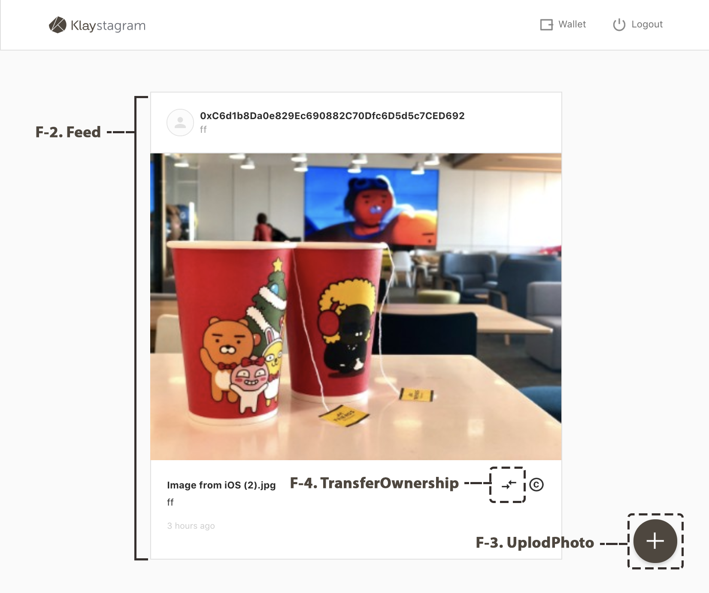

# 7. FeedPage



FeedPage는 `Klaystagram` 컨트랙트와 상호작용하는 3개의 주요 컴포넌트로 이루어져 있습니다.

[7-2. `UploadPhoto` component](7-2.-uploadphoto-component.md) [7-3. `Feed` component](7-3.-feed-component.md) [7-4. `TransferOwnership` 컴포넌트](7-4.-transferownership-component.md)

```javascript
// src/pages/FeedPage.js

const FeedPage = () => (
  <main className="FeedPage">
    <UploadButton />               // 7-2. UploadPhoto 컴포넌트
    <Feed />                       // 7-3. Feed 컴포넌트
  </main>
)
```

```javascript
// src/components/Feed.js

<div className="Feed">
  {feed.length !== 0
    ? feed.map((photo) => {
      // ...
      return (
        <div className="FeedPhoto" key={id}>

            // ...
            {
              userAddress === currentOwner && (
                <TransferOwnershipButton   // 7-4. TransferOwnership 컴포넌트
                  className="FeedPhoto__transferOwnership"
                  id={id}
                  issueDate={issueDate}
                  currentOwner={currentOwner}
                />
              )
            }
            // ...
        </div>
      )
    })
    : <span className="Feed__empty">No Photo :D</span>
  }
</div>
)
```

아래 세 단계에 걸쳐 컴포넌트가 컨트랙트와 상호작용하도록 합니다.

**첫 번째**, 프론트엔드와 컨트랙트를 연결하는 `KlaystagramContract` 인스턴스를 생성합니다. **두 번째**, `KlaystagramContract` 인스턴스를 사용하여 `redux/actions`에서 상호작용하는 API 함수를 작성합니다. **세 번째**, 각 컴포넌트에서 해당 함수를 호출합니다.

이제 구현해보죠!

