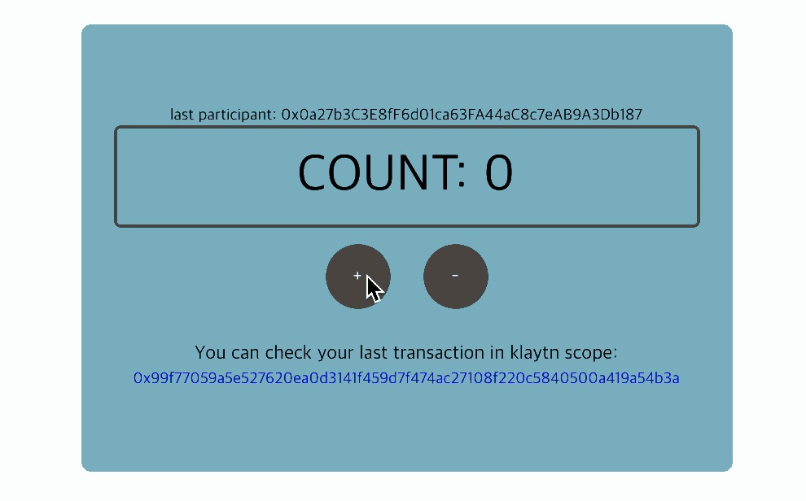

# Migrating Ethereum App to Klaytn

## 목차

* [1. 소개](#1-introduction)
* [2. Klaytn has Ethereum compatibility](#2-klaytn-has-ethereum-compatibility)
* [3. Change node connection from Ethereum to Klaytn](#3-change-node-connection-from-ethereum-to-klaytn)
* [4. Interact with Klaytn node: `BlockNumber` component](#4-interact-with-klaytn-node-blocknumber-component)
* [5. Interact with the contract: `Count` component](#5-interact-with-the-contract-count-component)
  * [5-1. Deploy Count contract on Klaytn](#5-1-deploy-count-contract-on-klaytn)
  * [5-2. Create a contract instance](#5-2-create-a-contract-instance)
  * [5-3. 컨트랙트와의 상호작용](#5-3-interact-with-contract)

## 1. 소개

This tutorial is intended to give a guide to migrate an Ethereum App to Klaytn. No previous Klaytn experience is needed. A simple blockchain app will be used as a sample to show how to migrate an Ethereum App to Klaytn.

We will focus only on the code modifications required to migrate an Ethereum App to Klaytn. If you need details on creating a Klaytn BApp, Please refer to [CountBApp Tutorial](https://docs.klaytn.com/bapp/tutorials/count-bapp).

> **Source Code** Complete source code can be found on GitHub at [https://github.com/klaytn/countbapp](https://github.com/klaytn/countbapp)

#### 튜토리얼 대상

* We assume that you have basic knowledge on [React](https://reactjs.org/). Sample code is made with React.
* Basic knowledge and experience in Blockchain app is required, but no previous Klaytn experience is needed.

#### 테스트 환경
CountBApp is tested in the following environment.

* MacOS Mojave 10.14.5
* Node 10.16.0 \(LTS\)
* npm 6.9.0
* Python 2.7.10

## 2. Klaytn has Ethereum compatibility

Klaytn runtime environment is compatible with Ethereum Virtual Machine and executes smart contracts written in Solidity. Klaytn's RPC APIs and other client libraries maintain almost identical API specifications with Ethereum's whenever available. Therefore, it is fairly straightforward to migrate Ethereum Apps to Klaytn. This helps developers easily move to a new blockchain platform.

## 3. Change node connection from Ethereum to Klaytn

First, you need to change the library that makes a connection to the node. Then you will specify the node URL in 'rpcURL'.

- In Ethereum BApp example
  - `web3` library connects to and communicates with Ethereum node.
  - `Ropsten testnet` URL is assigned to 'rpcURL' .
- In Klaytn BApp example
  - `caver-js` library is used to connect to and communicate with Klaytn node.
  - `Baobab testnet` URL is assigned to 'rpcURL'.

`src/klaytn/caver.js`

```javascript
// import Web3 from 'web3'
import Caver from 'caver-js'

// const ROPSTEN_TESTNET_RPC_URL = 'https://ropsten.infura.io/'
const BAOBAB_TESTNET_RPC_URL = 'https://api.baobab.klaytn.net:8651/'

// const rpcURL = ROPSTEN_TESTNET_RPC_URL
const rpcURL = BAOBAB_TESTNET_RPC_URL

// const web3 = new Web3(rpcURL)
const caver = new Caver(rpcURL)

// export default web3
export default caver
```


## 4. Interact with Klaytn node: `BlockNumber` component


BlockNumber component gets the current block number every 1 second (1000ms).

By simply replacing the `web3` library with `caver-js`, you can sync Klaytn's BlockNumber in real-time instead of Ethereum's BlockNumber.
> Ethereum: [`web3.eth.getBlockNumber()`](https://web3js.readthedocs.io/en/v1.2.1/web3-eth.html#getblocknumber)  
> Klaytn: [`caver.klay.getBlockNumber()`](https://docs.klaytn.com/bapp/sdk/caver-js/api-references/caver.klay/block#getblocknumber)

```js
// import web3 from 'ethereum/web3'
import caver from 'klaytn/caver'

class BlockNumber extends Component {
  state = { currentBlockNumber: '...loading' }

  getBlockNumber = async () => {
    // const blockNumber = await web3.eth.getBlockNumber()
    const blockNumber = await caver.klay.getBlockNumber()

    this.setState({ currentBlockNumber: blockNumber })
  }
  // ...
}

export default BlockNumber
```
For more detail about `BlockNumber` component, see [CountBApp tutorial - Blocknumber Component](https://docs.klaytn.com/bapp/tutorials/count-bapp/5.-frontend-code-overview/5-1.-blocknumber-component).

## 5. Interact with the contract: `Count` component



To interact with the contract, we need to create an instance of the deployed contract. With the instance, we can read and write the contract's data.

Let's learn step by step how to migrate `CountBApp` from Ethereum to Klaytn!

- 5-1. Deploy `Count` contract on Klaytn
- 5-2. Create a contract instance
- 5-3. 컨트랙트와의 상호작용

### 5-1. Deploy `Count` contract on Klaytn

The first step is deploying Count contract on Klaytn and get the contract address. Most of the cases, you can use Etherem contracts on Klaytn without modification. See [Porting Etherem Contract](../../smart-contract/porting-ethereum-contract.md). In this guide, we will use Truffle to deploy the contract.

1. Change network properties in `truffle-config.js` to deploy the contract on Klaytn.
2. Top up your account using [KLAY faucet](https://baobab.wallet.klaytn.com/access?next=faucet).
3. Type `$ truffle deploy --network baobab --reset`
4. `Count` contract will be deployed on Baobab testnet, Klaytn.

`truffle-config.js`
```js
// const HDWalletProvider = require("truffle-hdwallet-provider")
const HDWalletProvider = require("truffle-hdwallet-provider-klaytn")

// const NETWORK_ID = '3' // Ethereum, Ropsten testnet's network id
const NETWORK_ID = '1001' // Klaytn, Baobab testnet's network id

// const RPC_URL = 'https://ropsten.infura.io/'
const RPC_URL = 'https://api.baobab.klaytn.net:8651'

// Change it to your own private key that has enough KLAY to deploy contract
const PRIVATE_KEY = '0x3de0c90ce7e440f19eff6439390c29389f611725422b79c95f9f48c856b58277'


module.exports = {
  networks: {
    /* ropsten: {
      provider: () => new HDWalletProvider(PRIVATE_KEY, RPC_URL),
      network_id: NETWORK_ID,
      gas: '8500000',
      gasPrice: null,
    }, */

    baobab: {
      provider: () => new HDWalletProvider(PRIVATE_KEY, RPC_URL),
      network_id: NETWORK_ID,
      gas: '8500000',
      gasPrice: null,
    },
  },
  compilers: {
    solc: {
      version: '0.5.6',
    },
  },
}
```

For more details about deploying contracts, See [CountBapp tutorial - Deploy Contract](https://docs.klaytn.com/bapp/tutorials/count-bapp/6.-deploy-contract).

### 5-2. Create a contract instance

You can create a contract instance with the `caver-js` API. The contract instance creates a connection to `Count` contract. You can invoke contract methods through this instance.

> Ethereum : [`web3.eth.Contract(ABI, address)`](https://web3js.readthedocs.io/en/v1.2.1/web3-eth-contract.html#new-contract) Klaytn : [`caver.klay.Contract(ABI, address)`](https://docs.klaytn.com/bapp/sdk/caver-js/api-references/caver.klay.contract#new-contract)

`src/components/Count.js`
```javascript
// import web3 from 'ethereum/web3'
import caver from 'klaytn/caver'

class Count extends Component {
  constructor() {
    /* const CountContract = DEPLOYED_ABI
      && DEPLOYED_ADDRESS
      && new web3.eth.Contract(DEPLOYED_ABI, DEPLOYED_ADDRESS) */

    this.countContract = DEPLOYED_ABI
      && DEPLOYED_ADDRESS
      && new cav.klay.Contract(DEPLOYED_ABI, DEPLOYED_ADDRESS)
  }

  // ...
}
export default Count
```

### 5-3. 컨트랙트와의 상호작용

The `ABI` \(Application Binary Interface\) used to create the Count contract instance allows the `caver-js` to invoke contract's methods as below. You can interact with Count contract as if it were a JavaScript object.

- Read data (call)  
  `CountContract.methods.count().call()`
- Write data (send)  
  `CountContract.methods.plus().send({ ... })` `CountContract.methods.minus().send({ ... })`

Once you created a contract instance as in the previous step, you don't need to modify any code in using the contract methods afterward. BApp migration has been completed!

#### Full code: `Count` component

`src/components/Count.js`
```js
import React, { Component } from 'react'
import cx from 'classnames'

import caver from 'klaytn/caver'

import './Count.scss'

class Count extends Component {
  constructor() {
    super()
    // ** 1. 컨트랙트 인스턴스 생성 **
    // 예시: new caver.klay.Contract(DEPLOYED_ABI, DEPLOYED_ADDRESS)
    // 이 인스턴스를 통해 컨트랙트 메서드를 호출할 수 있습니다.
    // 이제 `this.countContract` 변수로 이 인스턴스에 접근할 수 있습니다.
    this.countContract = DEPLOYED_ABI
      && DEPLOYED_ADDRESS
      && new caver.klay.Contract(DEPLOYED_ABI, DEPLOYED_ADDRESS)
    this.state = {
      count: '',
      lastParticipant: '',
      isSetting: false,
    }
  }

  intervalId = null

  getCount = async () => {
    // ** 2. 컨트랙트 메서드 호출 (CALL) **
    // 예시: this.countContract.methods.methodName(arguments).call()
    // 위와 같이 컨트랙트 메서드(CALL)를 호출할 수 있습니다.
    // 예를 들어 컨트랙트에 `count`라는 메서드가 있을 때,
    // 해당 메서드를 아래와 같이 호출할 수 있습니다.
    // 예시: this.countContract.methods.count().call()
    // 이는 프로미스를 반환하므로 .then() 또는 async-await으로 접근할 수 있습니다.
    const count = await this.countContract.methods.count().call()
    const lastParticipant = await this.countContract.methods.lastParticipant().call()
    this.setState({
      count,
      lastParticipant,
    })
  }

  setPlus = () => {
    const walletInstance = caver.klay.accounts.wallet && caver.klay.accounts.wallet[0]

    // 컨트랙트 메서드 호출을 위해 지갑을 연동해야 합니다.
    if (!walletInstance) return

    this.setState({ settingDirection: 'plus' })

    // 3. ** 컨트랙트 메서드 호출 (SEND) **
    // 예시: this.countContract.methods.methodName(arguments).send(txObject)
    // 위와 같이 컨트랙트 메서드(SEND)를 호출할 수 있습니다.
    // 예를 들어 컨트랙트에 `plus`라는 메서드가 있을 때,
    // 해당 메서드를 다음과 같이 호출할 수 있습니다.
    // 예시: this.countContract.methods.plus().send({
    //   from: '0x952A8dD075fdc0876d48fC26a389b53331C34585', // 본인의 주소를 적으세요.
    //   gas: '200000',
    // })
    this.countContract.methods.plus().send({
      from: walletInstance.address,
      gas: '200000',
    })
      .once('transactionHash', (txHash) => {
        console.log(`
          Sending a transaction... (Call contract's function 'plus')
          txHash: ${txHash}
          `
        )
      })
      .once('receipt', (receipt) => {
        console.log(`
          Received receipt! It means your transaction(calling plus function)
          is in klaytn block(#${receipt.blockNumber})
        `, receipt)
        this.setState({
          settingDirection: null,
          txHash: receipt.transactionHash,
        })
      })
      .once('error', (error) => {
        alert(error.message)
        this.setState({ settingDirection: null })
      })
  }

  setMinus = () => {
    const walletInstance = caver.klay.accounts.wallet && caver.klay.accounts.wallet[0]

    // Need to integrate wallet for calling contract method.
    if (!walletInstance) return

    this.setState({ settingDirection: 'minus' })

    // 3. ** 컨트랙트 메서드 호출 (SEND) **
    // 예시: this.countContract.methods.methodName(arguments).send(txObject)
    // 위와 같이 컨트랙트 메서드(SEND)를 호출할 수 있습니다.
    // 예를 들어 컨트랙트에 `minus`라는 메서드가 있을 때,
    // 해당 메서드를 다음과 같이 호출할 수 있습니다.
    // 예시: this.countContract.methods.minus().send({
    //   from: '0x952A8dD075fdc0876d48fC26a389b53331C34585', // 본인의 주소를 적으세요.
    //   gas: '200000',
    // })

    // 이는 이벤트 에미터를 반환하므로 전송 후에 이벤트로 결과를 받아올 수 있습니다.
    // .on('transactionHash') 이벤트를 사용하세요.
    // : 트랜잭션을 전송한 후 로직을 처리하려는 경우
    // .once('receipt') 이벤트를 사용하세요.
    // : 트랜잭션이 블록에 포함된 후 로직을 처리하려는 경우
    // 예시: .once('receipt', (data) => {
    //   console.log(data)
    // })
    this.countContract.methods.minus().send({
      from: walletInstance.address,
      gas: '200000',
    })
      .once('transactionHash', (txHash) => {
        console.log(`
          Sending a transaction... (Call contract's function 'minus')
          txHash: ${txHash}
          `
        )
      })
      .once('receipt', (receipt) => {
        console.log(`
          Received receipt which means your transaction(calling minus function)
          is in klaytn block(#${receipt.blockNumber})
        `, receipt)
        this.setState({
          settingDirection: null,
          txHash: receipt.transactionHash,
        })
      })
      .once('error', (error) => {
        alert(error.message)
        this.setState({ settingDirection: null })
      })
  }

  componentDidMount() {
    this.intervalId = setInterval(this.getCount, 1000)
  }

  componentWillUnmount() {
    clearInterval(this.intervalId)
  }

  render() {
    const { lastParticipant, count, settingDirection, txHash } = this.state
    return (
      <div className="Count">
        {Number(lastParticipant) !== 0 && (
          <div className="Count__lastParticipant">
            last participant: {lastParticipant}
          </div>
        )}
        <div className="Count__count">COUNT: {count}</div>
        <button
          onClick={this.setPlus}
          className={cx('Count__button', {
            'Count__button--setting': settingDirection === 'plus',
          })}
        >
          +
        </button>
        <button
          onClick={this.setMinus}
          className={cx('Count__button', {
            'Count__button--setting': settingDirection === 'minus',
          })}
        >
          -
        </button>
        {txHash && (
          <div className="Count__lastTransaction">
            <p className="Count__lastTransactionMessage">
              You can check your last transaction in klaytnscope:
            </p>
            <a
              target="_blank"
              href={`https://scope.klaytn.com/transaction/${txHash}`}
              className="Count__lastTransactionLink"
            >
              {txHash}
            </a>
          </div>
        )}
      </div>
    )
  }
}

export default Count
```
