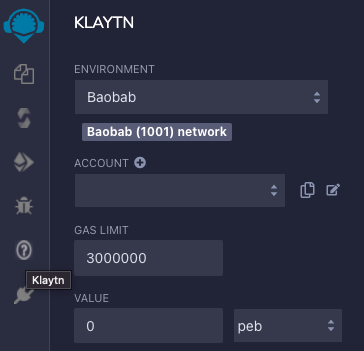

# Connecting Remix

## 리믹스(Remix)란? 

Remix is a browser-based IDE (Integrated Development Environment) for developing Solidity contracts. This document will cover connecting Remix with Klaytn. If you want to know more about how to use Remix, please refer to[ **Remix docs**](https://remix-ide.readthedocs.io/en/latest/) or [**Remix IDE**](https://remix.ethereum.org/).

## EVM 버전 설정하기 

Klaytn supports contracts written in Solidity, and is compatible with the **London** version of EVM. Also, Solidity version 0.8.x and lower are supported in Klaytn. Therefore, to deploy the contract on Klaytn, the contract must be compiled with the **London** EVM version.

* **solidity compiler**를 클릭한 후 **London** EVM 버전을 선택해주세요'.

## 로컬 플러그인 연동하기 

You need a local plugin to connect to the Klaytn network using Remix. The process is described in the following:

* **plugin manager**를 클릭한 뒤 **Connect to a Local Plugin**를 클릭하세요.

* **URL**에 https://klaytn-remix-plugin.ozys.net를 입력하세요. **Plugin Name**과 **Display Name**에 원하는 아무 이름이나 사용할 수 있습니다.

* [Klaytn] 탭이 보이면 이제 클레이튼과 연결할 준비가 된 것입니다.

## 배포 환경 설정하기

* [Klaytn] 탭을 클릭하세요.
* 적절한 [Environment]을 선택하세요.
* **Baobab**, **Cypress**, **Injected Caver**, **Caver Provider** or **Injected Web3** 중 선택할 수 있습니다.
  * **[Baobab]**: Baobab 네트워크에 연결합니다.
  * **[Cypress]**: Cypress 네트워크에 연결합니다.
  * **\[Injected Caver]**: injected caver (e.g., Kaikas)에 연결합니다.
  * **[Caver Provider]**: RPC를 지원하는 Klaytn 노드에 직접 연결합니다.
  * **\[Injected Web3]**: injected web3(e.g., Metamask)에 연결합니다.

## 계정 가져오기

* **private key** 나 **Keystore**에서 키를 가져올 수 있습니다.
* **ACCOUNT** 옆 **plus** 버튼을 클릭합니다.

* private key나 keystore를 입력하세요.
* **feePayer**를 위해 키를 가져올 수도 있습니다. **private key**만 지원합니다.

## EN(Endpoint Node)을 이용한 클레이튼 - 리믹스 연동

* [**EN 문서**](https://docs.klaytn.foundation/getting-started/quick-start/launch-an-en)의 설명을 따라 로컬 환경에 Endpoint Node를 설치하세요.
*   [**계정 관리**](https://docs.klaytn.foundation/getting-started/account)의 설명을 따라 계정을 생성하세요.

    > **Note:** 개인 환경의 EN이 아닌 Baobab Public EN으로 연결 시 personal API가 닫혀있기 때문에 Account에 연결되지 않습니다.
* 환경 설정에서 [Caver Provider]를 선택합니다.

* Caver Provider Endpoint에 위에서 띄운 EN의 RPC 주소를 입력합니다. 로컬 EN: (Default: [http://localhost:8551](http://localhost:8551/)
* 네트워크에 연결되면 Chain ID가 아래와 같이 표시됩니다.

## 메타마스크를 사용하여 클레이튼 - 리믹스 연동하기

* [**메타마스크 연동 문서**](https://docs.klaytn.foundation/dapp/tutorials/connecting-metamask)를 참고하여 Klaytn을 연동합니다.
* Remix 환경 설정에서 [Injected Web3]를 선택합니다.

* 메타마스크에 연결이 뜨면 연동된 Account를 선택 후 [Next]를 클릭합니다.
* Once you are successfully connected to the Network, you will see the Chain ID and Account of the connected network.

## 카이카스를 사용하여 Klaytn - 리믹스 연동하기

* Remix 환경 설정에서 [Injected Web3]를 선택합니다.

* 카이카스 팝업이 보이면 [Connect]를 클릭하세요.
* Once you are successfully connected to the Network, you will see the Chain ID and Account of the connected network.

## 튜토리얼: KlaytnGreeter 컨트랙트 

We will be using the [**KlaytnGreeter**](https://docs.klaytn.foundation/smart-contract/sample-contracts/klaytngreeter) sample contract.

* KlaytnGreeter.sol 파일을 추가하고 테스트할 코드를 작성합니다.

* Solidity Compile 탭에서 [Compile KlaytnGreeter.sol]을 클릭해 작성한 컨트랙트 코드를 컴파일합니다.

> Auto compile 설정을 하는 것을 권장합니다.

* Deploy & Run Transactions 탭에서 [Deploy]를 클릭해 컴파일된 컨트랙트를 배포합니다.

* 배포된 컨트랙트를 확인합니다. 테스트하거나 디버깅할 수 있습니다.

