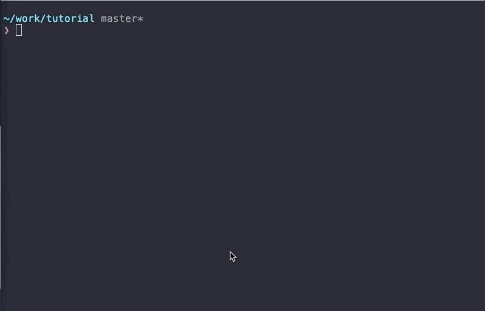

# 6. 스마트 컨트랙트 배포

1. Truffle 환경 설정
2. Deploy setup
3. Deploy

## 1) Truffle 환경 설정 <a href="#1-truffle-configuration" id="1-truffle-configuration"></a>

`truffle-config.js`는 컨트랙트 코드를 배포하는 것에 대한 파일입니다. truffle-config.js에서 다음 항목들을 설정할 수 있습니다.

**1) 컨트랙트 배포 주체 (컨트랙트 배포 Klaytn 계정)** **2) 컨트랙트 배포할 네트워크 ** **3) 컨트랙트 배포를 위해 지불할 가스의 양 **

There are 2 different methods to deploy your contract, first one uses `private key`, the other one uses `unlocked account`.

### 배포 방법 1: 개인키 <a href="#deploy-method-1-by-private-key" id="deploy-method-1-by-private-key"></a>

_WARNING: You shouldn't expose your private key. Otherwise, your account would be hacked._

If you want to deploy your contract using the private key, `provider` option is needed.

1\) Pass your private key as the 1st argument of `new HDWalletProvider()`.\
2\) Pass your Klaytn node's URL as the 2nd argument of `new HDWalletProvider()`.

example)

```javascript
{
 ...,
 provider: new HDWalletProvider(
   'YOUR PRIVATE KEY',
   'https://api.baobab.klaytn.net:8651', // If you're running full node you can set your node's rpc url.
  ),
 ...
}
```

```javascript
const HDWalletProvider = require("truffle-hdwallet-provider-klaytn");

const NETWORK_ID = '1001'
const GASLIMIT = '8500000'

/**
 * `URL`, `PRIVATE_KEY`을 상수로 설정하여 쉽게 값을 설정하도록 해줍니다.
 * 여기에 개인키와 Klaytn 노드의 URL을 설정하세요.
 */
const URL = `https://api.baobab.klaytn.net:8651`
const PRIVATE_KEY = '0x48f5a77dbf13b436ae0325ae91efd084430d2da1123a8c273d7df5009248f90c'

module.exports = {
  networks: {
    /**
     * DEPLOY METHOD 1: By private key.
     * 개인키를 노출하지 마세요. 노출할 경우 계정이 해킹될 수도 있어요!!
     */
    baobab: {
      provider: () => new HDWalletProvider(PRIVATE_KEY, URL),
      network_id: NETWORK_ID,
      gas: GASLIMIT,
      gasPrice: null,
    },
  },
}
```

See `networks` property in the above code. It has `baobab` key which has 4 properties, `provider`, `network_id`, `gas`, `gasPrice`.

`provider: new HDWalletProvider(PRIVATE_KEY, URL)` line informs the contract deployer account and the target network node URL.

`network_id: NETWORK_ID` line specifies the network id in Klaytn. Use `1001` for the Baobab network (testnet).

`gas: GASLIMIT` line informs how much gas limit will you endure to deploy your contract.

`gasPrice: null` line informs truffle how much price will you pay per gas unit. Currently in Klaytn, the price is fixed to `25000000000`. If you set it to `null`, truffle will set the value with the fixed gas price automatically.

### DEPLOY METHOD 2: By unlocked account (difficult) <a href="#deploy-method-2-by-unlocked-account-difficult" id="deploy-method-2-by-unlocked-account-difficult"></a>

To deploy a contract by unlocked account, you should have your Klaytn full node.\
Access your Klaytn node console by typing `$ klay attach http://localhost:8551` If you don't have a Klaytn account in the node, generate it by typing `personal.newAccount()` on the console.\
If you already have one, unlock your account through `personal.unlockAccount()`.

After ensuring account is unlocked,\
you should set the properties, `host`, `port`, `network_id`, and `from`. 1) Which network to deploy (`host`, `port`, `network_id`)\
2\) Who will deploy (`from`) 3) How much gas will you endure to deploy your contract (`gas`)

Put your unlocked account address on `from`. If you're running your own Klaytn full node, set the node's host to `host` and node's port to `port`.

example)

```javascript
{
  host: 'localhost',
  port: 8551,
  from: '0xd0122fc8df283027b6285cc889f5aa624eac1d23',
  network_id: NETWORK_ID,
  gas: GASLIMIT,
  gasPrice: null,
}
```

## 2) Deploy setup (Which contract do you want to deploy?) <a href="#2-deploy-setup-which-contract-do-you-want-to-deploy" id="2-deploy-setup-which-contract-do-you-want-to-deploy"></a>

`migrations/2_deploy_contracts.js`:

```javascript
const Count = artifacts.require('./Count.sol')
const fs = require('fs')

module.exports = function (deployer) {
  deployer.deploy(Count)
    .then(() => {
    // 'deployedAddress' 파일에 최근에 배포된 컨트랙트의 주소를 기록합니다.
    if (Count._json) {
      // deployedABI에 abi 파일을 저장합니다.
      fs.writeFile(
        'deployedABI',
        JSON.stringify(Count._json.abi, 2),
        (err) => {
          if (err) throw err
          console.log(`The abi of ${Count._json.contractName} is recorded on deployedABI file`)
        })
    }

    fs.writeFile(
      'deployedAddress',
      Count.address,
      (err) => {
        if (err) throw err
        console.log(`The deployed contract address * ${Count.address} * is recorded on deployedAddress file`)
    })
  })
}
```

You can specify which contract code will you deploy in your `contracts/` directory.\
First, you should import your contract file (`Count.sol`) in this file through `const Count = artifacts.require('./Count.sol')`\
And use `deployer` to deploy your contract, through `deployer.deploy(Count)`.\
If you want to run some logic after deploying your contract, use `.then()`.\
We want to store the contract ABI and the deployed address in files. `fs` node.js module is used to do it. (`fs.writeFile(filename, content, callback)`)\
Through this post-process, we save our contract address and ABI as `deployedABI` and `deployedAddress` in the directory.\
For further information about `artifacts.`, visit truffle document site, [https://trufflesuite.com/docs/truffle/getting-started/running-migrations#artifacts-require-](https://trufflesuite.com/docs/truffle/getting-started/running-migrations#artifacts-require-)

## 3) Deploy <a href="#3-deploy" id="3-deploy"></a>

You need KLAY to deploy a contract. You can receive testnet KLAY on faucet.

* On Klaytn wallet [https://baobab.wallet.klaytn.foundation/faucet](https://baobab.wallet.klaytn.foundation/faucet), there is a faucet providing 150 KLAY per 86400 blocks in Klaytn Baobab testnet. After creating your Klaytn account, run faucet to receive 150 KLAY.



Type `$ truffle deploy --network baobab`.\
It will deploy your contract according to the configurations defined in `truffle-config.js` and `migrations/2_deploy_contracts.js`.

cf) `--reset` option\
After deploying your contract, if you type `$ truffle deploy --network baobab` again, nothing will happen.\
Because truffle deploys a contract only when there are changes in the contract, otherwise truffle will not do anything.\ If you want to re-deploy your contract anyway, there is an option `--reset`.\
If you provide this option, truffle will deploy your contract even the content of contract hasn't changed.\ ex) `$ truffle deploy --reset --network baobab`

To recap, `truffle-config.js` configures the `target network`, `deployer account`, and the `gas limit`. `migrations/2_deploy_contracts.js` configures the `contract` to deploy.\
`target network`: We deploy our contract to the node `https://api.baobab.klaytn.net:8651`.\
`deployer account`: '0xd0122fc8df283027b6285cc889f5aa624eac1d23' will deploy this contract.\
`gas limit`: We can endure up to '20000000' gas for deploying our contract.\
`contract`: We will deploy the Count contract.

From the terminal output, you can see if the deployment has been succeeded and find the deployed address.
