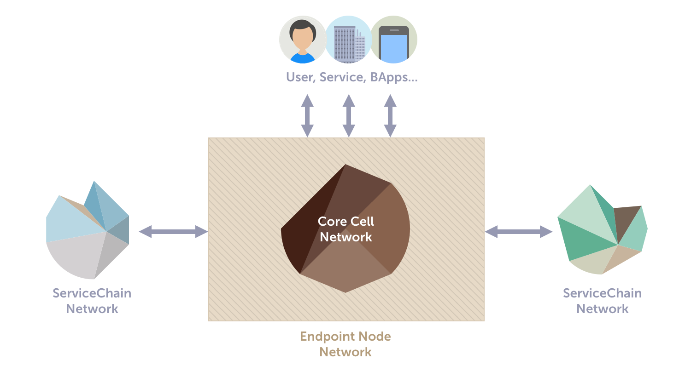
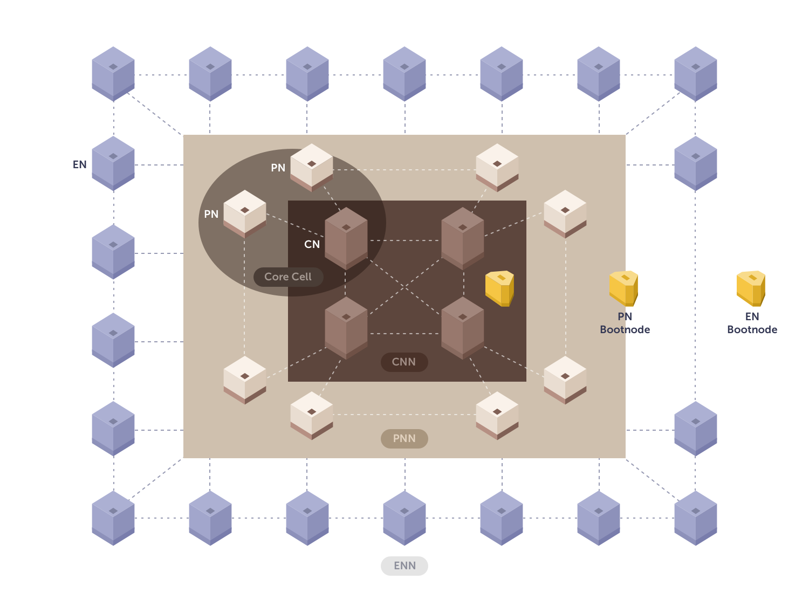

# 개요 

Klaytn은 엔터프라이즈급 안정성을 목표로 고도로 최적화된, BFT 알고리즘 기반 퍼블릭 블록체인입니다. 주요 디자인 목표는 다음과 같습니다.

- 즉각적인 완결성
- 실제 사용 사례에서 문제 없는 높은 TPS
- Blockchain 애플리케이션 실행 비용 절감
- 사용자의 진입 장벽을 낮춤
- 산업계의 블록체인 기술 도입 촉진

Klaytn은 2019년 6월 27일에 다음과 같은 사양으로 메인넷 [Cypress](https://scope.klaytn.com/)을 출시했습니다.

- 1초의 블록 생성 및 확인(Confirm) 시간
- 초당 4,000 건의 트랜잭션
- 이더리움 1/10 수준의 낮은 가스비
- EVM(이더리움 가상머신)을 구동하여 솔리디티 컨트랙트 실행을 지원함
- 세계적으로 평판이 높은 19개 기업이 모여 최초의 Klaytn 거버넌스 카운슬을 결성하고 컨센서스 노드 운영을 시작함. 컨센서스에 참여하는 노드 개수 현황은 [Klaytnscope](https://scope.klaytn.com/)에서 볼 수 있습니다.
- 50개 이상의 초기 서비스 파트너가 Klaytn에서 블록체인 애플리케이션을 출시하려고 준비

## Klaytn: 개관 

Klaytn은 역할 및 목적에 따라 세 개의 논리적 서브네트워크로 분할할 수 있습니다. 아래 그림은 Klaytn 생태계의 대략적인 구조를 보여줍니다.

### 코어 셀 네트워크(CCN) 

CCN은 엔드포인트 노드(EN)를 통해 제출된 트랜잭션을 확인하고 실행하는 코어 셀(CC, Core Cell)로 구성됩니다. CCN은 네트워크 전체에서 블록을 생성하고 전파합니다.

### 엔드포인트 노드 네트워크(ENN) 

ENN은 주로 트랜잭션을 생성하고, RPC API 요청을 처리하며, 서비스체인의 데이터 요청을 처리하는 엔드포인트 노드(EN)로 구성됩니다.

### 서비스체인 네트워크(SCN) 

SCNs are Klaytn subnetworks composed of auxiliary blockchains independently operated by dApps (Decentralized Applications). 서비스체인은 EN을 통해 메인 체인에 연결됩니다.

**코어 셀 네트워크**와 **엔드포인트 노드 네트워크**은 Klaytn 메인체인과 메인넷을 구성합니다. 블록체인 애플리케이션은 Klaytn 메인 체인인 Cypress에서 실행하거나 자체적인 블록체인인 **서비스체인**에서 작동할 수 있습니다. 높은 TPS와 설정 변경이 가능한 네트워크 정책을 가진 전용 실행 환경을 원한다면 서비스체인을 사용하는 것을 추천합니다.

> 애플리케이션을 위한 서비스체인을 구축하려면, [서비스체인의 설치 및 운영 가이드](../node/service-chain/README.md)를 읽어주세요.

## Klaytn 네트워크 토폴로지 

이 장에서는 Klaytn 메인체인의 네트워크 토폴로지에 대해 설명합니다. 네트워크 성능을 최적화하기 위해 역할 기반 노드 유형에 따라 계층화된 네트워크 아키텍처가 구현되었습니다.

### 역할 기반 노드 유형 

Klaytn 메인체인 네트워크 토폴로지를 살펴보기 전에 다양한 유형의 Klaytn 노드를 알아보겠습니다.

#### 코어 셀(CC): 컨센서스 노드(CN) + 프록시 노드(PN) 

코어 셀(CC)은 하나의 **컨센서스 노드(CN)**과 두 개의 **프록시 노드(PN)**로 이루어집니다. 컨센서스 노드는 블록 생성 프로세서에 참여하고, 프록시 노드는 네트워크에 인터페이스를 제공합니다. PN은 트랜잭션 요청을 컨센서스 노드로 전송하고 블록을 엔드포인트 노드로 전파합니다.

> 만약 코어 셀 오퍼레이터가 되는 것에 관심이 있으시면 [코어 셀 설치 및 운영 가이드](../node/core-cell/README.md)를 참고해주세요.

#### 엔드포인트 노드(EN) 

EN은 Klaytn 네트워크의 엔드포인트 역할로, RPC API 요청을 처리하고 서비스체인과 주고받는 데이터를 처리합니다.

> 애플리케이션을 위한 엔드포인트 노드를 구축하려면, [엔드포인트 노드의 설치 및 운영 가이드](../node/endpoint-node/README.md)를 읽어주세요.

#### 부트노드(Bootnode)

부트노드는 Klaytn에서 운영하는 특수 유형의 노드입니다. 새로 참여하는 노드가 네트워크에 등록하고 연결할 다른 노드를 검색하는 것을 돕습니다. CN 부트노드는 CNN 내에 있으며 대중에게 노출되지 않고, PN 및 EN 부트노드는 공개적으로 표시됩니다.  PN 부트노드는 허용된 PN만 등록할 수 있도록 허용하며, 적합한 PN을 EN과 연결할 수 있도록 합니다.  EN 부트노드는 연결할 PN에 대한 정보를 EN에게 제공합니다.

### 계층화된 네트워크(Tiered Networks)

CN, PN 및 EN은 각각 논리적 네트워크, 컨센서스 노드 네트워크(CNN), 프록시 노드 네트워크(PNN) 및 엔드포인트 노드 네트워크(ENN)을 구성합니다.

아래 그림은 Klaytn 메인넷의 전반적인 토폴로지를 보여줍니다. 여기서 CCN(Core Cell Network)은 CNN(Consensus Node Network)과 PNN(Proxy Node Network)으로 더욱 세분됩니다. 엔드포인트 노드 네트워크(ENN)은 직접 PNN에 연결된 주변 네트워크로 볼 수 있습니다.

#### 컨센서스 노드 네트워크(Consensus Node Network, CNN) 

CN은 CNN이라는 풀 메시 네트워크(full-mesh network)를 형성합니다. CNN은 WAN(wide area network)에서 BFT를 적용하므로 각 CN은 충분한 성능 수준으로 BFT 합의 과정을 수행하기 위해 하드웨어 및 네트워크 리소스 요구사항을 엄격하게 충족해야 합니다.

#### 프록시 노드 네트워크(PNN) 

PNN은 PN으로 구성됩니다. 일반적으로 PN은 인접한 코어 셀에서 PN과 하나의 연결만 유지합니다. 연결하는 피어 수는 네트워크 환경설정에 따라 변경 될 수 있습니다.

#### 엔드포인트 노드 네트워크(ENN) 

가장 바깥쪽 서브 네트워크인 ENN은 서로 연결되거나 다수의 PN에 연결된 EN들로만 구성됩니다.

## 블록 생성 및 전파 

블록 생성 및 전파의 디자인은 사용된 합의 알고리즘과 함께 블록체인 플랫폼의 지연 시간을 줄이는 데 중요한 역할을 합니다.

### 블록 생성주기 

'라운드'는 Klaytn의 블록 생성주기입니다. 각 라운드마다 새로운 블록이 생성되고 바로 다음에 새로운 라운드가 시작됩니다. 블록 생성 간격은 네트워크 트래픽 및 노드 작동 조건에 영향을 받을 수 있지만 Klaytn은 매 라운드마다 대략 1초로 설정합니다.

#### 제안자(Proposer) 및 위원회(Committee) 선택 

매 라운드마다 Klaytn은 무작위로, 하지만 결정적으로(deterministically) 하나의 컨센서스 노드(CN)를 블록을 생성할 제안자로 선택합니다. 그리고, 하나의 CN 그룹을 그 라운드의 위원회로 선정합니다. Klaytn은 제안자 또는 위원회 선택 시 직접 관여하지 않습니다. 대신, 각 CN은 가장 최근의 블록 헤더에서 파생된 임의의 숫자를 사용하여 이 라운드에 CN이 선택되었거나 선택되지 않았음을 입증하는 암호화 작업을 실행합니다. 위원회의 사이즈는 비잔틴 저항성을 가질 정도가 되어야 합니다. CNN이 작다면 모든 CN(제안자를 제외한)은 위원회 멤버로 선택될 수 있습니다.

#### 블록 제안 및 검증 

일단 선택되면 제안자는 그 라운드에 대한 선택 증명(즉, 제안자의 공개키로 확인 가능한 암호학적 증명)을 CN에게 브로드 캐스트 합니다. 그 후, 해당 라운드의 위원회로 선택된 CN들은 제안자에게 그들의 선택 증명으로 응답합니다. 제안자에게 새 블록을 누구에게 브로드캐스트 해야하는지 알리는 과정입니다. 제안자는 트랜잭션 풀에서 트랜잭션들을 선택하고 순서대로 블록을 만듭니다. 마지막으로, 제안자는 새롭게 만들어진 블록을 검증하고 과정을 마무리하기 위해 위원회와 합의 과정을 거칩니다. Klaytn 지속적으로 높은 수준의 보안과 효율성을 확보하기 위해 합의 알고리즘을 개선할 것 입니다.

### 블록 전파(Block Propagation)

제안된 블록은 성공적으로 마무리되려면 위원회 멤버 3분의 2 이상의 서명을 받아야 합니다. 위원회가 합의에 도달하면, 새로운 블록은 모든 CN에 전파되고 컨센서스 라운드는 종료됩니다. 새 블록이 모든 CN에 전파되면, 블록 헤더와 블록 바디를 PNN을 통해 ENN에 전달하여 새로 생성된 블록의 정보를 모든 Klaytn 네트워크 참가자가 이용할 수 있게 만듭니다.

## 데이터 공개와 공개 검증 

Klaytn 네트워크의 서비스 제공자와 사용자는 블록 생성 결과를 자유롭게 검증하고 적절한 절차를 통해서 CN 위원회가 블록을 생성했는지 확인할 수 있습니다. 이러한 유효성 검사에는 블록 헤더에 위원회 서명의 3분의 2 이상이 포함되어 있는지 확인하는 작업이 포함됩니다. 모든 CN은 공개 검증을 지원해야 하며, 블록 생성에 사용된 그들의 공개키를 공개적으로 접근 가능한 공간에 게시해야 합니다(예: 블록 헤더). 공개 검증은 투명성을 높이고, 검열을 억제하며, 악의적인 행동을 방지합니다.

## 블록 및 트랜잭션을 위한 별도의 전파 채널 (멀티채널 전파) 

네트워크 지연 시간은 네트워크의 정체 정도에 따라 크게 영향을받습니다. 네트워크의 처리량이 일정하고 트랜잭션 수가 증가하면 네트워크 대기 시간이 비례해서 증가합니다. Latency delay is a critical issue in dApps; typical users of legacy mobile apps or web services will not tolerate response time that takes more than a few seconds, and blockchain services have no reason to assume a higher user tolerance.

Klaytn은 네트워크 정체 문제를 처리하기 위해 다중 채널 접근 방식을 채택합니다. 트랜잭션과 블록에 별도의 전파 채널을 할당함으로써 Klaytn 네트워크는 많은 수의 트랜잭션으로 혼잡한 상황에도 제시간에 새로 생성된 블록을 전파 할 수 있습니다. In this way, Klaytn ensures that dApps on its network can stay responsive to end-user requests regardless of intermittent network traffic spikes.

## 블록 보상(Block Rewards)

각 라운드 마다 블록 보상(새로 발행된 Klay 9.6개와 트랜잭션 수수료의 합계)은 사전 설정된 분배 비율에 따라 네트워크 참가자에게 분배됩니다. 새로 생성된 블록의 제안자는 CN에게 수여되는 보상의 100%를 받지만, 위원회는 아무것도 받지 않습니다. 제안자로 선정될 확률은 스테이킹한 KLAY의 양에 영향을 받으므로 플랫폼에 더 많은 KLAY를 투자한 CN이 확률적으로 더 많은 보상을 받을 수 있습니다. 블록 보상 분배 시스템에 대한 자세한 내용은 [Klaytn 토큰 이코노미](design/token-economy.md)를 참고하세요.
