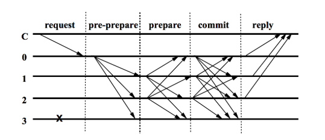

# 합의 메커니즘

합의 메커니즘(알고리즘)은 신뢰가 없는 주체들 간 합의에 도달하는 방법입니다. 블록체인 기술에서는 블록이 유효한지 아닌지에 대한 합의에 도달하는 데 사용됩니다. 블록체인 네트워크의 성능은 선택된 합의 메커니즘의 성능에 의존하며, 블록체인 어플리케이션의 사용성에 상당한 영향을 미칩니다.

Klaytn 메인넷 Cypress은 다음과 같은 성능을 보여줍니다.

- 초당 4,000 건의 트랜잭션을 처리합니다. 
- 즉각적인 트랜잭션 완결성(finality)
- 1초의 블록 생성 시간 
- 50개가 넘는 합의 노드가 합의 프로세스에 참여할 수 있습니다.

이 문서에서 우리는 Klaytn이 어떻게 고성능 합의 프로세스를 구현했는지 살펴볼 것입니다.

## 배경

[비트코인](https://en.wikipedia.org/wiki/Bitcoin)과 [이더리움](https://en.wikipedia.org/wiki/Ethereum)은 PoW(작업 증명)에 기초한 합의 메커니즘을 사용하고 있습니다. 그리고 [PoS ](https://en.wikipedia.org/wiki/Proof_of_stake)(지분 증명) 메커니즘을 사용하는 다른 블록체인 네트워크들이 있는데, 이 네트워크들은 노드가 가진 지분으로 블록을 생성하는 노드를 결정합니다. 일반적으로 이러한 알고리즘들은 블록의 유효성을 결정할 때 노드 간에 통신하지 않습니다.

따라서 이러한 시스템에서는 포크가 발생할 수 있습니다. 즉, 같은 높이에서 둘 이상의 서로 다른 블록이 만들어질 수 있습니다. 일반적으로 "가장 긴 체인이 이기는" 규칙은 포크 상태를 해결하는 데 사용됩니다. 포크가 일어난 체인이 결국 하나의 체인으로 병합되지만, 특정 기간 동안에 짧은 체인에 속한 블록들은 되돌려질 수 있다는 의미이기도 합니다. 그러므로 이러한 알고리즘에서는 블록 및 트랜잭션의 완결성을 즉시 보장 할 수 없습니다. 완결성은 일정 시간 후에 확률적으로만 달성할 수 있고, 100% 확신할 수 없습니다.

이러한 완결성 부족은 블록체인 서비스에서 매우 곤란한 문제입니다. 포크가 해결되고, 블록이 충분히 쌓여서 트랜잭션을 되돌릴 수 없게 될 때까지 기다려야 하기 때문입니다. 이 특성은 사용자와 서비스 공급자 모두에게 부정적인 영향을 미칩니다.

금융 서비스가 이 문제를 보여주는 간단한 예시입니다. 사용자가 다른 사람에게 자금을 전송했다고 가정할 경우, 서비스는 30분에서 60분이 지나야 이체가 유효하다는 것을 확인할 수 있습니다. 포크가 하나의 체인으로 병합되고, 트랜잭션을 되돌릴 수 없게 몇 개의 블록이 쌓일 때까지 기다려야 하기 때문입니다.

### PBFT (Practical Byzantine Fault Tolerance)

위의 문제를 방지하려면 완결성을 보장하는 다른 알고리즘이 필요합니다. BFT 알고리즘은 Lamport, Shostak, Pease에 의해 1982년에 처음 발표된 알고리즘입니다. 1999년, Miguel Castro와 Barbara Liskov는 high-performance state machine replication을 제공하는 "Practical Byzantine Fault Tolerance"(PBFT)를 도입했습니다.

위에서 설명한 PoW 알고리즘에서는 각 노드가 블록을 전송받고 검증하지만, 합의에 도달하기 위해 노드 간 메시지를 교환하지는 않습니다. 그러나 PBFT에서는 각 노드가 다른 참여 노드와 통신하여 합의에 도달하고 노드가 합의에 도달하는 즉시 블록의 완결성를 보장할 수 있습니다.

노드 간의 통신은 기본적으로 아래와 같이 진행됩니다. 하지만, 각 시스템에 따라 특성을 반영하는 몇 가지 예외가 있을 수 있습니다.

위와 같이 PBFT에 참여하는 노드는 기본적으로 네트워크의 모든 노드와 여러 단계에서 통신합니다. This characteristic limits the number of nodes because the communication volume increases exponentially as the number of nodes increases.

## Consensus Mechanism in Klaytn

Klaytn is aiming to be an Enterprise-ready and Service-centric platform. Therefore we need to solve the finality problem written above and the network should be able to allow many nodes to participate in the network. To make this possible, Klaytn is using an optimized version of Istanbul BFT, which implements PBFT with modifications to deal with blockchain network's characteristics.

In Klaytn, there are three types of nodes, CN (Consensus Node), PN (Proxy Node) and EN (Endpoint Node). CNs are managed by CCOs (Core Cell Operators) and are in charge of block generation. These blocks are verified by all nodes in the network. Please refer to [here](../README.md#klaytn-network-topology) to know more about this network topology.

Klaytn achieves fast finality by adopting and improving Istanbul BFT. Because validation and consensus are done for each block there is no fork and the block's finality is guaranted instantly as soon as the consensus is made.

And also the issue of increasing communication volume in the BFT algorithm is solved by utilizing randomly selected `Committee`. CNs collectively form a `Council` and on each block generation, part of them are selected as a member of `Committee` using a VRF (Verifiable Random Function).

Because consensus messages are exchanged only between the committee members, the communication volume can be limited under the designed level even though the total number of CNs increases.

Currently, Klaytn Mainnet Cypress can provide a high throughput of 4,000 transactions per second with one-second block generation interval. More than 50 consensus nodes can participate in the CNN (Consensus Node Network) at the moment and the number will continuously increase as Klaytn continues to aggressively optimize the algorithm.