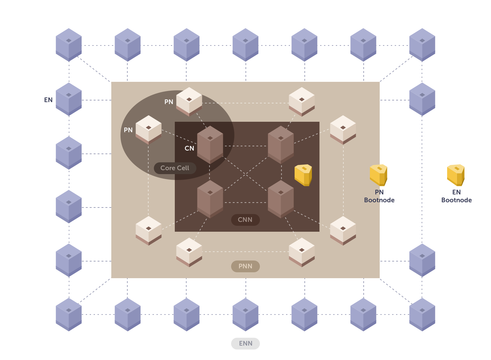
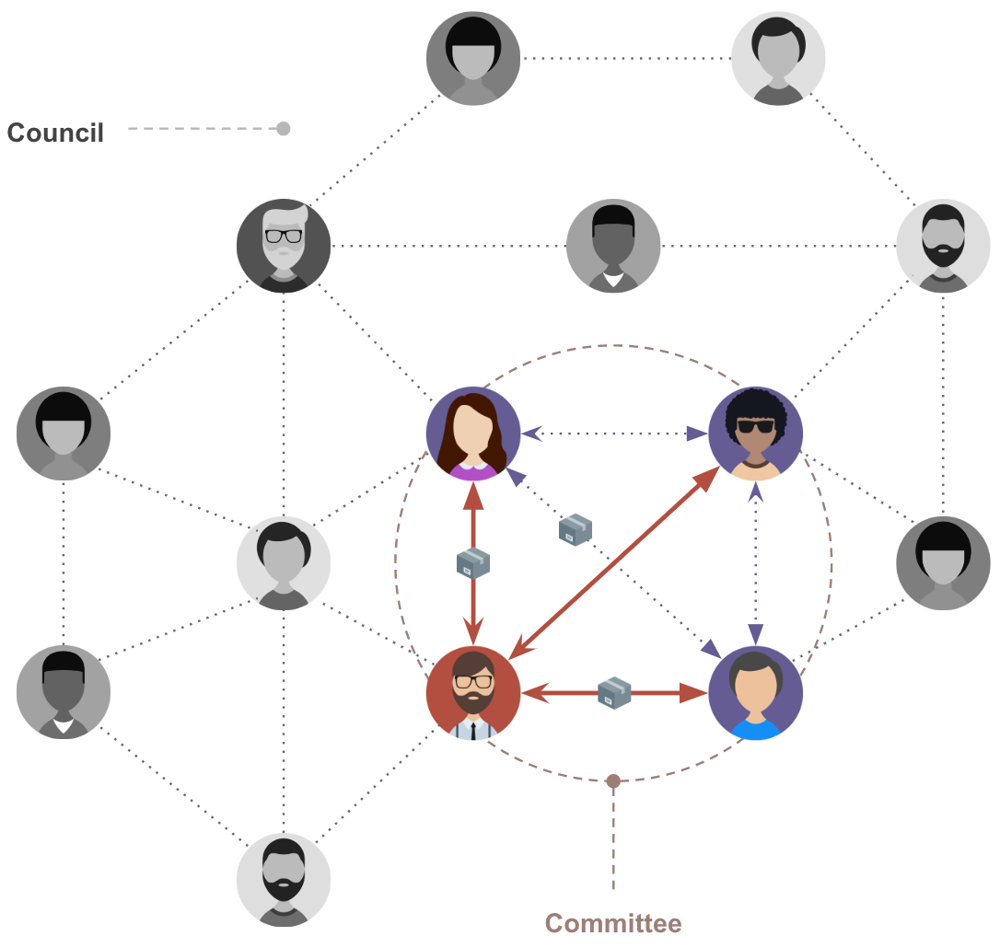

# 합의 메커니즘

합의 메커니즘(알고리즘)은 신뢰가 없는 주체들 간 합의에 도달하는 방법입니다. 블록체인 기술에서는 블록이 유효한지 아닌지에 대한 합의에 도달하는 데 사용됩니다. 블록체인 네트워크의 성능은 선택된 합의 메커니즘의 성능에 의존하며, 블록체인 어플리케이션의 사용성에 상당한 영향을 미칩니다.

Klaytn 메인넷 Cypress은 다음과 같은 성능을 보여줍니다.
- 초당 4,000 건의 트랜잭션을 처리합니다.
- 즉각적인 트랜잭션 완결성(finality)
- 1초의 블록 생성 시간
- 50개가 넘는 합의 노드가 합의 프로세스에 참여할 수 있습니다.

이 문서에서 우리는 Klaytn이 어떻게 고성능 합의 프로세스를 구현했는지 살펴볼 것입니다.

## 배경

[비트코인](https://en.wikipedia.org/wiki/Bitcoin)과 [이더리움](https://en.wikipedia.org/wiki/Ethereum)은 PoW(작업 증명)에 기초한 합의 메커니즘을 사용하고 있습니다. 그리고 [PoS ](https://en.wikipedia.org/wiki/Proof_of_stake)(지분 증명) 메커니즘을 사용하는 다른 블록체인 네트워크들이 있는데, 이 네트워크들은 노드가 가진 지분으로 블록을 생성하는 노드를 결정합니다. 일반적으로 이러한 알고리즘들은 블록의 유효성을 결정할 때 노드 간에 통신하지 않습니다.

따라서 이러한 시스템에서는 포크가 발생할 수 있습니다. 즉, 같은 높이에서 둘 이상의 서로 다른 블록이 만들어질 수 있습니다. 일반적으로 "가장 긴 체인이 이기는" 규칙은 포크 상태를 해결하는 데 사용됩니다. 포크가 일어난 체인이 결국 하나의 체인으로 병합되지만, 특정 기간 동안에 짧은 체인에 속한 블록들은 되돌려질 수 있다는 의미이기도 합니다. 그러므로 이러한 알고리즘에서는 블록 및 트랜잭션의 완결성을 즉시 보장 할 수 없습니다. 완결성은 일정 시간 후에 확률적으로만 달성할 수 있고, 100% 확신할 수 없습니다.

이러한 완결성 부족은 블록체인 서비스에서 매우 곤란한 문제입니다. 포크가 해결되고, 블록이 충분히 쌓여서 트랜잭션을 되돌릴 수 없게 될 때까지 기다려야 하기 때문입니다. 이 특성은 사용자와 서비스 공급자 모두에게 부정적인 영향을 미칩니다.

금융 서비스가 이 문제를 보여주는 간단한 예시입니다. 사용자가 다른 사람에게 자금을 전송했다고 가정할 경우, 서비스는 30분에서 60분이 지나야 이체가 유효하다는 것을 확인할 수 있습니다. 포크가 하나의 체인으로 병합되고, 트랜잭션을 되돌릴 수 없게 몇 개의 블록이 쌓일 때까지 기다려야 하기 때문입니다.

### PBFT (Practical Byzantine Fault Tolerance)
위의 문제를 방지하려면 완결성을 보장하는 다른 알고리즘이 필요합니다. BFT 알고리즘은 Lamport, Shostak, Pease에 의해 1982년에 처음 발표된 알고리즘입니다. 1999년, Miguel Castro와 Barbara Liskov는 high-performance state machine replication을 제공하는 "Practical Byzantine Fault Tolerance"(PBFT)를 도입했습니다.

위에서 설명한 PoW 알고리즘에서는 각 노드가 블록을 전송받고 검증하지만, 합의에 도달하기 위해 노드 간 메시지를 교환하지는 않습니다. 그러나 PBFT에서는 각 노드가 다른 참여 노드와 통신하여 합의에 도달하고 노드가 합의에 도달하는 즉시 블록의 완결성를 보장할 수 있습니다.

노드 간의 통신은 기본적으로 아래와 같이 진행됩니다. 하지만, 각 시스템에 따라 특성을 반영하는 몇 가지 예외가 있을 수 있습니다.

위와 같이 PBFT에 참여하는 노드는 기본적으로 네트워크의 모든 노드와 여러 단계에서 통신합니다. 이 특성은 노드 수가 증가할수록 통신량이 기하급수적으로 증가하므로 노드 수를 제한합니다.

## Klaytn의 합의 메커니즘
Klaytn은 엔터프라이즈급 서비스 중심 플랫폼이 되는 것을 목표로 하고 있습니다. 따라서 위에서 설명한 완결성 문제를 해결해야 하며 많은 노드가 네트워크에 참여할 수 있어야 합니다. 이를 위해 Klaytn은 최적화된 버전의 Istanbul BFT를 사용하고 있습니다. 이는 블록체인 네트워크의 특성을 반영하여 변형된 버전의 PBFT입니다.

Klaytn에는 CN(Consensus Node), PN(Proxy Node) 및 EN(Endpoint Node)라는 세 가지 유형의 노드가 있습니다. CN은 CCO(Core Cell Operators)에 의해 관리되며 블록 생성을 담당합니다. 이 블록은 네트워크의 모든 노드에서 검증됩니다. 이 네트워크 토폴로지를 더 알고 싶으시면, [여기](../README.md#klaytn-network-topology)를 확인해주세요.

Klaytn은 Istanbul BFT를 채택하고, 개선함으로써 빠른 완결성을 보장합니다. 각 블록에 대해 검증 및 합의가 수행되므로 포크가 없고, 합의가 이루어지면 블록의 완결성이 즉시 보장되기 때문입니다.

또한, BFT 알고리즘의 통신량 증가 문제는 임의로 선택된 `위원회(Committee)`를 활용하여 해결됩니다. CN은 함께 `Council`을 구성하고, 각 블록 생성시 VRF(Verifiable Random Function)을 이용하여 위원회의 멤버로 선택됩니다.

합의 메세지는 오직 위원회 멤버들 사이에 교환이 이루어지므로 총 CN의 숫자가 늘더라도 통신량은 제한될 수 있습니다.

현재 Klaytn Mainnet Cypress는 1초의 블록 생성 간격을 가지며 초당 4,000개의 트랜잭션을 처리할 수 있습니다. 현재 50개 이상의 합의 노드가 CNN(Consensus Node Network)에 참여할 수 있으며, Klaytn이 계속해서 알고리즘을 적극적으로 최적화함에 따라 그 수는 지속해서 증가할 예정입니다.
