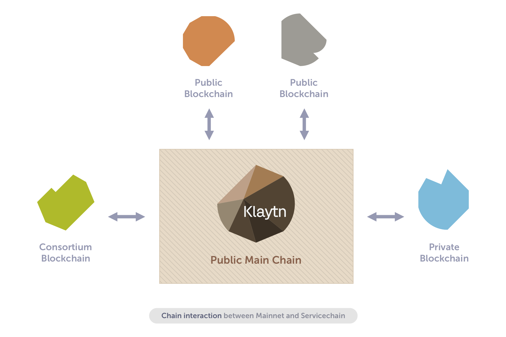

## 서비스체인 
Service chains in Klaytn are auxiliary blockchains independent from the Klaytn main chain, tailored for individual dApp requiring special node configurations, customized security levels, or exceptionally high throughput that makes deploying the dApp on the main chain inconvenient or economically infeasible.

완전히 탈중앙화된 스케일링 솔루션이 존재하지만 Challenge나 Exit 같은 어려운 인터페이스나 비즉각적 완결성 문제 때문에, Klaytn의 서비스체인은 다른 접근법을 취하였습니다. 서비스체인은 더 나은 사용성, 즉각적인 완결성, 높은 퍼포먼스, 높은 가용성을 위해 완전한 탈중앙화를 일부 희생하였습니다.

Klaytn service chains may be used for various service-specific goals, and can connect to the main chain for multiple reasons including data anchoring (periodic storing of block hashes from the service chain onto the main chain to compensate for the decreased security of the service chain due to the smaller number of nodes) or value transfer (interchain transfer of KLAY, Klaytn’s native unit of value, and the tokens issued by dApps).

## 네트워크 
Klaytn 메인체인에 연결된 서비스체인들을 통칭하여 서비스체인 네트워크라고 부릅니다. 서비스체인과 메인체인의 연결 방법은 추후 달라질 수 있습니다.

그림 1은 다양한 비즈니스 요구를 충족하기 위해 사용되는, Klaytn 메인체인과 연결되어 Klaytn 네트워크를 확장하는 서비스체인들의 네트워크 토폴로지를 보여줍니다.

그림 2는 서비스체인의 기능인 main/sub-bridge 모델을 이용하여 Klaytn 메인체인의 EN(Endpoint Node)과 직접적으로 연결되어있는 SCN(Service Chain Consensus Node)의 예를 보여줍니다.

## 주요 기능 
서비스체인은 데이터 무결성 메커니즘을 제공하고, 서로 다른 체인 간의 토큰 전송을 지원함으로써 Klaytn을 확장합니다.

### 데이터 앵커링 
데이터 무결성을 위해 서비스체인의 블록 해시를 메인체인에 특별한 트랜잭션을 이용해 자동으로 저장할 수 있습니다. 이 데이터 앵커링을 이용하여 서비스체인에 올라간 데이터가 바뀌지 않았음을 사용자들에게 확신시킬 수 있습니다.

### 밸류 트랜스퍼(Value Transfer)
To help the service providers (SPs) to easily migrate service users and values across chains, transferring tokens, such as KLAY (Klaytn's native unit of value) and Klaytn tokens issued by dApps, between different chains can be enabled. 사용자는 bridge contract라고 불리는 특별한 컨트랙트에 트랜잭션을 보냄으로써 다른 체인으로 토큰을 쉽게 이전할 수 있습니다.

