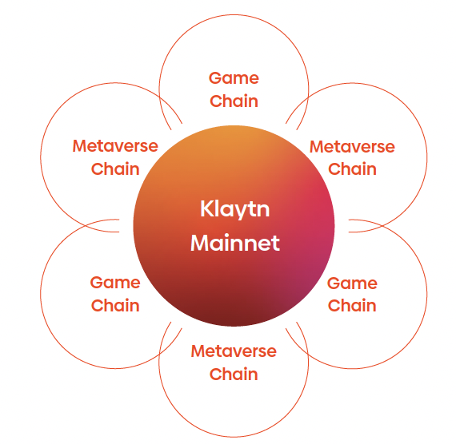

# 메타버스로 가는 간편한 관문

## 진입 장벽 낮추기

블록체인 기술이야 말로 메타버스의 필수적인 신뢰 레이어로 자리잡을 것입니다.

하지만 초기 단계에 있는 블록체인 기술, 그리고 올바른 도구와 구성요소들의 선택이라는 어려움 사이에서 블록체인 개발은 아직도 넘어야 할 관문이 많습니다.

그래서 우리는 메타버스 빌더들이 블록체인 세계에 최대한 부드럽게 진입할 수 있도록 도와주는 통합 패키지를 구성했습니다.

## 클레이튼의 "메타버스 패키지"

1차 인프라: 종단간 블록체인 통합과 개발을 위한 툴셋 맞춤형 L2 솔루션 SDK와 스마트 컨트랙트 라이브러리 월렛과 체인 탐색기 분산 저장 솔루션 오라클 지원 브릿지

2차 인프라: 제품과 서비스 지원을 위한 생태계 통합/추상화 서비스 스테이블 코인 통합 DAOs NFT 마켓플레이스 DEX와 DeFi 전통 금융 인터페이스

• 전담 패키지 매니저가 패키지를 관리해줍니다.

• 빌더들은 레이어 2를 쉽게 개발하고 맞춤형 제작할 수 있으며, 자산을 생성/전송할 수 있습니다.

클레이튼의 메타버스 패키지와 함께라면 여러분의 소망을 실현하는 데 있어 블록체인의 난해함이 더 이상 장애물이 되지 않을 것입니다.
